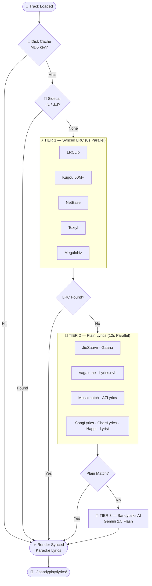
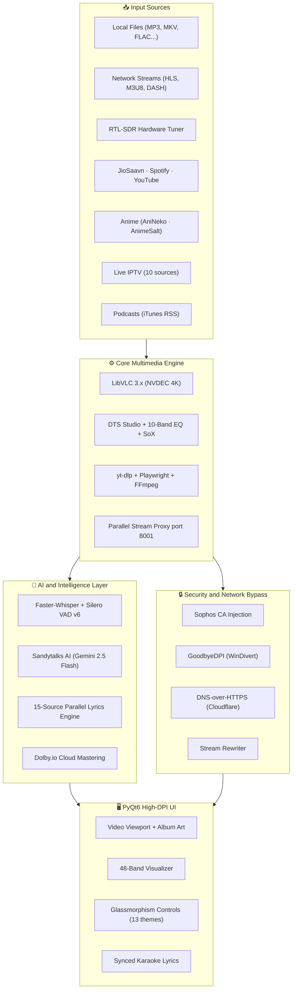

<div align="center">

<!-- HEADER BANNER -->


<br/>

<!-- BADGES BAR -->
<a href="https://github.com/sandytalks/SANDYPLAY/releases/latest"></a>&nbsp;
<a href="https://github.com/sandytalks/SANDYPLAY/releases"></a>&nbsp;
<a href="LICENSE"></a>&nbsp;
<a href="https://github.com/sandytalks/SANDYPLAY/stargazers"></a>&nbsp;
<a href="https://github.com/sandytalks/SANDYPLAY/releases/latest"></a>&nbsp;
<a href="https://python.org"></a>

<br/><br/>

<p align="center">
<b>Faster-Whisper</b> (99-Language Offline AI Subtitles · Silero VAD v6) &nbsp;·&nbsp; <b>Sandytalks AI</b> (Gemini 2.5 Flash)<br/>
<b>Dolby.io</b> (Cloud Audio Mastering) &nbsp;·&nbsp; <b>JioSaavn 320kbps &amp; Spotify</b> (pyDes Decrypted) &nbsp;·&nbsp; <b>LibVLC 3.x</b> (NVDEC 4K)<br/>
<b>RTL-SDR Hardware FM</b> &nbsp;·&nbsp; <b>GoodbyeDPI + DoH</b> (ISP &amp; Campus Bypass) &nbsp;·&nbsp; <b>15-Provider Lyrics Engine</b> &nbsp;·&nbsp; <b>48-Band Visualizer</b>
</p>

<br/>

<a href="https://github.com/sandytalks/SANDYPLAY/releases/download/Sandyplay/SandyPlay_Setup_v1.17.exe">

</a>

<br/><br/>
<sub>⚡ <b>Self-Contained Installer</b> · Windows 10 / 11 (64-bit) · No Python or external dependencies required</sub>

</div>

<br/>

---

## 🧠 What Makes SANDYPLAY Unique?

> SANDYPLAY is not a media player. It is a **complete multimedia studio** — engineered from the ground up with AI-native architecture, hardware integration, enterprise-grade network bypass, audiophile DSP, and a full online content ecosystem. Everything runs locally, offline-capable, and without subscriptions.

<br/>

---


## 🏆 The Definitive Comparison

*How SANDYPLAY stacks up against the best in the world.*

<table>
<thead>
<tr>
<th align="left">Feature</th>
<th align="center">🏅 SANDYPLAY</th>
<th align="center">VLC 3.x</th>
<th align="center">PotPlayer</th>
<th align="center">MPC-HC</th>
<th align="center">foobar2000</th>
<th align="center">Kodi</th>
<th align="center">MPV</th>
</tr>
</thead>
<tbody>
<tr><td><b>Offline AI Subtitles (Whisper + VAD)</b></td><td align="center">✅ 99 langs</td><td align="center">❌</td><td align="center">❌</td><td align="center">❌</td><td align="center">❌</td><td align="center">❌</td><td align="center">❌</td></tr>
<tr><td><b>Instant AI Video Caption</b></td><td align="center">✅ Gemini</td><td align="center">❌</td><td align="center">❌</td><td align="center">❌</td><td align="center">❌</td><td align="center">❌</td><td align="center">❌</td></tr>
<tr><td><b>Bilingual Lyrics + AI Translation</b></td><td align="center">✅ 2 langs</td><td align="center">❌</td><td align="center">❌</td><td align="center">❌</td><td align="center">❌</td><td align="center">❌</td><td align="center">❌</td></tr>
<tr><td><b>AI Smart Playlist Generator</b></td><td align="center">✅</td><td align="center">❌</td><td align="center">❌</td><td align="center">❌</td><td align="center">⚠️ plugin</td><td align="center">⚠️ addon</td><td align="center">❌</td></tr>
<tr><td><b>AI Metadata Auto-Cleaner</b></td><td align="center">✅ Gemini</td><td align="center">❌</td><td align="center">❌</td><td align="center">❌</td><td align="center">❌</td><td align="center">❌</td><td align="center">❌</td></tr>
<tr><td><b>AI Lyrics Summarizer</b></td><td align="center">✅</td><td align="center">❌</td><td align="center">❌</td><td align="center">❌</td><td align="center">❌</td><td align="center">❌</td><td align="center">❌</td></tr>
<tr><td><b>AI Command Palette</b></td><td align="center">✅</td><td align="center">❌</td><td align="center">❌</td><td align="center">❌</td><td align="center">❌</td><td align="center">❌</td><td align="center">❌</td></tr>
<tr><td><b>Dolby.io Cloud Audio Mastering</b></td><td align="center">✅</td><td align="center">❌</td><td align="center">❌</td><td align="center">❌</td><td align="center">❌</td><td align="center">❌</td><td align="center">❌</td></tr>
<tr><td><b>10 Hardware Speaker DSP Profiles</b></td><td align="center">✅ full DSP</td><td align="center">⚠️ basic</td><td align="center">⚠️ basic</td><td align="center">❌</td><td align="center">⚠️ plugin</td><td align="center">❌</td><td align="center">❌</td></tr>
<tr><td><b>DTS Studio (Music / Movies / Games)</b></td><td align="center">✅</td><td align="center">❌</td><td align="center">❌</td><td align="center">❌</td><td align="center">❌</td><td align="center">❌</td><td align="center">❌</td></tr>
<tr><td><b>10-Band Parametric EQ</b></td><td align="center">✅</td><td align="center">⚠️ basic</td><td align="center">✅</td><td align="center">❌</td><td align="center">✅</td><td align="center">⚠️ addon</td><td align="center">❌</td></tr>
<tr><td><b>Crossfade (Adjustable Duration)</b></td><td align="center">✅ E/W keys</td><td align="center">❌</td><td align="center">❌</td><td align="center">❌</td><td align="center">✅</td><td align="center">⚠️</td><td align="center">❌</td></tr>
<tr><td><b>SoX HiFi Resampler</b></td><td align="center">✅</td><td align="center">❌</td><td align="center">❌</td><td align="center">❌</td><td align="center">⚠️ plugin</td><td align="center">❌</td><td align="center">❌</td></tr>
<tr><td><b>0.25x – 4.0x Pitch-Preserved Speed</b></td><td align="center">✅</td><td align="center">✅</td><td align="center">✅</td><td align="center">❌</td><td align="center">❌</td><td align="center">⚠️</td><td align="center">✅</td></tr>
<tr><td><b>48-Band Real-Time Visualizer</b></td><td align="center">✅</td><td align="center">⚠️ basic</td><td align="center">⚠️</td><td align="center">❌</td><td align="center">✅</td><td align="center">⚠️</td><td align="center">❌</td></tr>
<tr><td><b>15-Source Lyrics Engine (Synced LRC)</b></td><td align="center">✅</td><td align="center">❌</td><td align="center">❌</td><td align="center">❌</td><td align="center">⚠️ plugin</td><td align="center">⚠️ addon</td><td align="center">❌</td></tr>
<tr><td><b>JioSaavn 320kbps Streaming</b></td><td align="center">✅ DES decrypted</td><td align="center">❌</td><td align="center">❌</td><td align="center">❌</td><td align="center">❌</td><td align="center">❌</td><td align="center">❌</td></tr>
<tr><td><b>Spotify Catalog Discovery</b></td><td align="center">✅ zero-auth</td><td align="center">❌</td><td align="center">❌</td><td align="center">❌</td><td align="center">⚠️ plugin</td><td align="center">⚠️ addon</td><td align="center">❌</td></tr>
<tr><td><b>YouTube Trending + Search</b></td><td align="center">✅ yt-dlp</td><td align="center">⚠️ manual URL</td><td align="center">❌</td><td align="center">❌</td><td align="center">❌</td><td align="center">⚠️ addon</td><td align="center">❌</td></tr>
<tr><td><b>Podcast Discovery (iTunes RSS)</b></td><td align="center">✅</td><td align="center">❌</td><td align="center">❌</td><td align="center">❌</td><td align="center">❌</td><td align="center">⚠️ addon</td><td align="center">❌</td></tr>
<tr><td><b>Live IPTV (10 Global Sources)</b></td><td align="center">✅</td><td align="center">⚠️ manual</td><td align="center">⚠️ manual</td><td align="center">❌</td><td align="center">❌</td><td align="center">✅ addon</td><td align="center">❌</td></tr>
<tr><td><b>Anime Studio (8 Languages)</b></td><td align="center">✅</td><td align="center">❌</td><td align="center">❌</td><td align="center">❌</td><td align="center">❌</td><td align="center">⚠️ addon</td><td align="center">❌</td></tr>
<tr><td><b>300+ Online Radio Stations</b></td><td align="center">✅</td><td align="center">⚠️ manual</td><td align="center">❌</td><td align="center">❌</td><td align="center">⚠️ plugin</td><td align="center">⚠️ addon</td><td align="center">❌</td></tr>
<tr><td><b>RTL-SDR Hardware FM Tuner</b></td><td align="center">✅ 76–108 MHz</td><td align="center">❌</td><td align="center">❌</td><td align="center">❌</td><td align="center">❌</td><td align="center">❌</td><td align="center">❌</td></tr>
<tr><td><b>Sophos SSL + GoodbyeDPI Bypass</b></td><td align="center">✅ auto</td><td align="center">❌</td><td align="center">❌</td><td align="center">❌</td><td align="center">❌</td><td align="center">❌</td><td align="center">❌</td></tr>
<tr><td><b>DNS-over-HTTPS (DoH)</b></td><td align="center">✅</td><td align="center">❌</td><td align="center">❌</td><td align="center">❌</td><td align="center">❌</td><td align="center">❌</td><td align="center">❌</td></tr>
<tr><td><b>Named Session Snapshots</b></td><td align="center">✅</td><td align="center">❌</td><td align="center">❌</td><td align="center">❌</td><td align="center">❌</td><td align="center">❌</td><td align="center">❌</td></tr>
<tr><td><b>Integrated Web Browser</b></td><td align="center">✅</td><td align="center">❌</td><td align="center">❌</td><td align="center">❌</td><td align="center">❌</td><td align="center">❌</td><td align="center">❌</td></tr>
<tr><td><b>Integrated Download Manager</b></td><td align="center">✅ yt-dlp</td><td align="center">❌</td><td align="center">❌</td><td align="center">❌</td><td align="center">❌</td><td align="center">❌</td><td align="center">❌</td></tr>
<tr><td><b>13 Themes + Custom HEX Picker</b></td><td align="center">✅</td><td align="center">❌</td><td align="center">⚠️ skins</td><td align="center">⚠️ skins</td><td align="center">⚠️ themes</td><td align="center">⚠️ skins</td><td align="center">❌</td></tr>
<tr><td><b>NVDEC 4K Hardware Acceleration</b></td><td align="center">✅</td><td align="center">✅</td><td align="center">✅</td><td align="center">✅</td><td align="center">❌</td><td align="center">✅</td><td align="center">✅</td></tr>
<tr><td><b>7 Deinterlace Algorithms</b></td><td align="center">✅</td><td align="center">✅</td><td align="center">✅</td><td align="center">✅</td><td align="center">❌</td><td align="center">⚠️</td><td align="center">✅</td></tr>
<tr><td><b>Sleep Timer</b></td><td align="center">✅</td><td align="center">❌</td><td align="center">✅</td><td align="center">❌</td><td align="center">⚠️ plugin</td><td align="center">⚠️ addon</td><td align="center">❌</td></tr>
<tr><td><b>Queue HTML Export</b></td><td align="center">✅</td><td align="center">❌</td><td align="center">❌</td><td align="center">❌</td><td align="center">❌</td><td align="center">❌</td><td align="center">❌</td></tr>
<tr><td><b>Setup Required / Addons Needed</b></td><td align="center">🟢 Zero</td><td align="center">🟢 Zero</td><td align="center">🟢 Zero</td><td align="center">🟡 Codec packs</td><td align="center">🔴 Many plugins</td><td align="center">🔴 Many addons</td><td align="center">🟡 Scripts</td></tr>
</tbody>
</table>

> ✅ = Native built-in &nbsp;·&nbsp; ⚠️ = Partial / Plugin-required &nbsp;·&nbsp; ❌ = Not available

<br/>

---

## 🤖 AI &amp; Intelligence Layer

<table>
<tr>
<td width="50%" valign="top">

### 🎤 Faster-Whisper Subtitle Engine

> **100% offline** · 99 languages · Silero VAD v6 neural silence filter

- **Model selection**: Tiny → Large-v3 (auto-cached on first use, ~1.5 GB)
- **Silero VAD v6** strips silence before transcription for maximum accuracy
- **SRT output** permanently cached per track — zero re-transcription on replay
- **Auto-trigger** for video files — subtitles appear automatically
- **Manual override**: `Ctrl+T` or AI Tools menu
- **Sub sync hotkeys**: `R` / `Shift+R` (−0.1s / −0.5s), `T` / `Shift+T` (+0.1s / +0.5s)
- **Subtitle track cycle**: `Z`

</td>
<td width="50%" valign="top">

### ✨ Sandytalks AI (Gemini 2.5 Flash)

> Media-aware chatbot grounded in live ID3 tags and LRCLib lyrics

| AI Tool | What It Does |
|---------|-------------|
| **AI Clean Metadata** | Auto-corrects title, artist, album via Gemini |
| **AI Smart Playlist** | Generates mood/genre-matched queue |
| **AI Recommend Next** | Suggests next track from listening history |
| **AI Summarize Lyrics** | Poetic Gemini-powered lyric meaning card |
| **AI Command Palette** | Natural language media commands |
| **Translate Lyrics → EN** | Full lyrics → English via Gemini |
| **Translate Lyrics → TA** | Full lyrics → Tamil via Gemini |
| **Translate Caption → EN/TA** | Whisper subtitle translation |
| **Bilingual Lyrics View** | Side-by-side original + translated panel |
| **Instant Video Caption** | One-click Gemini scene description |

</td>
</tr>
</table>

<br/>

---

## 🎤 3-Tier Parallel Lyrics Engine

> **15 providers · 3 tiers · Guaranteed delivery every time**

<table>
<tr>
<td width="55%" valign="top">

**⚡ Tier 1 — Synced LRC** *(8-second parallel deadline)*
> ① LRCLib · ② Kugou (50M+ tracks) · ③ NetEase · ④ Textyl · ⑤ Megalobiz

**📝 Tier 2 — Plain Lyrics** *(12-second parallel deadline)*
> ⑥ JioSaavn · ⑦ Gaana · ⑧ Vagalume · ⑨ Lyrics.ovh · ⑩ Musixmatch
> ⑪ AZLyrics · ⑫ SongLyrics · ⑬ ChartLyrics · ⑭ Happi.dev · ⑮ Lyrist

**🤖 Tier 3 — Sandytalks AI Synthesis** *(100% guaranteed)*
> When all 14 providers return empty, Gemini 2.5 Flash synthesizes exact lyrics from the track's ID3 title, artist, and album metadata.

</td>
<td width="45%" valign="top">

**Pipeline Intelligence:**
- 📂 Instant disk cache (MD5-keyed JSON per track)
- 📄 Sidecar `.lrc` and `.txt` file auto-detection
- ⚡ Parallel multi-provider execution (no serial waiting)
- 🎯 Fuzzy title matching (Levenshtein ratio > 0.72)
- 🔄 4 title variant queries per provider
- 📦 Batch pre-fetch: 200 tracks simultaneously
- ⏱️ Manual sync: `G` / `Shift+G` (−0.3s / −1.0s), `H` / `Shift+H` (+0.3s / +1.0s)
- 🎵 Synced karaoke panel with word-level highlight

</td>
</tr>
</table>

<details>
<summary><strong>🔍 Click to expand — Lyrics Pipeline Flowchart</strong></summary>
<br/>



</details>

<br/>

---

## 🎧 Audiophile DSP Engine

<table>
<tr>
<td width="50%" valign="top">

### 🔊 10 Hardware Speaker Profiles

*Each profile applies dedicated acoustic EQ curves + real-time DSP spatializer (extracted from `_speaker_audio_profile` in `player54.py`).*

| Mode | DSP Signature |
|------|--------------|
| **Stereo** | Natural Pristine Stereo (flat) |
| **Reverse Stereo** | L/R Swapped + Spatial Phase |
| **Left (Mono)** | Left Mono Balanced |
| **Right (Mono)** | Right Mono Balanced |
| **Surround 2.1** | Subwoofer LFE Pump + Satellite Separation |
| **Dolby Surround** | Cinema Center Dialog + Surround Matrix |
| **Surround 5.1** | 3D Virtual Theater + Deep Subwoofer LFE |
| **Surround 7.1** | 360° IMAX Dome Immersion + Ultra LFE |
| **Spatial 3D Audio** | Binaural HRTF Virtualization (Out-of-Head) |
| **Studio High-Fidelity** | Audiophile Master Reference (Transparent) |

</td>
<td width="50%" valign="top">

### 🎛️ DTS Studio + DSP Processing

**DTS Content Modes** *(simulated with live DSP from `player54.py`)*

| Mode | DSP Effect |
|------|-----------|
| 🎵 **Music** | +2 dB 62 Hz bass + +2 dB 8 kHz air |
| 🎬 **Movies** | +3 dB sub-bass + +2.5 dB vocal clarity |
| 🎮 **Games** | +3 dB 4 kHz + +3.5 dB 8 kHz spatial |
| ⭐ **Custom Audio** | Manual EQ takes full control |
| ❌ **Off** | Flat DSP passthrough |

**Additional Processing:**
- 🎚️ **10-Band Parametric EQ** with per-band fine control
- 🔊 **Dynamic Punch Expander** — +2.5 dB 62 Hz, +1.5 dB 1 kHz vocal
- 🎵 **SoX HiFi Resampler** — transparent upsampling
- ☁️ **Dolby.io Cloud Mastering** — loudness normalization, noise suppression
- ⚡ **0.25× – 4.0×** pitch-preserved speed (`[` / `]` keys)

</td>
</tr>
</table>

<br/>

---

## 🎬 Playback Engine &amp; Video Controls

<table>
<tr>
<td width="50%" valign="top">

### ⚙️ Core Engine

- **LibVLC 3.x** — battle-tested C++ multimedia core
- **NVDEC 4K hardware acceleration** — GPU-decoded video on NVIDIA
- **yt-dlp** — 1000+ site stream extractor
- **Playwright** — headless Chromium for DRM-lite stream resolution
- **Parallel Stream Proxy** (port 8001) — real-time mux of split video + audio CDN streams

### ▶️ Playback (from `create_menu_bar` in `player54.py`)

- Play / Pause · Stop · Next / Previous
- **Crossfade to Next** `E` · **Crossfade to Prev** `W`
- **Crossfade Duration +1s** `Shift+E` · **−1s** `Shift+W`
- Seek −10s / +10s · Seek −30s / +30s (`Alt+Arrow`)
- Volume Up / Down (`↑`/`↓`) · Mute `M`
- Speed `[` / `]` · Loop `L` · Stop `S`
- Cycle Audio Track `X` · Cycle Subtitle Track `Z`

</td>
<td width="50%" valign="top">

### 🎬 Video Processing

**8 Aspect Ratios:**
`16:9` · `4:3` · `21:9` · `16:10` · `1.85:1` · `2.35:1` · `1:1` · `Original`

**5 Crop Modes:**
`16:9` · `4:3` · `21:9` · `1:1` · `Original` — cycle with `C`

**7 Deinterlace Algorithms:**
`Yadif` · `Blend` · `Bob` · `Discard` · `Linear` · `Mean` · `X`

**Live Adjustments:**
- Contrast · Brightness · Saturation · Gamma · Hue
- Zoom In/Out (`Ctrl+Scroll`) · Reset Zoom
- Frame Size → Aspect Ratio → Window Size menus

**Subtitle Rendering:**
- External `.srt` / `.ass` / `.vtt` / `.sub` support
- Whisper-generated `.srt` auto-loaded per track
- Sub delay fine-sync: `R/T` (±0.1s), `Shift+R/T` (±0.5s)

**Screenshot:** `Video → Screenshot` — saves full-res frame

</td>
</tr>
</table>

### 🎵 Supported Formats

<table>
<tr>
<td width="50%" valign="top">

**Audio (12+ formats)**
`mp3` `flac` `wav` `m4a` `aac` `ogg` `opus` `alac` `wma` `ac3` `eac3` `thd`

</td>
<td width="50%" valign="top">

**Video (15+ formats)**
`mp4` `mkv` `avi` `mov` `webm` `flv` `wmv` `m4v` `mpeg` `mpg` `ts` `vob` `3gp` `rm` `rmvb`

</td>
</tr>
</table>

<br/>

---

## 🎵 Online Music Studio

> **One unified search** across JioSaavn (320kbps) · YouTube · Spotify catalog

<table>
<tr>
<td width="50%" valign="top">

### 🎵 JioSaavn 320kbps Engine
- **jiosaavnpy + pyDes decryption** — fetches and decrypts CDN URL locally
- Direct 320 kbps `.m4a` streams — no quality cap
- Search by song, album, artist, or playlist
- Artwork, duration, and ID3 tags fetched simultaneously

### 🎧 Spotify Catalog Discovery
- **Zero authentication** — no account required
- Browse tracks, albums, artists, and playlists
- Resolve to playable streams via yt-dlp
- Works seamlessly with GoodbyeDPI ISP bypass

</td>
<td width="50%" valign="top">

### ▶️ YouTube Music &amp; Video
- **Search + Trending** in one unified panel
- Resolution selector (360p → 4K)
- Auto-queue playlists and channels
- Stream proxy for split audio/video CDN URLs

### 🎙️ iTunes Podcast Discovery
- Browse global podcast directory with iTunes RSS
- Category-based discovery
- Direct episode playback with seek support
- Auto-artwork and episode metadata

</td>
</tr>
</table>

<br/>

---

## 📺 Online TV — Live IPTV Studio

> **10 aggregated public IPTV networks · searchable · auto-deduplicated**

<table>
<tr>
<td width="55%" valign="top">

**10 Aggregated Sources:**

| Source | Coverage |
|--------|---------|
| **iptv-org** | Global community directory |
| **Free-TV** | Free-to-air international channels |
| **PlutoTV** | 200+ US streaming live channels |
| **Samsung TV+** | Samsung Smart TV free content |
| **Plex** | Plex free live TV catalog |
| **Roku** | Roku Channel live streams |
| **PBS** | US public broadcasting |
| **Stirr** | Sinclair Broadcasting streams |
| **Tubi** | Tubi live TV library |
| **LocalNow** | Local and regional US news |

</td>
<td width="45%" valign="top">

**Browse &amp; Filter:**

- 🌐 **All Channels** — complete deduplicated directory
- 🎥 **Genre Wise** — News · Movies · Music · Kids · Sports
- 🗣️ **Language Wise** — Tamil · Hindi · English · Korean · Spanish...
- 🌍 **Region Wise** — India (state-level) · USA · UK · Japan
- ❤️ **Favorites** — persistent across restarts
- 🔍 **Instant fuzzy search** — real-time filtering
- 🖼️ **Channel logos** — auto-fetched and cached

</td>
</tr>
</table>

<br/>

---

## 📻 FM Studio — Hardware + 300+ Online Stations

<table>
<tr>
<td width="50%" valign="top">

### 📡 RTL-SDR Hardware FM Tuner
- Plug in any **RTL-SDR USB dongle** for true over-the-air FM
- Frequency range: **76 MHz – 108 MHz**
- Fine-tune with nudge controls
- `F8` opens the FM Studio instantly
- Favorites panel with persistent station memory
- Station logo auto-fetch via Radio Browser API

</td>
<td width="50%" valign="top">

### 🌐 300+ Online Stations

| Category | Count &amp; Highlights |
|----------|----------------------|
| 🎶 Tamil | 32 (AIR, Ilayaraja Hits, AR Rahman 24/7, Mirchi) |
| 🎵 Hindi | 8 (Vividh Bharati, Mirchi Top 20, Bollywood Retro) |
| 🎤 Artists | 100+ (Taylor Swift, BTS, Coldplay, Anirudh, Yuvan) |
| 🌟 K-Pop | 30+ (BTS Radio, SBS PopAsia, K-Rock) |
| 🎼 Classical | BBC Radio 3, WQXR, Jazz24, Calm Radio |
| 🎸 Rock | KEXP Seattle, Radio Paradise, 1.FM |
| 📰 News | BBC World Service, NPR News, France Info |
| 💃 EDM | SomaFM, 1.FM Trance, Defected Radio |

</td>
</tr>
</table>

<br/>

---

## 🎌 Anime Studio — 8 Languages

> Direct video extraction via **AniNeko** &amp; **AnimeSalt** — dubbed + subbed

<table>
<tr>
<td width="50%" valign="top">

| Indian Regional | International |
|----------------|---------------|
| 🇮🇳 Tamil — AnimeSalt | 🇬🇧 English — AniNeko |
| 🇮🇳 Hindi — AnimeSalt | 🇪🇸 Spanish — AniNeko |
| 🇮🇳 Telugu — AnimeSalt | 🇫🇷 French — AniNeko |
| 🇮🇳 Malayalam — AnimeSalt | 🇯🇵 Japanese — AniNeko |

</td>
<td width="50%" valign="top">

- 🔥 Popular &amp; Ongoing feeds — updated hourly
- 🔍 Instant fuzzy search with category tags
- 📺 Multi-quality streams (360p – 1080p)
- ❤️ Persistent favorites and custom watchlists
- 🖼️ High-DPI anime posters with lazy caching
- 🔒 Zero blocking — DNS-over-HTTPS always active

</td>
</tr>
</table>

<br/>

---

## 🛡️ Network &amp; Security Layer

> Built for college campus networks and corporate firewalls — SANDYPLAY **always connects**.

<table>
<tr>
<td width="33%" valign="top">

### 🔒 Sophos SSL Injection
Auto-detects `SecurityAppliance_SSL_CA.pem` and injects it into:
- Python default SSL context
- `requests` session CA bundle
- `yt-dlp` HTTPS verification

Zero manual setup — plug and stream on any corporate network.

</td>
<td width="33%" valign="top">

### 🚫 GoodbyeDPI (WinDivert)
- Bypasses ISP **deep packet inspection** throttling
- Preset `-7` mode — optimal for media streaming
- WinDivert kernel driver for packet-level bypass
- Auto-starts before stream fetch, auto-stops after

</td>
<td width="33%" valign="top">

### 🌐 DNS-over-HTTPS
- All DNS queries routed over HTTPS (encrypted)
- Providers: **Cloudflare** (1.1.1.1) + Alibaba fallback
- Prevents DNS-based content blocking
- Essential for anime, radio, and IPTV in restricted regions

</td>
</tr>
</table>

<br/>

---

## 🎨 Themes &amp; UI

<table>
<tr>
<td width="50%" valign="top">

### 🎨 13 Glassmorphism Theme Presets

*(defined as `COLOR_THEME_PRESETS` in `player54.py`)*

| Theme | Accent |
|-------|--------|
| 🪻 Lavender | `#b593fa` |
| 🔵 Sky Blue | `#0ea5e9` |
| 🟣 Purple Haze | `#8b5cf6` |
| 🟠 Sunset Orange | `#f97316` |
| 🟢 Emerald | `#22c55e` |
| 🔴 Crimson | `#ef4444` |
| 🟡 Golden Glow | `#eab308` |
| 🩷 Hot Pink | `#ec4899` |
| 🔷 Deep Indigo | `#4f46e5` |
| 🩵 Teal Surge | `#14b8a6` |
| 🌊 Ocean Cyan | `#06b6d4` |
| 🟤 Copper | `#b45309` |
| ⚪ Moonlight | `#e2e8f0` |
| 🎨 **Custom HEX** | Any color you want |

</td>
<td width="50%" valign="top">

### 🖥️ UI Features

- **Dark glassmorphism** base — midnight `#0F172A` background
- **Custom accent color** applied globally everywhere
- **48-band real-time visualizer** — `V` key toggle
- **Synced karaoke panel** — word-level lyric highlight, `Ctrl+L`
- **Fullscreen** `F` · **Fullscreen Stretch** `Ctrl+Enter`
- **Playlist sidebar** toggle `P`
- **Floating OSD** — on-screen display for volume/speed changes
- **Sleep Timer** — auto-pause at scheduled time
- **Album art display** — high-DPI with smooth lazy loading
- **Queue management**: shuffle, dedup, sort, same-folder mix
- **Export Queue HTML** `Ctrl+Alt+E`

</td>
</tr>
</table>

<br/>

---

## ➕ Plus Features

<table>
<tr>
<td width="50%" valign="top">

### 💾 Named Session Snapshots
- Save queue, position, EQ, speaker profile, DTS mode, theme &amp; volume
- `Ctrl+Alt+S` — Save Snapshot with custom name
- **Load Snapshot** submenu — instant restore
- Stored in `%APPDATA%\SandyPlay\plus\`

### ❤️ Favorites &amp; History
- `Ctrl+Alt+F` — Toggle current track as favorite
- **Favorites** submenu — browse and play any starred track
- **Recently Played** submenu — full history with timestamps

</td>
<td width="50%" valign="top">

### 🧹 Queue Intelligence
- **Add Same-Folder Mix** — auto-adds all files in current folder
- **Remove Duplicates** `Ctrl+Alt+D` — hash-based deduplication
- **Remove Missing Files** — cleans dead queue entries
- **Queue Stats** — track count, total duration, format breakdown
- **Export Queue HTML** `Ctrl+Alt+E` — shareable playlist page
- **Copy Current Path** — instant clipboard copy
- **Open Current Folder** — jumps to Explorer at current file

</td>
</tr>
</table>

<br/>

---

## ⌨️ Complete Keyboard Shortcuts

<details>
<summary><strong>Click to expand — All 40+ Shortcuts</strong></summary>
<br/>

<table>
<thead>
<tr><th>Category</th><th>Key</th><th>Action</th></tr>
</thead>
<tbody>
<tr><td rowspan="14"><b>Playback</b></td><td><code>Space</code></td><td>Play / Pause</td></tr>
<tr><td><code>N</code> / <code>B</code></td><td>Next / Previous Track</td></tr>
<tr><td><code>E</code> / <code>W</code></td><td>Crossfade to Next / Previous</td></tr>
<tr><td><code>Shift+E</code> / <code>Shift+W</code></td><td>Increase / Decrease Crossfade Duration ±1s</td></tr>
<tr><td><code>S</code></td><td>Stop Playback</td></tr>
<tr><td><code>→</code> / <code>←</code></td><td>Seek ±10 seconds</td></tr>
<tr><td><code>Alt+→</code> / <code>Alt+←</code></td><td>Seek ±30 seconds</td></tr>
<tr><td><code>↑</code> / <code>↓</code></td><td>Volume Up / Down</td></tr>
<tr><td><code>[</code> / <code>]</code></td><td>Speed Down / Up</td></tr>
<tr><td><code>M</code></td><td>Mute / Unmute</td></tr>
<tr><td><code>L</code></td><td>Toggle Loop Mode</td></tr>
<tr><td><code>X</code></td><td>Cycle Audio Track</td></tr>
<tr><td><code>Z</code></td><td>Cycle Subtitle Track</td></tr>
<tr><td><code>R/T · Shift+R/T</code></td><td>Sub Sync ±0.1s / ±0.5s</td></tr>
<tr><td rowspan="6"><b>View</b></td><td><code>F</code> / <code>Enter</code></td><td>Toggle Fullscreen</td></tr>
<tr><td><code>Ctrl+Enter</code></td><td>Fullscreen Stretch</td></tr>
<tr><td><code>P</code></td><td>Toggle Playlist Sidebar</td></tr>
<tr><td><code>V</code></td><td>Toggle 48-Band Visualizer</td></tr>
<tr><td><code>C</code></td><td>Cycle Crop Mode</td></tr>
<tr><td><code>?</code></td><td>Show Keyboard Shortcuts Dialog</td></tr>
<tr><td rowspan="3"><b>Lyrics / Sub</b></td><td><code>Ctrl+L</code></td><td>Toggle Synced Lyrics Panel</td></tr>
<tr><td><code>Ctrl+T</code></td><td>Toggle Whisper CC Subtitles</td></tr>
<tr><td><code>G/H · Shift+G/H</code></td><td>Lyrics Sync ±0.3s / ±1.0s</td></tr>
<tr><td rowspan="6"><b>Files</b></td><td><code>Ctrl+O</code> / <code>F3</code></td><td>Open File(s)</td></tr>
<tr><td><code>Ctrl+D</code></td><td>Open Folder</td></tr>
<tr><td><code>Ctrl+U</code></td><td>Open URL / Stream</td></tr>
<tr><td><code>Ctrl+P</code></td><td>Open Playlist</td></tr>
<tr><td><code>Ctrl+S</code></td><td>Save Playlist</td></tr>
<tr><td><code>F8</code></td><td>Open FM Radio &amp; SDR Tuner</td></tr>
<tr><td rowspan="4"><b>Plus</b></td><td><code>Ctrl+Alt+S</code></td><td>Save Session Snapshot</td></tr>
<tr><td><code>Ctrl+Alt+F</code></td><td>Toggle Current Track Favorite</td></tr>
<tr><td><code>Ctrl+Alt+D</code></td><td>Remove Duplicate Queue Items</td></tr>
<tr><td><code>Ctrl+Alt+E</code></td><td>Export Queue as HTML</td></tr>
<tr><td rowspan="3"><b>Info</b></td><td><code>F5</code></td><td>Preferences / Effects Panel</td></tr>
<tr><td><code>F1</code></td><td>About Dialog</td></tr>
<tr><td><code>Ctrl+F1</code></td><td>Media &amp; Codec Info</td></tr>
</tbody>
</table>

</details>

<br/>

---

## 🏗️ Architecture

<details>
<summary><strong>Click to expand — Application Architecture Diagram</strong></summary>
<br/>



</details>

<details>
<summary><strong>🛠️ Complete Technology Stack</strong></summary>
<br/>

| Component | Technology | Purpose |
|-----------|-----------|---------|
| 🖥️ **GUI** | PyQt6 + QtWebEngine | Glassmorphism UI, themes, embedded browser |
| 🎬 **Media Core** | LibVLC 3.x | Hardware-accelerated playback (NVDEC) |
| 🤖 **AI Speech** | faster-whisper + ONNX | Offline multilingual subtitle generation |
| 🎙️ **VAD** | Silero VAD v6 | Neural voice activity detection |
| 🧠 **LLM** | Google Gemini 2.5 Flash | Sandytalks AI, metadata, translation |
| 🎵 **HD Music** | jiosaavnpy + pyDes | JioSaavn 320kbps decryption |
| 🎧 **Spotify** | spotify_scraper | Zero-auth catalog lookup |
| ☁️ **Mastering** | Dolby.io REST APIs | Cloud audio mastering |
| 📡 **Streams** | yt-dlp + Playwright | Universal extractor + DOM solver |
| 📻 **Hardware** | RTL-SDR x64 | USB software-defined FM radio |
| 🛡️ **Bypass** | Sophos SSL + GoodbyeDPI | Campus/ISP unblocking |
| 🏷️ **Tags** | mutagen | ID3v2, FLAC, Vorbis, MP4 metadata |
| 🔊 **Resample** | SoX | HiFi transparent resampler |

</details>

<details>
<summary><strong>🗂️ Directory Structure</strong></summary>
<br/>

```
SANDYPLAY/
├── player54.py                     # Main application (v1.17 · 32,000+ lines)
├── sandbox_ai.py                   # AI background worker subprocess
├── vlc.py & vlc_bin/               # LibVLC bindings & native 64-bit DLLs
├── vpn/goodbyedpi.exe              # GoodbyeDPI & WinDivert engine
├── rtl-sdr/x64/rtl_fm.exe         # Hardware RTL-SDR FM receiver
├── SecurityAppliance_SSL_CA.pem   # Enterprise SSL certificate (auto-detected)
└── %APPDATA%/SandyPlay/           # Persistent user data
    ├── config.json                 # Settings, EQ, theme, speaker mode
    ├── plus/                       # Snapshots, history, library, favorites
    ├── lyrics/                     # MD5-keyed JSON lyrics cache
    ├── subtitles/                  # Whisper-generated .srt files
    └── cache/images/               # Album covers & anime poster cache
```

</details>

<br/>

---

## 🚀 Installation

<div align="center">

<a href="https://github.com/sandytalks/SANDYPLAY/releases/download/Sandyplay/SandyPlay_Setup_v1.17.exe">

</a>

</div>

<br/>

| Step | Instruction |
|------|-------------|
| 📥 **Step 1** | Download `SandyPlay_Setup_v1.17.exe` from the badge above |
| 🛡️ **Step 2** | If Windows SmartScreen prompts: **More Info → Run Anyway** |
| 🚀 **Step 3** | Launch **SANDYPLAY** from the Desktop shortcut or Start Menu |
| 🎵 **Step 4** | Drag &amp; drop files/folders, or `Ctrl+O` / `Ctrl+U` for URL streams |
| 🤖 **Step 5** | First AI subtitle use caches the Whisper model (~1.5 GB, one-time) |

### ⚙️ System Requirements

| Component | Minimum | Recommended |
|-----------|---------|-------------|
| **OS** | Windows 10 64-bit (Build 17763+) | Windows 11 64-bit |
| **CPU** | Dual-Core 2.0 GHz x64 | Quad-Core 3.0 GHz+ |
| **RAM** | 4 GB | 8 GB+ |
| **GPU** | DirectX 11 | NVIDIA GTX 1060+ (NVDEC 4K) |
| **Storage** | 500 MB app | 3 GB+ (Whisper models + cache) |

<br/>

---

## ❓ FAQ

<details>
<summary><strong>Do I need an NVIDIA GPU?</strong></summary>
No. SANDYPLAY runs on any modern Intel/AMD CPU. NVIDIA with NVDEC is optional — only needed for hardware-accelerated 4K decoding.
</details>

<details>
<summary><strong>Does Whisper work offline?</strong></summary>
Yes — 100% offline after the one-time model download. Silero VAD v6 and faster-whisper process audio locally. Generated SRT files are permanently cached per track.
</details>

<details>
<summary><strong>How does Sophos / campus network bypass work?</strong></summary>
SANDYPLAY auto-detects <code>SecurityAppliance_SSL_CA.pem</code> in the install directory and injects it into all SSL contexts, requests sessions, and yt-dlp — preventing HTTPS failures on filtered campus networks. GoodbyeDPI handles ISP-level DPI throttling.
</details>

<details>
<summary><strong>Do I need API keys?</strong></summary>
<b>No API keys</b> needed for any core feature — playback, 10 speaker modes, DTS, 48-band visualizer, 15-source lyrics, JioSaavn/Spotify streaming, anime, radio, IPTV, or sleep timer. A built-in key powers Sandytalks AI out-of-the-box.
</details>

<details>
<summary><strong>Can I stream YouTube playlists and live streams?</strong></summary>
Yes. Press <code>Ctrl+U</code>, paste any YouTube, Twitch, HLS, or M3U8 link. YouTube playlists auto-unpack into your queue. Live streams work via the Parallel Stream Proxy.
</details>

<details>
<summary><strong>How does crossfade work?</strong></summary>
Press <code>E</code> to crossfade to the next track, <code>W</code> to crossfade back. Use <code>Shift+E</code> / <code>Shift+W</code> to adjust crossfade duration by ±1 second. SANDYPLAY fades out the current track while fading in the next — fully gapless.
</details>

<br/>

---

## 🗺️ Roadmap

| Status | Milestone | Version |
|--------|-----------|---------|
| ✅ Done | Lyrics · Dolby.io · Whisper · DTS · Hardware FM | v1.14 |
| ✅ Done | Music Studio · IPTV · Session snapshots | v1.15 |
| ✅ Done | Anime Studio · ISP bypass · Video/Podcast studios | v1.16 |
| ✅ Done | JioSaavn 320kbps · Spotify · Sophos SSL · Silero VAD v6 | v1.17 |
| 📋 Building | **Online OTT Studio** | **v1.19** |
| 💡 Planned | Discord Rich Presence · Watch Party · DJ Mode · macOS | Future |

<br/>

---

## 🤝 Contributing

SANDYPLAY is open-source. Every contribution matters.

⭐ Star the repo &nbsp;·&nbsp; 🐛 Report bugs &nbsp;·&nbsp; 💡 Suggest features &nbsp;·&nbsp; 📻 Add radio stations &nbsp;·&nbsp; 🎌 Fix anime scrapers &nbsp;·&nbsp; 📣 Share with friends

<div align="center">

<a href="https://github.com/sandytalks/SANDYPLAY/issues"></a>&nbsp;&nbsp;
<a href="https://github.com/sandytalks/SANDYPLAY/pulls"></a>&nbsp;&nbsp;
<a href="https://github.com/sandytalks/SANDYPLAY/discussions"></a>

</div>

<br/>

---

## 📄 License

**GPL 3.0 License** — Copyright © 2026 Sandytalks Devops

<sub>Third-party: LibVLC (LGPL) · FFmpeg (LGPL/GPL) · Faster-Whisper (MIT) · PyQt6 (GPL) · yt-dlp (Unlicense) · Dolby.io · Google Gemini API · GoodbyeDPI (MIT) · Silero VAD (MIT)</sub>

<br/>

---

<div align="center">

<p><strong>Built with ❤️ by <a href="https://www.instagram.com/sandyfromindia/">Santhosh</a></strong></p>

<a href="https://www.instagram.com/sandyfromindia/"></a>&nbsp;&nbsp;
<a href="https://github.com/sandytalks/SANDYPLAY"></a>

<br/><br/>

<picture>
  <source media="(prefers-color-scheme: dark)" srcset="https://api.star-history.com/svg?repos=sandytalks/SANDYPLAY&type=Date&theme=dark"/>
  <source media="(prefers-color-scheme: light)" srcset="https://api.star-history.com/svg?repos=sandytalks/SANDYPLAY&type=Date"/>
  
</picture>

<br/><br/>

<p>⭐ <b>If SANDYPLAY elevated your media experience — star the repo to fuel the next version!</b></p>

</div>

<br/>

<!-- FOOTER BANNER -->

