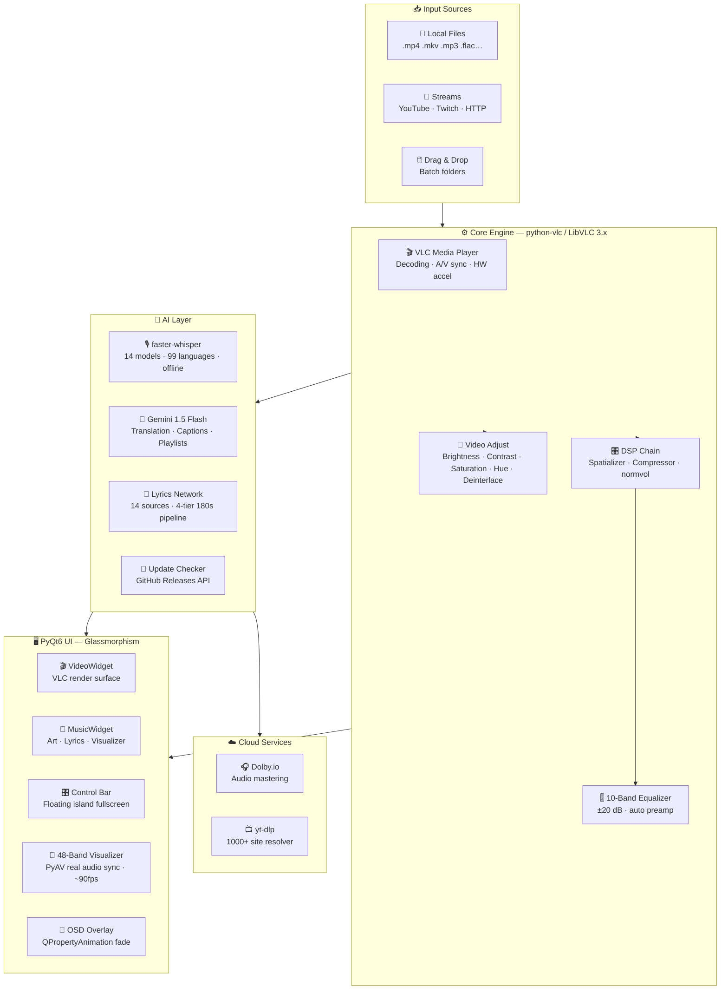

<div align="center">


</div>

<div align="center">

<br/>


<br/><br/>

[](https://github.com/sandytalks/SANDYPLAY/releases/latest)
[](https://github.com/sandytalks/SANDYPLAY/releases)
[](https://python.org)
[](LICENSE)

<br/>

[](https://aistudio.google.com)
[](https://dolby.io)
[](https://videolan.org)
[](https://github.com/yt-dlp/yt-dlp)
[](https://github.com/sandytalks/SANDYPLAY/stargazers)

<br/>

[⚡ Why SandyPlay](#-why-sandyplay) • [✨ Features](#-complete-feature-breakdown) • [🎤 Lyrics Engine](#-lyrics-engine---worlds-1-lyrics-fetching-system) • [🚀 Install](#-installation) • [⌨️ Keybinds](#-keyboard-reference) • [🏗️ Architecture](#-architecture) • [🗺️ Roadmap](#-roadmap)

<br/>

</div>


<br/>

> [!NOTE]
> **SANDYPLAY v1.13** is not just a media player — it is a **complete AI multimedia production studio** for Windows 10/11.
>
> Built on **LibVLC 3.x + PyQt6** with glassmorphism UI, integrating **OpenAI Whisper** (14 models, 99 languages, 100% offline subtitles), **Google Gemini 1.5 Flash** (translation, AI captions, smart playlists), **Dolby.io** (one-click cloud audio mastering), and **PyAV real audio energy extraction** for true-sync visualizer — all **free, open-source, and completely self-contained**.
>
> `14 lyrics sources` · `48-band ~90fps visualizer` · `real audio sync` · `DTS studio simulation` · `NVDEC hardware acceleration` · `live update checker` · **Everything. Free.**

<br/>


<br/>

## 〔 By The Numbers 〕

<div align="center">

| &nbsp;&nbsp;14&nbsp;&nbsp; | &nbsp;&nbsp;48&nbsp;&nbsp; | &nbsp;&nbsp;~90fps&nbsp;&nbsp; | &nbsp;&nbsp;12+&nbsp;&nbsp; | &nbsp;&nbsp;14&nbsp;&nbsp; | &nbsp;&nbsp;10&nbsp;&nbsp; |
|:---:|:---:|:---:|:---:|:---:|:---:|
| **Lyrics Sources** | **Visualizer Bands** | **Visualizer Rate** | **Themes** | **Whisper Models** | **Speaker Modes** |
| Synced · Plain · AI | Real audio sync | 11ms timer | + Unlimited HEX | tiny → large-v3-turbo | Stereo → Spatial 3D |

</div>

<br/>


<br/>

## ⚡ Why SANDYPLAY?

<div align="center">

> No other free, open-source media player comes close to this feature set.

| Feature | ◈ **SANDYPLAY v1.13** | VLC 3.0 | MPC-HC | foobar2000 | Winamp |
|:---|:---:|:---:|:---:|:---:|:---:|
| 🤖 AI Local Subtitle (Whisper, 14 models, offline) | ✅ **NEW** | ❌ | ❌ | ❌ | ❌ |
| ☁️ Cloud Audio Mastering (Dolby.io) | ✅ **NEW** | ❌ | ❌ | ❌ | ❌ |
| 🎤 Synced Lyrics (14+ sources, 4-tier) | ✅ **v1.13 Overhaul** | ❌ | ❌ | ⚠️ plugin | ⚠️ plugin |
| 🌐 Lyrics AI Translation (5 languages, LRC sync) | ✅ **NEW** | ❌ | ❌ | ❌ | ❌ |
| 🧠 Natural Language Command Palette | ✅ | ❌ | ❌ | ❌ | ❌ |
| 🎨 Dynamic Ambient Video Theming | ✅ | ❌ | ❌ | ❌ | ❌ |
| 🌊 Real Audio Sync Visualizer (48-band ~90fps) | ✅ **PyAV-driven** | ❌ | ❌ | ⚠️ plugin | ✅ 14-band |
| 🔊 DTS Studio Simulation (5 modes) | ✅ | ⚠️ basic | ⚠️ basic | ❌ | ❌ |
| 💾 Named Session Snapshots | ✅ Persistent | ❌ | ❌ | ⚠️ playlists | ⚠️ playlists |
| 📡 YouTube / Twitch Streaming | ✅ yt-dlp | ✅ | ❌ | ❌ | ❌ |
| 🎛️ 10-Band Parametric EQ | ✅ ±20dB | ⚠️ basic | ❌ | ✅ | ✅ |
| 🎬 Deinterlacing (7 modes) | ✅ **NEW** | ✅ | ✅ | ❌ | ❌ |
| 🎨 Live Color Controls (brightness/contrast/sat/hue) | ✅ **NEW** | ⚠️ limited | ⚠️ limited | ❌ | ❌ |
| ⚡ Hardware NVDEC / CUDA Decoding | ✅ | ✅ | ✅ | ❌ | ❌ |
| 🔄 Built-in Update Checker | ✅ **GitHub API** | ❌ | ❌ | ❌ | ❌ |
| 🖥️ Glassmorphism UI (12+ themes) | ✅ | ❌ | ❌ | ⚠️ skins | ⚠️ skins |
| 🔖 Bookmarks + A-B Repeat | ✅ Persistent | ✅ | ✅ | ❌ | ❌ |
| 🏷️ AI Metadata Cleaner | ✅ | ❌ | ❌ | ⚠️ plugin | ❌ |
| 📻 FM Radio + SDR Hardware Tuner | ✅ | ❌ | ❌ | ❌ | ❌ |
| 📺 Online TV (IPTV m3u auto-parse) | ✅ | ❌ | ❌ | ❌ | ❌ |

</div>

<br/>


<br/>

## ✨ Complete Feature Breakdown

### 🤖 AI Intelligence Layer

| Module | Details |
|:---|:---|
| **Whisper Engine** | `faster-whisper` · 100% local, offline · 14 models: `tiny` · `tiny.en` · `base` · `base.en` · `small` · `small.en` · `medium` · `medium.en` · `large` · `large-v1` · `large-v2` · `large-v3` · `large-v3-turbo` |
| **Language Detection** | 99 languages with confidence scoring · auto-translates output to English |
| **Subtitle Output** | `.SRT` with word-level timestamps · 500ms VAD silence-gap segmentation · FFmpeg audio pre-extraction for video files |
| **Auto-Generate Mode** | Optional toggle: auto-generate subtitles when playback starts (NEW in v1.13) |
| **Caching System** | Stored to `~/.sandyplay/subtitles/` · instant reload on every replay (no re-run) |
| **Gemini Translation** | auto-detect → EN / TA / HI / TE · LRC-aware (preserves `[mm:ss]` sync timestamps after translation) |
| **Bilingual Lyrics** | Original + translation interleaved line-by-line in real time |
| **Smart Playlists** | Vibe keyword semantic sort — `"chill"` · `"workout"` · `"sad"` |
| **AI Captions** | Local mood-keyword engine (instant) + Gemini AI upgrade in background · 8 mood categories |
| **Command Palette** | Natural language control — `"play next"` · `"smart chill"` · `"louder"` · `"bilingual lyrics"` |
| **Metadata Cleaner** | Strips `[Official Video]`, `(Lyrics)`, year tags, site watermarks from title/artist |
| **Update Checker** | GitHub Releases API · styled animated dialog · one-click download (NEW in v1.13) |

### 🎧 Studio-Grade Audio Engine

| Module | Details |
|:---|:---|
| **Dolby.io Mastering** | OAuth2 auth · `dlb://` upload protocol · Dolby Enhance API (de-noise + master + normalize) · auto-inserted into queue after processing (NEW) |
| **DTS 🎵 Music Mode** | `normvol DSP` + Pop EQ curve → warm, balanced listening |
| **DTS 🎬 Movie Mode** | spatializer + compressor + cinema EQ → wide soundstage, punchy dialogue |
| **DTS 🎮 Game Mode** | headphone 3D + compressor + air EQ → directional gaming audio |
| **DTS ⚙️ Custom Mode** | Manual DSP toggle per individual filter |
| **DTS Session Persist** | Mode stores and restores across app restarts |
| **10-Band EQ** | 60 · 170 · 310 · 600 · 1k · 3k · 6k · 12k · 14k · 16k Hz · range ±20 dB · auto-preamp safety |
| **EQ Presets** | Flat / Bass Boost / Treble Boost / Vocal Clarity / Rock / Pop |
| **Surround Modes** | Stereo / Reverse / Left-Mono / Right-Mono / 2.1 / Dolby Surround / 5.1 / 7.1 / Spatial 3D / Studio HiFi |
| **Speed Control** | 0.25× – 4.0× pitch-locked via SoX · real-time, no artifacts |
| **Audio Sync** | Live ±5000ms delay slider (NEW) |

### 🌊 Visualizer & Glassmorphism UI

| Module | Details |
|:---|:---|
| **Real Audio Sync** | `AudioEnergyExtractor` thread via **PyAV** · reads actual RMS energy per frame · drives kick/snare/hihat zones (NEW in v1.13) |
| **Math Fallback** | If PyAV unavailable: BPM-matched sine-wave physics (90–140 BPM per song hash) |
| **Visualizer Rate** | 11ms tick (~90 fps) · `Qt.TimerType.PreciseTimer` on Windows (IMPROVED v1.13) |
| **Bar Physics** | attack 75% · decay 18% per frame · ±0.04 organic noise floor · floating peak dots |
| **12 Built-in Themes** | Sky Blue · Purple Haze · Sunset Orange · Emerald · Crimson · Golden Glow · Hot Pink · Deep Indigo · Teal Surge · Ocean Cyan · Copper · Moonlight |
| **Ambient Theming** | Fires 2.5s after video load · `snapshot(128×72)` → HSL boost (sat+0.5, L clamp) → apply as accent |
| **Custom SeekSlider** | Custom QPainter · grows on hover · hover tooltip shows HH:MM:SS · accent-colored fill |
| **Fullscreen Island** | Floating control bar · 2.5s auto-hide · 1200px max-width · frosted glass style |
| **OSD Animations** | `QPropertyAnimation` fade-in/out · centered overlay |
| **Session Manager** | Auto-save every 2 min · named JSON snapshots · unlimited · MD5 dedupe · HTML export |
| **Video Controls** | Zoom 0.5×→3.0× · Crop modes · HDR simulation · Deinterlace (7 modes, NEW) · live color adjust (NEW) |

### 🎬 Playback & Streaming

| Module | Details |
|:---|:---|
| **Media Core** | LibVLC 3.x / python-vlc · NVDEC hardware decode · FFmpeg CPU fallback · SoX resampler |
| **Video Color Controls** | Live brightness / contrast / saturation / hue · toggle-able color controls (NEW in v1.13) |
| **Deinterlacing** | Disable · Blend · Bob · Yadif · Yadif (2x) · Linear · Mean · X (NEW in v1.13) |
| **Caching** | file 1000ms · network 1500ms · live 1500ms · mux 800ms |
| **Streaming** | yt-dlp resolver · YouTube / Twitch / SoundCloud / 1000+ sites · playlist auto-expand |
| **A-B Repeat** | Set in/out points live · visual button state (yellow A → cyan A-B → reset) |
| **Frame Step** | Step-by-step in paused mode |
| **Bookmarks** | Up to 40 per file · sorted · persisted in `config.json` across restarts (NEW) |
| **Seek** | ±10s / ±30s (Alt) · click-to-seek slider · hover tooltip HH:MM:SS |
| **Track Control** | Cycle audio tracks (X) · cycle subtitle tracks (Z) · load external .srt/.ass/.vtt/.sub |
| **Sync Sliders** | Audio delay ±5000ms · subtitle delay ±5000ms · live |

### 📻 FM Radio & Online TV

| Module | Details |
|:---|:---|
| **FM Radio Studio** | 200+ pre-tuned stations · category browser (Classical, Electronic, K-Pop, English, etc.) |
| **Hardware SDR Tuner** | RTL-SDR integration · live frequency tuning (87.5–108.0 MHz) · FM WBFM mode |
| **Radio Favorites** | Save/load favorite stations · persistent JSON storage |
| **Online TV (IPTV)** | Auto-fetches `iptv-org/iptv` index · parse by Genre / Language / Region |
| **TV Favorites** | Bookmark favorite channels · 1-click playback |
| **Background Loading** | Live IPTV parsing in background thread (no UI freeze) |

<br/>


<br/>

## 🎤 Lyrics Engine - World's #1 Lyrics Fetching System

<div align="center">

> A **4-tier parallel fetch pipeline** — 14 live sources, all deadlines raised to 180s (v1.13 enhancement), smart disk caching, sidecar support, and guaranteed AI fallback.

</div>

### Tier Architecture

```
TRACK STARTS
    ↓
📂 Disk Cache Hit?
    ├─✅ Instant display → DONE
    └─❌ Miss ↓
    
📄 Sidecar .lrc / .txt?
    ├─✅ Found → Cache & display → DONE
    └─❌ None ↓

⚡ TIER 1: Synced LRC (180s parallel, NEW deadline in v1.13)
    Sources: LRCLib · Kugou · NetEase · Textyl · Megalobiz
    ├─✅ Found → Cache & display → DONE
    └─❌ All timeout ↓

🤖 TIER 2: Gemini AI (Instant fallback)
    ├─✅ Found → Cache & display → DONE
    └─❌ No key / failed ↓

📝 TIER 3: Plain Lyrics (180s parallel)
    Sources: JioSaavn · Gaana · Vagalume · Lyrics.ovh · Lyrist · Musixmatch · AZLyrics (NEW) · SongLyrics · ChartLyrics · Happi.dev
    ├─✅ Found → Cache & display → DONE
    └─❌ All timeout ↓

🔍 TIER 4: Loose Fallback (60s)
    LRCLib no-artist search + AI final attempt
    ├─✅ Found → Cache & display → DONE
    └─❌ Not found → Cache "fail" (30s TTL)

💾 All cached for instant replay (no re-fetch)
```

### Source Breakdown

<div align="center">

| # | Source | Type | Coverage | Method | Speed | NEW? |
|:---:|:---|:---:|:---|:---:|:---:|:---:|
| ① | **LRCLib** | Synced | Global, growing | REST API | Fast | — |
| ② | **Kugou** | Synced | 50M+ Asian | base64 decode | Med | — |
| ③ | **NetEase** | Synced | Chinese catalog | JSON API | Fast | — |
| ④ | **Textyl** | Synced | English-heavy | REST API | Fast | — |
| ⑤ | **Megalobiz** | Synced | Intl repo | HTML scrape | Slow | — |
| ⑥ | **JioSaavn** | Plain | India TA/HI/TE/ML | REST chain | Med | — |
| ⑦ | **Gaana** | Plain | Bollywood + South | HTML + JSON | Slow | NEW! |
| ⑧ | **Vagalume** | Plain | Portuguese + Intl | REST API | Fast | — |
| ⑨ | **Lyrics.ovh** | Plain | Global | REST API | Fast | — |
| ⑩ | **Lyrist** | Plain | Global, no key | REST API | Fast | NEW! |
| ⑪ | **Musixmatch** | Plain | Largest catalog | HTML scrape | Slow | — |
| ⑫ | **AZLyrics** | Plain | English catalog | HTML scrape | Slow | NEW! |
| ⑬ | **SongLyrics** | Plain | Indian + Intl | HTML scrape | Slow | — |
| ⑭ | **ChartLyrics** | Plain | XML feed | REST API | Fast | — |
| ⑮ | **Happi.dev** | Plain | Community | REST API | Med | — |
| 🤖 | **Gemini AI** | Fallback | Anything Gemini knows | LLM prompt | Instant | — |

</div>

### NEW in v1.13

- ✅ Tier deadlines raised from `8s/12s → 180s` per tier (eliminates timeout failures on slow connections)
- ✅ `wait()` API fix: now receives `list(remaining.keys())` (was mutation-during-iteration race)
- ✅ Added **Gaana** (Bollywood + South Indian), **Lyrist** (free REST), **AZLyrics** (large English catalog)
- ✅ `_is_title_match` fuzzy threshold relaxed `0.82 → 0.72` (catches more variants)
- ✅ `saavn.dev` now handles both dict and list response schemas
- ✅ Fail-cache TTL raised `10s → 30s` (reduced re-fetch spam on unavailable songs)

<br/>


<br/>

## 📸 Visual Showcase

<div align="center">


**🎬 Video Mode** — Floating island control bar · Whisper AI subtitle overlay · Ambient color extraction · HDR simulation · Live color/deinterlace controls


<br/>


**🎵 Music Mode** — Real-time synced LRC lyrics · 48-band ~90fps PyAV-synced visualizer · Album artwork · Bilingual translation panel


</div>

<br/>


<br/>

## 🆕 What's New in v1.13

<details>
<summary><b>📋 Click to expand full changelog</b></summary>

<br/>

### 🔴 Critical Fixes
- Fixed `_is_video_mode` not initialized in `__init__` → caused progress bar, time display, and auto-advance to silently break
- Added `getattr` guards in `update_ui` for belt-and-suspenders safety
- Fixed `wait(FIRST_COMPLETED)` only imported inside function → moved to top-level import
- Fixed `saavn.dev` response schema handling (now supports both dict and list)

### 🟠 Lyrics Engine Overhaul (4-Tier System)
- Completely rewrote `_run_fetch_chain` into true **4-tier parallel fetch pipeline**:
  1. **Synced LRC** (Tier 1) — LRCLib · Kugou · NetEase · Textyl · Megalobiz
  2. **Gemini AI** (Tier 2) — Instant fallback if available
  3. **Plain Lyrics** (Tier 3) — JioSaavn · Gaana · Vagalume · Musixmatch · AZLyrics · SongLyrics · ChartLyrics · Happi.dev
  4. **Loose Fallback** (Tier 4) — LRCLib no-artist + AI final attempt
- All fetch deadlines raised from `8s/12s → 180s` per tier (no more timeout failures on slow connections)
- `wait(FIRST_COMPLETED)` now receives `list(remaining.keys())` (eliminated mutation-during-iteration race)
- Fail-cache TTL raised `10s → 30s` (reduced re-fetch spam)
- `_is_title_match` fuzzy threshold relaxed `0.82 → 0.72` (catches more variant titles)
- Added 3 new sources: **Gaana** (Bollywood), **Lyrist** (free REST), **AZLyrics** (large English catalog)

### 🟡 Visualizer Overhaul — Real Audio Sync
- Added `AudioEnergyExtractor` background thread via **PyAV** — reads actual RMS energy per audio frame
- Visualizer now driven by real kick/snare/hihat energy zones from the actual audio signal
- Timer interval reduced `33ms → 11ms` (~90 fps) with `Qt.TimerType.PreciseTimer` for smooth Windows rendering
- Math fallback mode retained when PyAV is unavailable

### 🟢 UI Enhancements
- **Live Update Checker** — GitHub Releases API with animated styled dialog + one-click download
- **Auto Whisper Generate** — toggle to automatically generate subtitles when playback starts
- **Video Color Controls** — live brightness / contrast / saturation / hue with toggle enable/disable (NEW)
- **Deinterlacing Menu** — 7 modes (Disable · Blend · Bob · Yadif · Yadif 2x · Linear · Mean · X)
- Dedicated **Dolby Studio** tab in Control Panel with auth + one-click mastering
- **DTS Mode Persistence** — stores across sessions via `config.json`
- **Bookmarks Persistence** — now persist in `config.json` across app restarts
- Reduced `_run_tier()` helper code by ~60 lines
- About dialog includes **Check for Updates** button
- **FM Radio Studio** — 200+ pre-tuned stations, hardware SDR integration, favorites
- **Online TV (IPTV)** — Auto-fetch IPTV m3u, parse by Genre/Language/Region

### ✨ Performance Optimizations
- Reduced 4-tier fetch code duplication with helper function
- Optimized `_http_get` cache eviction (cap 200 entries)
- Improved thread pool worker timeout handling
- Better FFmpeg audio extraction error recovery

</details>

<br/>


<br/>

## 🚀 Installation

<div align="center">

### ⬇️ Download and read the Steps Before Installation

[](https://github.com/sandytalks/SANDYPLAY/releases/download/Sandyplay/SandyPlay_Setup_v1.13.exe)

</div>

<br/>

> **Step 1 — 📥 Download** → Click the button above to download `SandyPlay_Setup_v1.13.exe`

> **Step 2 — 🛠️ Install** → Windows may show SmartScreen warning. Click **More Info → Run Anyway** (100% safe). Installer auto-configures:
> - VLC 3.x Engine + plugins
> - Visual C++ runtimes
> - Start Menu + Desktop shortcuts
> - `~/.sandyplay/` user directory

> **Step 3 — 🚀 Launch** → Open SANDYPLAY from Desktop shortcut or Start Menu

> **Step 4 — 🎵 Load Media** → 
> - Drag & drop files/folders
> - `Ctrl+O` open file
> - `Ctrl+D` open folder
> - `Ctrl+U` stream URL (YouTube, Twitch, etc.)

> **Step 5 — 🤖 AI Setup** →
> - First Whisper use downloads model once (~1.5 GB for `medium`)
> - 100% offline after that
> - For real audio sync visualizer: `pip install av`
> - For Gemini translation: get free API key from [Google AI Studio](https://aistudio.google.com)

<br/>

### System Requirements

<div align="center">

| Component | Minimum | Recommended |
|:---|:---|:---|
| **OS** | Windows 10 64-bit | Windows 11 64-bit |
| **CPU** | Dual-core 2 GHz | Quad-core 3+ GHz |
| **RAM** | 4 GB | 8 GB+ |
| **GPU** | Integrated graphics | NVIDIA GTX 1060+ (NVDEC) |
| **Storage** | 500 MB | 3 GB+ (with Whisper models) |
| **Network** | Optional | For Dolby.io / Gemini / Lyrics |
| **Optional** | — | `pip install av` for real audio sync visualizer |

</div>

<br/>

> [!TIP]
> **AI First-run:** `faster-whisper` downloads the Whisper model once. After that — **fully offline, instant replay from cache**. You can also enable **auto-generate** so subtitles are created whenever playback starts.

> [!IMPORTANT]
> **Supported Formats:** 
> - **Video:** `MP4 · MKV · AVI · MOV · WMV · WebM · FLV · M4V · MPEG · TS · VOB · 3GP`
> - **Audio:** `MP3 · FLAC · WAV · AAC · M4A · OGG · WMA · OPUS · AC3 · EAC3 · THD · ALAC`
> - If LibVLC decodes it, SANDYPLAY plays it.

<br/>


<br/>

## ⌨️ Keyboard Reference

<div align="center">

### 🎬 Playback

| Key | Action | Key | Action |
|:---:|:---|:---:|:---|
| `Space` | Play / Pause | `S` | Stop |
| `N` | Next Track | `B` | Previous Track |
| `→` | Seek +10s | `←` | Seek −10s |
| `Alt+→` | Seek +30s | `Alt+←` | Seek −30s |
| `↑` | Volume +5% | `↓` | Volume −5% |
| `M` | Mute / Unmute | `E` | Frame Step |
| `]` | Speed +0.1× | `[` | Speed −0.1× |
| `L` | Toggle Loop | `Shift+S` | Toggle Shuffle |

### 🖥️ View & Display

| Key | Action | Key | Action |
|:---:|:---|:---:|:---|
| `F` / `Enter` | Toggle Fullscreen | `Ctrl+Enter` | Stretch Fullscreen |
| `Esc` | Exit Fullscreen | `P` | Toggle Playlist |
| `V` | Toggle Visualizer | `C` | Cycle Crop Mode |
| `F5` | Effects & EQ Panel | `F6` | Playlist Panel |

### 🤖 AI & Lyrics

| Key | Action | Key | Action |
|:---:|:---|:---:|:---|
| `Ctrl+L` | Toggle Lyrics Panel | `Ctrl+T` | Toggle Whisper CC |
| `G` | Lyrics offset −0.3s | `H` | Lyrics offset +0.3s |
| `X` | Cycle Audio Track | `Z` | Cycle Subtitle Track |

### 💾 Session Tools

| Key | Action | Key | Action |
|:---:|:---|:---:|:---|
| `Ctrl+Alt+F` | Toggle Favorite | `Ctrl+Alt+R` | Restore Last Queue |
| `Ctrl+Alt+S` | Save Snapshot | `Ctrl+Alt+P` | Resume Session |
| `Ctrl+Alt+D` | Remove Duplicates | `Ctrl+Alt+E` | Export Queue HTML |
| `?` | Show All Shortcuts | `F1` | About / Update Check |

</div>

<br/>


<br/>

## 🏗️ Architecture



<br/>


<br/>

## 🛠️ Tech Stack

<div align="center">

| Component | Technology | Version | Purpose |
|:---|:---|:---:|:---|
| 🖥️ **GUI Framework** | PyQt6 | 6.x | Glassmorphism UI, animations, OSD |
| 🎬 **Media Engine** | python-vlc / LibVLC | 3.x | Decoding, playback, HW acceleration |
| 🎵 **Audio Analysis** | PyAV (`av`) | latest | Real audio energy extraction for visualizer |
| 🤖 **AI Subtitles** | faster-whisper | latest | Local STT · 14 models · offline |
| 🧠 **LLM Engine** | Google Gemini 1.5 Flash | API | Translation, captions, smart tools |
| ☁️ **Cloud Audio** | Dolby.io REST API | v1 | De-noise, master, normalize |
| 🎤 **Lyrics** | 14 sources (LRCLib, Kugou, JioSaavn, Gaana, Lyrist, etc.) | mixed | 4-tier parallel pipeline |
| 📡 **Streaming** | yt-dlp | latest | YouTube, Twitch, SoundCloud + 1000+ sites |
| 🏷️ **Tag Reading** | mutagen | latest | ID3 / MP4 / FLAC metadata + artwork |
| 🔉 **Resampler** | SoX (via VLC) | — | Highest-quality pitch-locked audio |
| 📊 **Fuzzy Match** | difflib | stdlib | Title similarity for lyrics matching |
| 🔄 **Update Check** | GitHub Releases API | — | Live version check with one-click download |

</div>

<br/>


<br/>

## 🗺️ Roadmap

| Status | Feature | Target |
|:---:|:---|:---:|
| ✅ Done | 4-tier parallel lyrics fetch with Gemini AI as 2nd tier | v1.13 |
| ✅ Done | Dolby.io one-click cloud audio mastering | v1.13 |
| ✅ Done | Real audio sync visualizer via PyAV energy extraction | v1.13 |
| ✅ Done | ~90fps visualizer with PreciseTimer | v1.13 |
| ✅ Done | Live update checker with GitHub API | v1.13 |
| ✅ Done | Video color controls (brightness/contrast/saturation/hue) | v1.13 |
| ✅ Done | Deinterlacing (7 modes) | v1.13 |
| ✅ Done | Whisper AI auto-generate toggle | v1.13 |
| ✅ Done | FM Radio + SDR Hardware Tuner | v1.13 |
| ✅ Done | Online TV (IPTV m3u auto-parse) | v1.13 |
| 🔄 In Progress | Lyrics contributor mode — submit user corrections | v1.14 |
| 🔄 In Progress | Apple Music / Spotify album artwork fetch | v1.14 |
| 📋 Planned | Linux (Ubuntu / Debian) native build | v1.15 |
| 📋 Planned | Podcast mode with chapter markers | v1.15 |
| 📋 Planned | Watch Party — synchronized LAN playback | v1.16 |
| 💡 Idea | Discord Rich Presence — Show "Now Playing" on profile | TBD |
| 💡 Idea | Cloud Sync for settings, queues & playlists | TBD |
| 💡 Idea | Custom CSS / JSON Theme Engine | TBD |
| 💡 Idea | Gemini-powered "DJ Mode" auto-playlist | TBD |
| 💡 Idea | macOS support | TBD |
| 💡 Idea | Mobile companion app (Android) | TBD |

<br/>


<br/>

## ❓ FAQ

<details>
<summary><b>Do I need a GPU?</b></summary>
<br/>
No. SANDYPLAY works perfectly on CPU-only. An NVIDIA GPU unlocks NVDEC hardware acceleration (toggle with the <code>HW</code> button) for smoother 4K and lower CPU usage — completely optional.
</details>

<details>
<summary><b>Does the visualizer need PyAV?</b></summary>
<br/>
No — PyAV is optional. Without it, the visualizer uses a high-quality BPM-matched math engine (sine waves with beat physics). With <code>pip install av</code>, it upgrades to <strong>real audio energy extraction</strong> — the bars are driven by the actual audio signal of the current track.
</details>

<details>
<summary><b>Does Whisper AI work offline?</b></summary>
<br/>
Yes, 100%. After the one-time model download (tiny ~75 MB · medium ~1.5 GB · large-v3 ~3 GB), Whisper runs entirely locally — no internet required. Subtitles are cached and load instantly on replay. You can also enable <strong>auto-generate</strong> so subtitles are created whenever playback starts.
</details>

<details>
<summary><b>What API keys do I need?</b></summary>
<br/>

| Feature | Key Required | Free? |
|:---|:---|:---:|
| Core playback, EQ, DTS, Lyrics | None | ✅ |
| Whisper AI subtitles | None | ✅ |
| Real audio sync visualizer | None (`pip install av`) | ✅ |
| Update checker | None | ✅ |
| Gemini translation & captions | Google AI Studio key | ✅ |
| Dolby.io cloud mastering | Dolby App Key + Secret | ✅ free tier |

</details>

<details>
<summary><b>Why aren't lyrics showing?</b></summary>
<br/>

1. **Check the status bar** — it shows which tier is being searched live
2. **Manual Search** → `Misc → Search Lyrics Manually` — clean the title (remove "Official Video", remix tags, etc.)
3. **Paste manually** → `Misc → Paste Lyrics Text` — supports plain text and LRC format
4. **Indian music** — JioSaavn and Gaana (Tier 3) have the best TA/HI/TE/ML coverage
5. **Gemini fallback** — if all sources fail, Tier 2 (Gemini AI) tries automatically if you have an API key
</details>

<details>
<summary><b>Can I use it as a YouTube / streaming client?</b></summary>
<br/>
Yes! Press <code>Ctrl+U</code>, paste any YouTube, Twitch, SoundCloud, or Dailymotion URL. SANDYPLAY resolves and plays it via <strong>yt-dlp</strong> (1000+ sites). Playlists auto-expand. Streams mix freely with local files.
</details>

<details>
<summary><b>Will there be a Linux or macOS version?</b></summary>
<br/>
Linux (Ubuntu/Debian) is on the v1.15 roadmap. macOS is a future consideration — depends on VLC and PyQt6 support, plus GPU driver differences. Windows 10/11 is the primary supported platform for now.
</details>

<br/>


<br/>

## 🤝 Connect

<div align="center">

**Built from scratch with ❤️ by Santhosh — [Sandytalks](https://www.instagram.com/itsyouhuman/)**

*A solo developer crafting something truly extraordinary.*

<br/>

[](https://www.instagram.com/itsyouhuman/)
[](https://github.com/sandytalks/SANDYPLAY)

<br/><br/>


<br/>

> ⭐ **If SANDYPLAY elevated your listening or viewing experience, a star on GitHub means the world.**
> It helps others discover the project — and keeps the motivation burning for the next version.

<br/>

---


</div>
