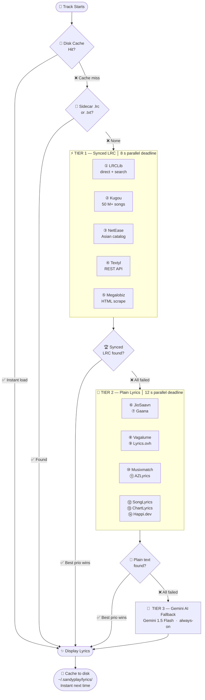

<!-- ╔══════════════════════════════════════════════════════════════╗ -->
<!-- ║                  ANIMATED HEADER BANNER                     ║ -->
<!-- ╚══════════════════════════════════════════════════════════════╝ -->
<div align="center">

</div>

<!-- ══════════════════════  LOGO BLOCK  ══════════════════════════ -->
<br/>
<div align="center">
  
  <br/><br/>

  <!-- Typing animation -->
  

  <br/><br/>

  <!-- ── Badge Row 1 ─────────────────────────────────────── -->
  <a href="https://github.com/itsyouhuman/SandyPlay/releases/latest">
    
  </a>&nbsp;
  <a href="https://github.com/itsyouhuman/SandyPlay/releases">
    
  </a>&nbsp;
  &nbsp;
  &nbsp;
  

  <br/>&nbsp;<br/>

  <!-- ── Badge Row 2 ─────────────────────────────────────── -->
  &nbsp;
  &nbsp;
  &nbsp;
  &nbsp;
  <a href="https://github.com/itsyouhuman/SandyPlay/stargazers">
    
  </a>

  <br/><br/>

  <!-- ── Navigation ────────────────────────────────────────── -->
  <a href="#-why-sandyplay">⚡ Why SandyPlay</a>&emsp;·&emsp;
  <a href="#-complete-feature-breakdown">✨ Features</a>&emsp;·&emsp;
  <a href="#-lyrics-engine-deep-dive">🎤 Lyrics</a>&emsp;·&emsp;
  <a href="#-visual-showcase">📸 Showcase</a>&emsp;·&emsp;
  <a href="#-installation">🚀 Install</a>&emsp;·&emsp;
  <a href="#%EF%B8%8F-full-keyboard-reference">⌨️ Keys</a>&emsp;·&emsp;
  <a href="#%EF%B8%8F-system-architecture">🏗️ Arch</a>&emsp;·&emsp;
  <a href="#-roadmap">🗺️ Roadmap</a>&emsp;·&emsp;
  <a href="#-faq">❓ FAQ</a>&emsp;·&emsp;
  <a href="#-connect">🤝 Connect</a>
</div>

<br/>

---

> [!NOTE]
> **SANDYPLAY v1.13** is not a media player — it is a **complete AI multimedia production studio** for Windows.  
> Built on **LibVLC** for bulletproof decoding and **PyQt6** for silky-smooth glassmorphism UI, it integrates **OpenAI Whisper** (local, offline subtitles), **Google Gemini 1.5 Pro** (lyrics translation, smart playlists, AI captions), and **Dolby.io** (one-click cloud audio mastering) into a single, free, open-source application.  
> **13+ lyrics sources. 48-band visualizer. Dynamic ambient theming. DTS studio simulation. Hardware NVDEC acceleration. Everything. Free.**

<br/>

---

## ⚡ Why SANDYPLAY?

> See exactly how SANDYPLAY stacks up against the competition.

<div align="center">

| Feature | **SANDYPLAY** | VLC 3.0 | MPC-HC | foobar2000 | Winamp |
|:---|:---:|:---:|:---:|:---:|:---:|
| 🤖 AI Local Subtitle (Whisper) | ✅ | ❌ | ❌ | ❌ | ❌ |
| ☁️ Cloud Audio Mastering (Dolby.io) | ✅ | ❌ | ❌ | ❌ | ❌ |
| 🎤 Synced Lyrics (13+ Sources) | ✅ | ❌ | ❌ | ⚠️ plugin | ⚠️ plugin |
| 🌐 Lyrics AI Translation (5 langs) | ✅ | ❌ | ❌ | ❌ | ❌ |
| 🧠 Natural Language Command Palette | ✅ | ❌ | ❌ | ❌ | ❌ |
| 🎨 Dynamic Ambient Video Theming | ✅ | ❌ | ❌ | ❌ | ❌ |
| 🌊 Built-in Audio Visualizer (48-band) | ✅ | ❌ | ❌ | ⚠️ plugin | ✅ 14-band |
| 🔊 DTS / Surround Simulation | ✅ 5 modes | ⚠️ basic | ⚠️ basic | ❌ | ❌ |
| 💾 Named Session Snapshots | ✅ | ❌ | ❌ | ⚠️ playlists | ⚠️ playlists |
| 📡 YouTube / Twitch Streaming | ✅ yt-dlp | ✅ | ❌ | ❌ | ❌ |
| 🎛️ 10-Band Parametric Equalizer | ✅ | ⚠️ basic | ❌ | ✅ | ✅ |
| ⚡ Hardware NVDEC/CUDA Decoding | ✅ | ✅ | ✅ | ❌ | ❌ |
| 🖥️ Glassmorphism UI + Themes | ✅ 12+ | ❌ | ❌ | ⚠️ skins | ⚠️ skins |
| 🔖 Bookmarks + A-B Repeat | ✅ | ✅ | ✅ | ❌ | ❌ |
| 🏷️ AI Metadata Cleaner | ✅ | ❌ | ❌ | ⚠️ plugin | ❌ |

</div>

<br/>

---

## ✨ Complete Feature Breakdown

<table>
<tr>
<td width="50%" valign="top">

### 🤖 AI Intelligence Layer

```yaml
# ═══ WHISPER LOCAL SUBTITLES ═══════════════
Engine      : faster-whisper  (100% local, offline)
Models      : tiny · base · small · medium · large-v3
Auto-detect : 99 languages with confidence score
Output      : .SRT with word-level timestamps
VAD filter  : 500ms silence-gap segmentation
Post-process: auto-translated to English
Storage     : cached to ~/.sandyplay/subtitles/
Reload      : instant on replays (no re-run)

# ═══ GOOGLE GEMINI 1.5 FLASH ═══════════════
Lyrics Translate : auto-detect → EN/TA/HI/TE
LRC-Aware        : preserves [mm:ss] timestamps
                   after translation (synced!)
Bilingual View   : original + translation
                   interleaved line-by-line
Captions         : 2-sentence mood description
                   for video tracks (AI-polish)
Smart Playlists  : vibe keyword semantic sort
                   ("chill", "workout", "sad")
Command Palette  : natural language control
                   "play next" · "add classics"
Metadata Clean   : strip [Official Video] noise
                   from title/artist tags
AI Recommend     : fuzzy + semantic next-track
```

</td>
<td width="50%" valign="top">

### 🎧 Studio-Grade Audio Engine

```yaml
# ═══ DOLBY.IO CLOUD MASTERING ═══════════════
Auth     : OAuth2 App Key + App Secret
Upload   : dlb:// internal protocol
Process  : Dolby Enhance API
           (de-noise + master + normalize)
Output   : high-quality WAV file
Queue    : auto-inserted after current track
Status   : live progress in status bar

# ═══ DTS STUDIO SIMULATION ══════════════════
Music   : normvol DSP  + Pop EQ curve
          → warm, balanced listening
Movies  : spatializer + compressor + cinema EQ
          → wide soundstage, punchy dialogue
Games   : headphone 3D + compressor + air EQ
          → directional sound for gaming
Custom  : manual DSP toggle per filter
Off     : bypass all (pure VLC output)

# ═══ 10-BAND PARAMETRIC EQ ══════════════════
Frequencies : 60 · 170 · 310 · 600 · 1k
              3k · 6k · 12k · 14k · 16k Hz
Range       : ±20 dB per band
Presets     : Flat / Bass Boost / Treble Boost
              Vocal Clarity / Rock / Pop
Preamp      : auto-set to prevent clipping
              (12 − maxBoost dB safety margin)

# ═══ SURROUND & SPATIAL AUDIO ═══════════════
Modes       : Stereo / Reverse / Left-Mono
              Right-Mono / 2.1 / Dolby Surround
              5.1 / 7.1 / Spatial 3D / Studio HiFi
Filters     : spatializer · headphone · compressor
              normvol · (stacked per mode)
Tempo       : 0.25× – 4.0× (pitch-locked via SoX)
Resampler   : SoX (highest quality available)
```

</td>
</tr>
<tr>
<td width="50%" valign="top">

### 🌊 Glassmorphism UI System

```yaml
# ═══ THEMES & AMBIENT COLOR ══════════════════
Built-in  : 12 curated accent colors
  Sky Blue · Purple Haze · Sunset Orange
  Emerald · Crimson · Golden Glow · Hot Pink
  Deep Indigo · Teal Surge · Ocean Cyan
  Copper · Moonlight

Custom    : any HEX via Qt color picker
Ambient   : fires 2.5s after video loads
  Method  : snapshot(128×72) → pixel-sample
            grid → HSL boost (sat+0.5, L clamp)
            → apply as new accent

# ═══ 48-BAND VISUALIZER ══════════════════════
Engine    : custom QPainter, 33ms tick (~30 fps)
Bars      : symmetric mirror, 48 total
Physics   : attack 75% · decay 18% per frame
            + random ±0.04 organic noise
Peaks     : floating indicators, slow fade 0.018/frame
Palette   : accent color + 60-unit brightness boost
Display   : gradient (bright top → dim bottom)
            rounded bars + ellipse peak dots

# ═══ VIDEO CONTROLS ══════════════════════════
Fullscreen  : floating island bar, 2.5s auto-hide
Zoom        : Ctrl+Scroll 0.5× → 3.0×
Crop        : default / 16:9 / 4:3 / 21:9 / 1:1
Aspect      : 7 presets + null (auto)
HDR Sim     : contrast 1.18 / brightness 1.06
              saturation 1.28 / gamma 0.92
Color Adj   : live contrast/brightness/sat/gamma/hue
Screenshot  : Qt dialog → PNG at native res
OSD         : centered overlay, 1-2s fade

# ═══ PLUS SESSION MANAGER ════════════════════
Auto-save   : every 2 min, atomic .tmp → rename
Snapshots   : named JSON, unlimited, timestamped
Restore     : offers queue + seek position on launch
Favorites   : per-track, Ctrl+Alt+F toggle
Recent      : last 35 tracks, played_at timestamp
Duplicates  : MD5-key dedupe, 1-click
Missing     : scan + remove broken file paths
HTML Export : full queue report (status/favorite/path)
Stats       : folder counts, type breakdown
```

</td>
<td width="50%" valign="top">

### 🎬 Playback & Streaming

```yaml
# ═══ MEDIA ENGINE ════════════════════════════
Core        : LibVLC 3.x / python-vlc binding
HW Decode   : NVDEC (NVIDIA) / system "any"
SW Decode   : FFmpeg CPU (always available)
Caching     : file 1000ms · network 1500ms
              live 1500ms · mux 800ms
Resampler   : SoX (force stereo downmix)
Frame drop  : enabled (maintains A/V sync)
Equalizer   : VLC AudioEqualizer API (libvlc)

# ═══ STREAMING SUPPORT ═══════════════════════
Resolver    : yt-dlp  (1000+ supported sites)
  YouTube   : best video+audio combined format
  Twitch    : live stream (RTMP/HLS)
  SoundCloud: audio streams
  Playlists : auto-expand all entries
Direct URLs : HTTP(S) / RTSP / RTMP / MMS / FTP
Stream title: saved for lyrics lookup
Queue       : streams mix freely with local files

# ═══ PLAYBACK FEATURES ═══════════════════════
Loop        : single / off
Shuffle     : true random (randint over playlist)
Speed       : 0.25× – 4.0× with rate API
A-B Repeat  : set in / out points live
Frame Step  : step-by-step (paused mode)
Bookmarks   : per-file, up to 40 marks, sorted
Seek        : ±10s / ±30s (Alt) keyboard
              click-to-seek progress slider
              hover tooltip shows HH:MM:SS

# ═══ AUDIO / SUBTITLE TRACKS ════════════════
Audio cycle : X key — all embedded tracks
Sub cycle   : Z key — all embedded + Whisper
Sub load    : .srt / .ass / .vtt / .sub
Sub delay   : live ±5000ms slider
Audio delay : live ±5000ms slider
Speaker out : 10 channel routing modes
```

</td>
</tr>
</table>

<br/>

---

## 🎤 Lyrics Engine Deep Dive

> SANDYPLAY runs the most advanced open-source lyrics system available — a **3-tier parallel fetch pipeline** with 13 live sources, smart caching, sidecar file support, and an AI fallback.



<br/>

**Source Details:**

| # | Source | Type | Coverage | Method |
|:---:|:---|:---:|:---|:---|
| ① | **LRCLib** | Synced LRC | Global, growing rapidly | Free REST API · direct + search endpoints |
| ② | **Kugou** | Synced LRC | 50M+ songs · strongest Asian coverage | JSON API + base64 LRC decode |
| ③ | **NetEase** | Synced LRC | Chinese + international | JSON API with referer auth |
| ④ | **Textyl** | Synced LRC | English-heavy, fast | Lightweight REST API |
| ⑤ | **Megalobiz** | Synced LRC | International repository | HTML scrape → span extraction |
| ⑥ | **JioSaavn** | Plain | India's top streaming — TA/HI/TE/ML | saavn.dev REST API chain |
| ⑦ | **Gaana** | Plain | Bollywood + South Indian deep catalog | HTML scrape + JSON-LD |
| ⑧ | **Vagalume** | Plain | Portuguese + international | Free REST API |
| ⑨ | **Lyrics.ovh** | Plain | Global, simple English | Free REST API |
| ⑩ | **Musixmatch** | Plain | Largest global catalog | HTML scrape |
| ⑪ | **AZLyrics** | Plain | Extensive English catalog | HTML scrape |
| ⑫ | **SongLyrics** | Plain | Indian + international | HTML scrape |
| ⑬ | **ChartLyrics** | Plain | Free, no key required | XML REST API |
| ⑭ | **Happi.dev** | Plain | Community-driven | REST API (demo key) |
| 🤖 | **Gemini AI** | Plain | Anything Gemini knows | LLM prompt fallback |

<br/>

---

## 📊 By the Numbers

<div align="center">

<table>
<tr>
<td align="center" width="20%">
<h2>14</h2>
<b>Lyrics Sources</b><br/>
<sub>Synced · Plain · AI</sub>
</td>
<td align="center" width="20%">
<h2>48</h2>
<b>Visualizer Bands</b><br/>
<sub>~30 fps real-time</sub>
</td>
<td align="center" width="20%">
<h2>12</h2>
<b>Built-in Themes</b><br/>
<sub>+ unlimited custom HEX</sub>
</td>
<td align="center" width="20%">
<h2>10</h2>
<b>Speaker Modes</b><br/>
<sub>Stereo to Spatial 3D</sub>
</td>
<td align="center" width="20%">
<h2>5+</h2>
<b>AI Languages</b><br/>
<sub>EN · TA · HI · TE · auto</sub>
</td>
</tr>
</table>

</div>

<br/>

---

## 📸 Visual Showcase

<div align="center">


<sub>🎬 <b>Video Mode</b> — Floating island control bar · Whisper AI subtitle overlay · Ambient video color extraction · HDR simulation</sub>

<br/><br/>


<sub>🎵 <b>Music Mode</b> — Real-time synced LRC lyrics · 48-band spectrum visualizer · Album artwork · Bilingual translation panel</sub>

</div>

<br/>

---

## 🆕 What's New in v1.13

<details>
<summary><b>📋 Click to expand full changelog</b></summary>

<br/>

**🔴 Critical Fixes**
- Fixed `_is_video_mode` not initialised in `__init__` → caused progress bar, time display, and auto-advance to silently break on every tick
- Added `getattr` guard in `update_ui` for belt-and-suspenders safety
- Fixed `wait, FIRST_COMPLETED` only imported inside function on every call → moved to top-level module import

**🟠 Lyrics Engine Overhaul**
- Completely rewrote `_run_fetch_chain` — now uses direct `executor.submit(fn, *args)` (zero lambda/closure risk)
- Added `_fetch_lrclib` **direct endpoint** (`/api/get?track_name=…&duration=…`) to Tier 1 — was defined but never called
- `wait()` now receives `list(remaining.keys())` instead of live dict-view — eliminates mutation-during-iteration race
- Fail-cache TTL raised 10 s → 30 s (aggressive 10s blocked legitimate retries)
- Tier 1 deadline extended 6 s → 8 s; Tier 2 deadline 8 s → 12 s

**🟡 Reliability Fixes**
- `_http_get` default timeout raised 3.5 s → 6.0 s (JioSaavn/Gaana regularly need 4–5 s)
- `_is_title_match` fuzzy threshold relaxed 0.82 → 0.72 (language suffixes and minor differences no longer block matches)
- `saavn.dev` now handles both `"data": {…}` (dict) and `"data": [{…}]` (list) response schemas

**✨ New Features**
- Dedicated Dolby Studio tab in Control Panel
- DTS mode now stores and restores across sessions
- Bookmarks persisted in config.json — survive app restarts
- `_run_tier()` helper reduces fetch-chain code by ~60 lines

</details>

<br/>

---

## 🚀 Installation

<div align="center">

### ⬇️ Download the Installer

<a href="https://github.com/sandytalks/SANDYPLAY/releases/download/Sandyplay/SandyPlay_Setup_v1.13.exe">
  
</a>

<br/>
<sub>Windows 10 / 11 &nbsp;·&nbsp; 64-bit &nbsp;·&nbsp; Self-contained installer</sub>

</div>

<br/>


```
Step 1  📥  Download    →  Click the button above

Step 2  🛠️  Install     →  Run SandyPlay_Setup_v1.13.exe
                           The installer auto-configures:
                             • VLC 3 Engine + plugins
                             • Visual C++ runtimes
                             • Start Menu + Desktop shortcuts

Step 3  🚀  Launch      →  Open SANDYPLAY from the Desktop

Step 4  🎵  Load Media  →  Drag & drop files · Ctrl+O · Ctrl+D (folder)

Step 5  🤖  AI Setup    →  go to Misc → AI Tools
                           First Whisper use triggers a one-time model download
```


<br/>

### System Requirements

<div align="center">

| | Minimum | Recommended |
|:---|:---|:---|
| **OS** | Windows 10 64-bit | Windows 11 64-bit |
| **CPU** | Any dual-core 2 GHz | Quad-core 3 GHz+ |
| **RAM** | 4 GB | 8 GB+ |
| **GPU** | Integrated graphics | NVIDIA GTX 1060+ (NVDEC) |
| **Storage** | 500 MB (app) | 3 GB+ (with Whisper models) |
| **Network** | Optional | Required for Dolby.io / Gemini |

</div>

> [!TIP]
> **AI First-time setup:** `faster-whisper` downloads the Whisper model on first use (~1.5 GB for `medium`). After that it runs **100% offline**. For Gemini features a free API key from [Google AI Studio](https://aistudio.google.com) works perfectly.

> [!IMPORTANT]
> Supported formats include: **MP4 · MKV · AVI · MOV · WMV · WebM · FLV · M4V · MPEG · TS · VOB · 3GP · RM** and **MP3 · FLAC · WAV · AAC · M4A · OGG · WMA · OPUS · AC3 · EAC3 · THD · ALAC** — if LibVLC decodes it, SANDYPLAY plays it.

<br/>

---

## ⌨️ Full Keyboard Reference

<div align="center">

### 🎬 Playback Control

| Key | Action | Key | Action |
|:---:|:---|:---:|:---|
| <kbd>Space</kbd> | Play / Pause | <kbd>S</kbd> | Stop |
| <kbd>N</kbd> | Next Track | <kbd>B</kbd> | Previous Track |
| <kbd>→</kbd> | Seek +10 seconds | <kbd>←</kbd> | Seek −10 seconds |
| <kbd>Alt</kbd>+<kbd>→</kbd> | Seek +30 seconds | <kbd>Alt</kbd>+<kbd>←</kbd> | Seek −30 seconds |
| <kbd>↑</kbd> | Volume +5% | <kbd>↓</kbd> | Volume −5% |
| <kbd>M</kbd> | Mute / Unmute | <kbd>E</kbd> | Frame Step |
| <kbd>]</kbd> | Speed +0.1× | <kbd>[</kbd> | Speed −0.1× |
| <kbd>L</kbd> | Toggle Loop | <kbd>Shift</kbd>+<kbd>S</kbd> | Toggle Shuffle |

### 🖥️ View & Display

| Key | Action | Key | Action |
|:---:|:---|:---:|:---|
| <kbd>F</kbd> / <kbd>Enter</kbd> | Toggle Fullscreen | <kbd>Ctrl</kbd>+<kbd>Enter</kbd> | Stretch Fullscreen |
| <kbd>Esc</kbd> | Exit Fullscreen | <kbd>P</kbd> | Toggle Playlist Sidebar |
| <kbd>V</kbd> | Toggle Visualizer | <kbd>C</kbd> | Cycle Crop Mode |
| <kbd>F5</kbd> | Effects & EQ Panel | <kbd>F6</kbd> | Playlist Panel |

### 🤖 AI & Lyrics

| Key | Action | Key | Action |
|:---:|:---|:---:|:---|
| <kbd>Ctrl</kbd>+<kbd>L</kbd> | Toggle Lyrics Panel | <kbd>Ctrl</kbd>+<kbd>T</kbd> | Translate Lyrics → EN |
| <kbd>G</kbd> | Lyrics offset −0.3 s | <kbd>H</kbd> | Lyrics offset +0.3 s |
| <kbd>X</kbd> | Cycle Audio Track | <kbd>Z</kbd> | Cycle Subtitle Track |

### 💼 Plus Tools

| Key | Action | Key | Action |
|:---:|:---|:---:|:---|
| <kbd>Ctrl</kbd>+<kbd>Alt</kbd>+<kbd>F</kbd> | Toggle Favorite | <kbd>Ctrl</kbd>+<kbd>Alt</kbd>+<kbd>R</kbd> | Restore Last Queue |
| <kbd>Ctrl</kbd>+<kbd>Alt</kbd>+<kbd>S</kbd> | Save Snapshot | <kbd>Ctrl</kbd>+<kbd>Alt</kbd>+<kbd>P</kbd> | Resume Last Session |
| <kbd>Ctrl</kbd>+<kbd>Alt</kbd>+<kbd>D</kbd> | Remove Duplicates | <kbd>Ctrl</kbd>+<kbd>Alt</kbd>+<kbd>E</kbd> | Export Queue HTML |
| <kbd>?</kbd> | Show all shortcuts | <kbd>F1</kbd> | About dialog |

</div>

<br/>

---

## 🏗️ System Architecture


<br/>

---

## 🛠️ Tech Stack

<div align="center">

</div>

<br/>

<div align="center">

| Component | Technology | Version | Purpose |
|:---|:---|:---:|:---|
| 🖥️ **GUI Framework** | PyQt6 | 6.x | Glassmorphism UI, animations, painting |
| 🎬 **Media Engine** | python-vlc / LibVLC | 3.x | Decoding, playback, HW acceleration |
| 🤖 **AI Subtitles** | faster-whisper | latest | Local on-device speech-to-text |
| 🧠 **LLM Engine** | Google Gemini 1.5 Flash | API | Translation, captions, AI tools |
| ☁️ **Cloud Audio** | Dolby.io REST API | v1 | Professional audio mastering |
| 🎵 **Lyrics #1** | LRCLib | API | Synced LRC — primary global source |
| 🎵 **Lyrics #2** | Kugou | API | Synced LRC — 50M+ Asian catalog |
| 🎵 **Lyrics #3** | JioSaavn (saavn.dev) | API | Plain — India's largest catalog |
| 📡 **Streaming** | yt-dlp | latest | YouTube, Twitch, SoundCloud + 1000 |
| 🏷️ **Tag Reading** | mutagen | latest | ID3/MP4/FLAC metadata + artwork |
| 🔉 **Resampler** | SoX (via VLC) | — | Highest-quality audio processing |
| 📊 **Fuzzy Match** | difflib | stdlib | Title similarity for lyrics matching |

</div>

<br/>

---

## 🗺️ Roadmap

<details>
<summary><b>🔮 Click to see what's coming</b></summary>

<br/>

| Status | Feature | Version |
|:---:|:---|:---:|
| ✅ Done | 3-tier parallel lyrics fetch with AI fallback | v1.13 |
| ✅ Done | Dolby.io cloud mastering integration | v1.13 |
| ✅ Done | Whisper AI local subtitle generation | v1.12 |
| ✅ Done | DTS Studio simulation (Music/Movies/Games) | v1.12 |
| 🔄 In Progress | Lyrics contributor mode — submit corrections | v1.14 |
| 🔄 In Progress | Apple Music / Spotify artwork fetch | v1.14 |
| 📋 Planned | Linux (Ubuntu/Debian) native build | v1.15 |
| 📋 Planned | Podcast mode with chapter markers | v1.15 |
| 📋 Planned | Watch Party — sync playback over LAN | v1.16 |
| 💡 Idea | macOS support | TBD |
| 💡 Idea | Mobile companion app (Android) | TBD |
| 💡 Idea | Gemini-powered "DJ mode" auto-playlist | TBD |

</details>

<br/>

---

## ❓ FAQ

<details>
<summary><b>❓ Do I need a GPU to use SANDYPLAY?</b></summary>

No — SANDYPLAY works perfectly with CPU-only decoding. An **NVIDIA GPU** unlocks hardware NVDEC acceleration (toggle with the `HW` button) for smoother 4K playback and reduced CPU load, but it's completely optional.

</details>

<details>
<summary><b>❓ Does Whisper AI work offline?</b></summary>

Yes. After the **one-time model download** (~1.5 GB for the `medium` model), Whisper runs 100% locally on your machine with **no internet required**. Generated subtitles are cached so they load instantly on replay.

</details>

<details>
<summary><b>❓ What API keys do I need?</b></summary>

| Feature | Key Required | Free? |
|:---|:---|:---:|
| Core playback, EQ, DTS | None | ✅ |
| Lyrics fetching (all 14 sources) | None | ✅ |
| Whisper subtitles | None | ✅ |
| Gemini AI translation & captions | Google AI Studio key | ✅ |
| Dolby.io cloud mastering | Dolby App Key + Secret | ✅ free tier |

</details>

<details>
<summary><b>❓ Why aren't lyrics showing for my track?</b></summary>

1. **Check the status bar** — it shows which tier is being searched
2. **Try Manual Search** → Misc → Search Lyrics Manually → clean the title (remove "Official Video", "Remix", etc.)
3. **Paste manually** → Misc → Paste Lyrics Text — supports both plain text and LRC format
4. **For Indian music** — JioSaavn and Gaana have the best Tamil/Hindi/Telugu coverage; they're Tier 2 so they run if Tier 1 synced sources miss

</details>

<details>
<summary><b>❓ Can I use SANDYPLAY as a YouTube / streaming client?</b></summary>

Yes! Press `Ctrl+U`, paste any YouTube, Twitch, SoundCloud, or Dailymotion URL, and SANDYPLAY resolves and plays it via **yt-dlp**. Playlists are auto-expanded. Streams mix freely with local files in your queue.

</details>

<br/>

---

## 🤝 Connect

<div align="center">

Built from the ground up with ❤️ by **Sandytalks** (Santhosh)

<br/>

<a href="https://www.instagram.com/itsyouhuman/">
  
</a>&emsp;
<a href="https://github.com/itsyouhuman/SandyPlay">
  
</a>&emsp;
<a href="https://github.com/sandytalks/SANDYPLAY/releases/download/Sandyplay/SandyPlay_Setup_v1.13.exe">
  
</a>

<br/><br/>

<!-- Star History chart -->
<picture>
  <source media="(prefers-color-scheme: dark)"
    srcset="https://api.star-history.com/svg?repos=itsyouhuman/SandyPlay&type=Date&theme=dark"/>
  <source media="(prefers-color-scheme: light)"
    srcset="https://api.star-history.com/svg?repos=itsyouhuman/SandyPlay&type=Date"/>
  
</picture>

<br/><br/>


<br/>

**⭐ If SANDYPLAY elevated your listening or viewing experience, a star on GitHub means the world.**  
*It helps more people discover the project — and keeps me motivated to build even more incredible features.*

<br/>

</div>

<!-- ══════════════════════  FOOTER WAVE  ══════════════════════════ -->

ENDOFFILE

