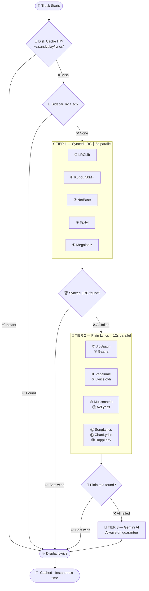
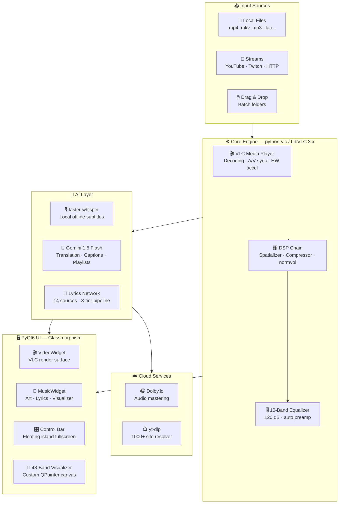

<div align="center">


</div>

<br/>

<div align="center">


</div>

<br/>

<div align="center">

<!-- ── VERSION & PLATFORM ── -->
[](https://github.com/itsyouhuman/SandyPlay/releases/latest)
[](https://github.com/itsyouhuman/SandyPlay/releases)
[](https://python.org)
[](LICENSE)

</div>

<div align="center">

<!-- ── TECH & POWER ── -->
[](https://aistudio.google.com)
[](https://dolby.io)
[](https://videolan.org)
[](https://github.com/yt-dlp/yt-dlp)
[](https://github.com/itsyouhuman/SandyPlay/stargazers)

</div>

<br/>

<div align="center">

[⚡ Why SandyPlay](#-why-sandyplay) &nbsp;·&nbsp;
[✨ Features](#-complete-feature-breakdown) &nbsp;·&nbsp;
[🎤 Lyrics Engine](#-lyrics-engine) &nbsp;·&nbsp;
[📸 Showcase](#-visual-showcase) &nbsp;·&nbsp;
[🚀 Install](#-installation) &nbsp;·&nbsp;
[⌨️ Keybinds](#-keyboard-reference) &nbsp;·&nbsp;
[🏗️ Architecture](#-architecture) &nbsp;·&nbsp;
[🗺️ Roadmap](#-roadmap) &nbsp;·&nbsp;
[❓ FAQ](#-faq) &nbsp;·&nbsp;
[🤝 Contributing](#-contributing)

</div>

<br/>


<br/>

> [!NOTE]
> **SANDYPLAY v1.13** is not just a media player — it is a **complete AI multimedia production studio** for Windows, built by a solo developer from scratch.
> Powered by **LibVLC** + **PyQt6** glassmorphism, integrating **OpenAI Whisper** (offline subtitles), **Gemini 1.5 Flash** (translation, playlists, captions), and **Dolby.io** (one-click cloud mastering).
>
> **Everything you see here is free, open-source, and self-contained.**
> `14 lyrics sources` · `48-band visualizer` · `dynamic ambient theming` · `DTS studio simulation` · `NVDEC hardware acceleration`

<br/>


<br/>

## 〔 Studio-Grade. Zero Cost. 〕

<div align="center">

```
 ╔══════════════╦═══════════════╦════════════════╦═══════════════╦═══════════════╗
 ║      14      ║      48       ║      12+       ║      10       ║      5+       ║
 ║ Lyrics Srcs  ║ Visualizer    ║ Built-in       ║ Speaker       ║ AI Languages  ║
 ║              ║ Bands         ║ Themes         ║ Modes         ║               ║
 ║ Synced · AI  ║ ~30fps Live   ║ + Unlimited    ║ Stereo→3D     ║ EN·TA·HI·TE   ║
 ╚══════════════╩═══════════════╩════════════════╩═══════════════╩═══════════════╝
```

</div>

<br/>


<br/>

## ⚡ Why SANDYPLAY?

<div align="center">

> **No other free, open-source media player even comes close.**

</div>

<br/>

| Feature | ◈ **SANDYPLAY** | VLC 3.0 | MPC-HC | foobar2000 | Winamp |
|:---|:---:|:---:|:---:|:---:|:---:|
| 🤖 AI Local Subtitle (Whisper, offline) | ✅ | ❌ | ❌ | ❌ | ❌ |
| ☁️ Cloud Audio Mastering (Dolby.io) | ✅ | ❌ | ❌ | ❌ | ❌ |
| 🎤 Synced Lyrics (14+ sources) | ✅ | ❌ | ❌ | ⚠️ plugin | ⚠️ plugin |
| 🌐 Lyrics AI Translation (5 langs) | ✅ | ❌ | ❌ | ❌ | ❌ |
| 🧠 Natural Language Command Palette | ✅ | ❌ | ❌ | ❌ | ❌ |
| 🎨 Dynamic Ambient Video Theming | ✅ | ❌ | ❌ | ❌ | ❌ |
| 🌊 48-Band Audio Visualizer | ✅ | ❌ | ❌ | ⚠️ plugin | ✅ 14-band |
| 🔊 DTS / Surround Simulation | ✅ **5 modes** | ⚠️ basic | ⚠️ basic | ❌ | ❌ |
| 💾 Named Session Snapshots | ✅ | ❌ | ❌ | ⚠️ playlists | ⚠️ playlists |
| 📡 YouTube / Twitch Streaming | ✅ yt-dlp | ✅ | ❌ | ❌ | ❌ |
| 🎛️ 10-Band Parametric Equalizer | ✅ | ⚠️ basic | ❌ | ✅ | ✅ |
| ⚡ Hardware NVDEC / CUDA Decoding | ✅ | ✅ | ✅ | ❌ | ❌ |
| 🖥️ Glassmorphism UI (12+ themes) | ✅ | ❌ | ❌ | ⚠️ skins | ⚠️ skins |
| 🔖 Bookmarks + A-B Repeat | ✅ | ✅ | ✅ | ❌ | ❌ |
| 🏷️ AI Metadata Cleaner | ✅ | ❌ | ❌ | ⚠️ plugin | ❌ |

<br/>


<br/>

## 🎯 Perfect For

<div align="center">

| 🎬 Cinephiles | 🎵 Audiophiles | 🧑‍💻 Developers | 🌏 Multi-language Users |
|:---:|:---:|:---:|:---:|
| AI subtitles in any language, HDR simulation, hardware-accelerated 4K | Dolby mastering, 10-band EQ, DTS modes, SoX HiFi resampling | Open-source Python stack, LibVLC API, extensible architecture | Tamil · Hindi · Telugu lyrics & translations via Gemini |

</div>

<br/>


<br/>

## ✨ Complete Feature Breakdown

<details open>
<summary><b>🤖 AI Intelligence Layer</b></summary>

<br/>

| Module | Details |
|:---|:---|
| **🎙️ Whisper Engine** | `faster-whisper` · 100% local & offline · models: `tiny` / `base` / `small` / `medium` / `large-v3` |
| **🌍 Language Detection** | 99 languages with confidence score · auto-translated output to English |
| **📝 Subtitle Output** | `.SRT` with word-level timestamps · 500ms VAD silence-gap segmentation |
| **⚡ Smart Caching** | Stored to `~/.sandyplay/subtitles/` · instant reload on replay — zero re-run |
| **🔄 Gemini Translation** | Auto-detect → EN / TA / HI / TE · LRC-aware (preserves `[mm:ss]` sync timestamps) |
| **📖 Bilingual View** | Original + translation interleaved line-by-line in real time |
| **🧠 Smart Playlists** | Vibe keyword semantic sort — `"chill"` · `"workout"` · `"sad"` |
| **🎞️ AI Captions** | 2-sentence mood description generated for every video track |
| **⌨️ Command Palette** | Natural language control — `"play next"` · `"add classics"` · `"boost bass"` |
| **🏷️ Metadata Cleaner** | Strips `[Official Video]`, `(Lyrics)`, year tags from title/artist automatically |

</details>

<details open>
<summary><b>🎧 Studio-Grade Audio Engine</b></summary>

<br/>

| Module | Details |
|:---|:---|
| **☁️ Dolby.io Mastering** | OAuth2 auth · `dlb://` upload protocol · Dolby Enhance API (de-noise + master + normalize) |
| **📤 Dolby Output** | High-quality WAV · auto-inserted after current track · live progress in status bar |
| **🎵 DTS Music Mode** | `normvol DSP` + Pop EQ curve → warm, balanced listening |
| **🎬 DTS Movie Mode** | Spatializer + compressor + cinema EQ → wide soundstage, punchy dialogue |
| **🎮 DTS Game Mode** | Headphone 3D + compressor + air EQ → directional gaming audio |
| **⚙️ DTS Custom Mode** | Manual DSP toggle per individual filter — full control |
| **🎚️ 10-Band EQ** | 60 · 170 · 310 · 600 · 1k · 3k · 6k · 12k · 14k · 16k Hz · range ±20 dB |
| **📻 EQ Presets** | Flat · Bass Boost · Treble Boost · Vocal Clarity · Rock · Pop |
| **🛡️ Auto Preamp** | Safety margin: `12 − maxBoost dB` to prevent clipping at all times |
| **🔊 Surround Modes** | Stereo · Reverse · Left-Mono · Right-Mono · 2.1 · Dolby Surround · 5.1 · 7.1 · Spatial 3D · Studio HiFi |

</details>

<details open>
<summary><b>🌊 Glassmorphism UI System</b></summary>

<br/>

| Module | Details |
|:---|:---|
| **🎨 12 Built-in Themes** | Sky Blue · Purple Haze · Sunset Orange · Emerald · Crimson · Golden Glow · Hot Pink · Deep Indigo · Teal Surge · Ocean Cyan · Copper · Moonlight |
| **🖌️ Custom Color** | Any HEX code via the Qt color picker — truly unlimited theming |
| **🌅 Ambient Theming** | Fires 2.5s after video load · `snapshot(128×72)` → pixel-grid sample → HSL boost (sat+0.5, L clamp) → applied as accent |
| **📊 48-Band Visualizer** | Custom QPainter · 33ms tick (~30 fps) · symmetric mirror bars · attack 75% / decay 18% per frame |
| **⚛️ Visualizer Physics** | ±0.04 organic noise floor · floating peak indicators · 0.018/frame fade · gradient bright→dim |
| **🖥️ Fullscreen Controls** | Floating island bar · 2.5s auto-hide · Zoom 0.5×→3.0× via Ctrl+Scroll |
| **📐 Video Adjustments** | Crop modes: default / 16:9 / 4:3 / 21:9 / 1:1 · HDR Sim (contrast 1.18, sat 1.28, gamma 0.92) |
| **💾 Session Manager** | Auto-save every 2 min · named JSON snapshots · unlimited · MD5 dedupe · HTML export |

</details>

<details open>
<summary><b>🎬 Playback & Streaming</b></summary>

<br/>

| Module | Details |
|:---|:---|
| **⚙️ Media Core** | LibVLC 3.x / python-vlc · NVDEC hardware decode · FFmpeg CPU fallback |
| **📦 Caching** | file 1000ms · network 1500ms · live 1500ms · mux 800ms — buttery-smooth buffering |
| **📡 Streaming** | yt-dlp resolver · YouTube / Twitch / SoundCloud / 1000+ sites · playlist auto-expand |
| **🏎️ Speed Control** | 0.25× – 4.0× pitch-locked via SoX · highest-quality resampler in the industry |
| **🔁 Advanced Playback** | A-B Repeat · Frame Step · up to 40 bookmarks per file · loop / shuffle |
| **⏩ Seek** | ±10s / ±30s (Alt) · click-to-seek slider · hover tooltip HH:MM:SS |
| **🎙️ Track Control** | Cycle audio tracks `X` · cycle subtitle tracks `Z` · load external `.srt`/`.ass`/`.vtt`/`.sub` |
| **⏱️ Delay Sliders** | Audio delay ±5000ms · subtitle delay ±5000ms · live real-time adjustment |

</details>

<br/>


<br/>

## 🎤 Lyrics Engine

<div align="center">

> **The most advanced open-source lyrics system ever built.**
> 3-tier parallel pipeline · 14 live sources · smart disk caching · sidecar support · guaranteed AI fallback

</div>

<br/>



<br/>

<div align="center">

| # | Source | Type | Coverage | Method |
|:---:|:---|:---:|:---|:---|
| ① | **LRCLib** | `Synced LRC` | Global, growing rapidly | Free REST API · direct + search |
| ② | **Kugou** | `Synced LRC` | 50M+ · strongest Asian catalog | JSON API + base64 LRC decode |
| ③ | **NetEase** | `Synced LRC` | Chinese + international | JSON API + referer auth |
| ④ | **Textyl** | `Synced LRC` | English-heavy, very fast | Lightweight REST API |
| ⑤ | **Megalobiz** | `Synced LRC` | International community repo | HTML scrape → span extraction |
| ⑥ | **JioSaavn** | `Plain` | India — TA / HI / TE / ML | saavn.dev REST API chain |
| ⑦ | **Gaana** | `Plain` | Bollywood + South Indian | HTML scrape + JSON-LD |
| ⑧ | **Vagalume** | `Plain` | Portuguese + international | Free REST API |
| ⑨ | **Lyrics.ovh** | `Plain` | Global, English | Free REST API |
| ⑩ | **Musixmatch** | `Plain` | Largest global catalog | HTML scrape |
| ⑪ | **AZLyrics** | `Plain` | Extensive English catalog | HTML scrape |
| ⑫ | **SongLyrics** | `Plain` | Indian + international | HTML scrape |
| ⑬ | **ChartLyrics** | `Plain` | Free, no key needed | XML REST API |
| ⑭ | **Happi.dev** | `Plain` | Community-driven | REST API (demo key) |
| 🤖 | **Gemini AI** | `Fallback` | Anything Gemini knows | LLM prompt · guaranteed result |

</div>

<br/>


<br/>

## 📸 Visual Showcase

<div align="center">


**🎬 Video Mode** — Floating island control bar · Whisper AI subtitle overlay · Ambient color extraction · HDR simulation

<br/><br/>


**🎵 Music Mode** — Real-time synced LRC lyrics · 48-band spectrum visualizer · Album artwork · Bilingual translation panel

</div>

<br/>


<br/>

## 🆕 What's New in v1.13

<details>
<summary><b>📋 Click to expand full changelog</b></summary>

<br/>

**🔴 Critical Fixes**
- Fixed `_is_video_mode` not initialised in `__init__` → caused progress bar, time display, and auto-advance to silently break on every tick
- Added `getattr` guard in `update_ui` for belt-and-suspenders safety
- Fixed `wait, FIRST_COMPLETED` only imported inside function on every call → moved to top-level import

**🟠 Lyrics Engine Overhaul**
- Rewrote `_run_fetch_chain` — uses `executor.submit(fn, *args)` directly (zero lambda/closure risk)
- Added `_fetch_lrclib` **direct endpoint** `/api/get?track_name=…&duration=…` — was defined but never called
- `wait()` now receives `list(remaining.keys())` — eliminates mutation-during-iteration race
- Fail-cache TTL raised `10s → 30s` (aggressive 10s was blocking legitimate retries)
- Tier 1 deadline `6s → 8s` · Tier 2 deadline `8s → 12s`

**🟡 Reliability Fixes**
- `_http_get` default timeout `3.5s → 6.0s` (JioSaavn/Gaana regularly need 4–5s)
- `_is_title_match` fuzzy threshold `0.82 → 0.72` (language suffixes no longer block)
- `saavn.dev` handles both `"data": {…}` (dict) and `"data": [{…}]` (list) schemas

**✨ New Features**
- Dedicated **Dolby Studio** tab in Control Panel
- DTS mode **persists across sessions** — your preferred mode is always remembered
- **Bookmarks** now persist in `config.json` across restarts
- `_run_tier()` helper reduces fetch-chain code by ~60 lines

</details>

<br/>


<br/>

## 📦 What's Included

> Everything ships in the **self-contained installer** — no separate downloads required for core playback.

<div align="center">

| Component | Bundled? | Notes |
|:---|:---:|:---|
| LibVLC 3.x + all plugins | ✅ | Hardware decode, all codecs |
| Visual C++ Runtimes | ✅ | Auto-installed silently |
| Python runtime | ✅ | No separate Python install needed |
| SoX resampler | ✅ | Pitch-locked speed control |
| Start Menu + Desktop shortcut | ✅ | Ready to launch instantly |
| faster-whisper model | ⬇️ | ~1.5 GB, one-time on first AI use |
| Gemini API key | 🔑 | Free from Google AI Studio |
| Dolby.io key | 🔑 | Free tier from dolby.io |

</div>

<br/>


<br/>

## 🚀 Installation

> Read the installation steps before downloading!

<div align="center">

<a href="https://github.com/sandytalks/SANDYPLAY/releases/download/Sandyplay/SandyPlay_Setup_v1.13.exe">

</a>

</div>

<br/>

```
  ┌─────────────────────────────────────────────────────────────────────────┐
  │  STEP 1  📥  Download   →  Click the button above                       │
  │  STEP 2  🛡️  Install    →  Windows Defender SmartScreen ?               |
  |                            Click More Info → Run Anyway                 │
  │                            (Installer auto-configures VLC + runtimes)   │
  │  STEP 3  🚀  Launch     →  Open SANDYPLAY from your Desktop shortcut    │
  │  STEP 4  🎵  Load Media →  Drag & drop · Ctrl+O file · Ctrl+D folder    │
  │  STEP 5  🤖  AI Setup   →  Misc → AI Tools · First Whisper use          │
  │                            downloads model once (~1.5 GB) · offline ✅  │
  └─────────────────────────────────────────────────────────────────────────┘
```

<br/>

### System Requirements

<div align="center">

| | Minimum | Recommended |
|:---|:---|:---|
| **OS** | Windows 10 64-bit | Windows 11 64-bit |
| **CPU** | Dual-core 2 GHz | Quad-core 3 GHz+ |
| **RAM** | 4 GB | 8 GB+ |
| **GPU** | Integrated graphics | NVIDIA GTX 1060+ (NVDEC) |
| **Storage** | 500 MB | 3 GB+ (with Whisper models) |
| **Network** | Optional | Required for Dolby.io / Gemini |

</div>

<br/>

> [!TIP]
> **AI First-run:** `faster-whisper` downloads the model once (~1.5 GB for `medium`). After that — **fully offline, instant replay from cache**. Get your free Gemini key from [Google AI Studio](https://aistudio.google.com).

> [!IMPORTANT]
> **Supported Formats:** `MP4 · MKV · AVI · MOV · WMV · WebM · FLV · M4V · MPEG · TS · VOB · 3GP` and `MP3 · FLAC · WAV · AAC · M4A · OGG · WMA · OPUS · AC3 · EAC3 · THD · ALAC` — if LibVLC decodes it, SANDYPLAY plays it.

<br/>


<br/>

## ⌨️ Keyboard Reference

<div align="center">

### 🎬 Playback Controls

| Key | Action | Key | Action |
|:---:|:---|:---:|:---|
| `Space` | Play / Pause | `S` | Stop |
| `N` | Next Track | `B` | Previous Track |
| `→` | Seek +10s | `←` | Seek −10s |
| `Alt+→` | Seek +30s | `Alt+←` | Seek −30s |
| `↑` | Volume +5% | `↓` | Volume −5% |
| `M` | Mute / Unmute | `E` | Frame Step |
| `]` | Speed +0.1× | `[` | Speed −0.1× |
| `L` | Toggle Loop | `Shift+S` | Toggle Shuffle |

### 🖥️ View & Display

| Key | Action | Key | Action |
|:---:|:---|:---:|:---|
| `F` / `Enter` | Toggle Fullscreen | `Ctrl+Enter` | Stretch Fullscreen |
| `Esc` | Exit Fullscreen | `P` | Toggle Playlist |
| `V` | Toggle Visualizer | `C` | Cycle Crop Mode |
| `F5` | Effects & EQ Panel | `F6` | Playlist Panel |

### 🤖 AI & Lyrics

| Key | Action | Key | Action |
|:---:|:---|:---:|:---|
| `Ctrl+L` | Toggle Lyrics Panel | `Ctrl+T` | Translate Lyrics |
| `G` | Lyrics offset −0.3s | `H` | Lyrics offset +0.3s |
| `X` | Cycle Audio Track | `Z` | Cycle Subtitle Track |

### 💾 Session & Utilities

| Key | Action | Key | Action |
|:---:|:---|:---:|:---|
| `Ctrl+Alt+F` | Toggle Favorite | `Ctrl+Alt+R` | Restore Last Queue |
| `Ctrl+Alt+S` | Save Snapshot | `Ctrl+Alt+P` | Resume Session |
| `Ctrl+Alt+D` | Remove Duplicates | `Ctrl+Alt+E` | Export Queue HTML |
| `Ctrl+U` | Open Stream URL | `?` | Show All Shortcuts |
| `F1` | About Dialog | | |

</div>

<br/>


<br/>

## 🏗️ Architecture



<br/>


<br/>

## 🛠️ Tech Stack

<div align="center">


<br/><br/>

| Component | Technology | Version | Purpose |
|:---|:---|:---:|:---|
| 🖥️ **GUI Framework** | PyQt6 | 6.x | Glassmorphism UI, animations, custom painting |
| 🎬 **Media Engine** | python-vlc / LibVLC | 3.x | Decoding, playback, hardware acceleration |
| 🤖 **AI Subtitles** | faster-whisper | latest | Local on-device speech-to-text (offline) |
| 🧠 **LLM Engine** | Google Gemini 1.5 Flash | API | Translation, captions, smart tools |
| ☁️ **Cloud Audio** | Dolby.io REST API | v1 | De-noise, master, normalize |
| 🎵 **Lyrics #1** | LRCLib | API | Synced LRC — primary global source |
| 🎵 **Lyrics #2** | Kugou | API | Synced LRC — 50M+ Asian catalog |
| 🎵 **Lyrics #3** | JioSaavn (saavn.dev) | API | Plain — India's largest catalog |
| 📡 **Streaming** | yt-dlp | latest | YouTube, Twitch, SoundCloud + 1000 sites |
| 🏷️ **Tag Reading** | mutagen | latest | ID3 / MP4 / FLAC metadata + artwork |
| 🔉 **Resampler** | SoX (via VLC) | — | Highest-quality pitch-locked audio |
| 📊 **Fuzzy Match** | difflib | stdlib | Title similarity for lyrics matching |

</div>

<br/>


<br/>

## 🗺️ Roadmap

<details>

<br/>

| Status | Feature | Target |
|:---:|:---|:---:|
| ✅ Done | 3-tier parallel lyrics fetch with Gemini AI fallback | v1.13 |
| ✅ Done | Dolby.io one-click cloud audio mastering | v1.13 |
| ✅ Done | Whisper AI local subtitle generation (offline) | v1.13 |
| ✅ Done | DTS Studio simulation — Music / Movies / Games | v1.13 |
| 🔄 In Progress | Lyrics contributor mode — submit corrections | v1.14 |
| 🔄 In Progress | Apple Music / Spotify artwork fetch | v1.14 |
| 📋 Planned | Linux (Ubuntu / Debian) native build | v1.15 |
| 📋 Planned | Podcast mode with chapter markers | v1.15 |
| 📋 Planned | Watch Party — synchronized LAN playback | v1.16 |
| 💡 Idea | Discord Rich Presence — Show "Now Playing" on profile | TBD |
| 💡 Idea | Cloud Sync for settings, queues & playlists | TBD |
| 💡 Idea | Custom CSS / JSON Theme Engine | TBD |
| 💡 Idea | Gemini-powered "DJ Mode" auto-playlist | TBD |
| 💡 Idea | macOS support | TBD |
| 💡 Idea | Mobile companion app (Android) | TBD |

</details>

<br/>


<br/>

## ❓ FAQ

<details>
<summary><b>Do I need a GPU?</b></summary>
<br/>

No. SANDYPLAY works perfectly on CPU-only. An NVIDIA GPU unlocks NVDEC hardware acceleration (toggle with the `HW` button) for smoother 4K and lower CPU usage — but it is completely optional.
</details>

<details>
<summary><b>Does Whisper AI work offline?</b></summary>
<br/>

Yes, 100%. After the one-time model download (~1.5 GB for `medium`), Whisper runs entirely locally with no internet required. Subtitles are cached to disk and load instantly on replay.
</details>

<details>
<summary><b>What API keys do I need?</b></summary>
<br/>

| Feature | Key Required | Free? |
|:---|:---|:---:|
| Core playback, EQ, DTS | None | ✅ |
| Lyrics (all 14 sources) | None | ✅ |
| Whisper AI subtitles | None | ✅ |
| Gemini translation & captions | Google AI Studio key | ✅ |
| Dolby.io cloud mastering | Dolby App Key + Secret | ✅ free tier |

</details>

<details>
<summary><b>Why aren't lyrics showing?</b></summary>
<br/>

1. **Check the status bar** — it shows which tier is being searched live
2. **Manual Search** → `Misc → Search Lyrics Manually` — clean the title (remove "Official Video", remix tags, etc.)
3. **Paste manually** → `Misc → Paste Lyrics Text` — supports plain text and LRC format
4. **Indian music** — JioSaavn and Gaana (Tier 2) have the best TA / HI / TE / ML coverage
</details>

<details>
<summary><b>Can I use it as a YouTube / streaming client?</b></summary>
<br/>

Yes! Press `Ctrl+U`, paste any YouTube, Twitch, SoundCloud, or Dailymotion URL. SANDYPLAY resolves and plays it via **yt-dlp** (1000+ sites supported). Playlists auto-expand. Streams mix freely with local files in your queue.
</details>

<details>
<summary><b>Is SANDYPLAY truly free and open-source?</b></summary>
<br/>

Yes — MIT licensed. Every line of code is open. Fork it, study it, build on it. The only external costs are optional: Dolby.io has a generous free tier, and Gemini API keys are free from Google AI Studio.
</details>

<br/>


<br/>

## 🤝 Contributing

> SANDYPLAY is a solo project — and every star, issue, and PR makes a real difference.

Here's how you can help:

- ⭐ **Star the repo** — helps others discover the project
- 🐛 **Report bugs** — open an Issue with reproduction steps
- 💡 **Suggest features** — open a Discussion or Issue tagged `enhancement`
- 🎤 **Contribute lyrics** — lyrics contributor mode coming in v1.14
- 📣 **Share it** — tell your audiophile and cinephile friends

<div align="center">

[](https://github.com/itsyouhuman/SandyPlay/issues)
[](https://github.com/itsyouhuman/SandyPlay/pulls)
[](https://github.com/itsyouhuman/SandyPlay/discussions)

</div>

<br/>


<br/>

## 🔗 Connect

<div align="center">

**Built from scratch with ❤️ by Santhosh — [Sandytalks](https://www.instagram.com/itsyouhuman/)**

*A solo developer crafting something truly extraordinary.*

<br/>

[](https://www.instagram.com/itsyouhuman/)
[](https://github.com/itsyouhuman/SandyPlay)

<br/>

### ⭐ Star History

<picture>
  <source media="(prefers-color-scheme: dark)" srcset="https://api.star-history.com/svg?repos=itsyouhuman/SandyPlay&type=Date&theme=dark"/>
  <source media="(prefers-color-scheme: light)" srcset="https://api.star-history.com/svg?repos=itsyouhuman/SandyPlay&type=Date"/>
  
</picture>

<br/><br/>


<br/>

> ⭐ **If SANDYPLAY elevated your listening or viewing experience, a GitHub star means the world.**
>
> It helps others discover the project — and keeps the motivation burning for the next version.

<br/>

</div>


