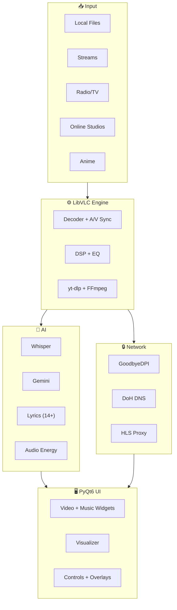

<div align="center">


<br/>

[](https://github.com/sandytalks/SANDYPLAY/releases/latest)&nbsp;
[](https://github.com/sandytalks/SANDYPLAY/releases)&nbsp;
[](LICENSE)&nbsp;
[](https://github.com/sandytalks/SANDYPLAY/stargazers)&nbsp;
[](https://github.com/sandytalks/SANDYPLAY/releases/latest)&nbsp;
[](https://python.org)

<br/>

**A complete AI multimedia production studio — not just a media player.**

OpenAI Whisper (offline subtitles) · Gemini AI (translation & chat) · Dolby.io (cloud mastering)  
LibVLC engine · PyQt6 glassmorphism UI · 14+ lyrics sources · 48-band visualizer

<br/>

<a href="https://github.com/sandytalks/SANDYPLAY/releases/download/Sandyplay/SandyPlay_Setup_v1.15.exe">

</a>

<sub>Windows 10 / 11 · 64-bit · Self-contained · No Python install needed</sub>

</div>

<br/>

---

<br/>

## ⚡ Why SANDYPLAY?

<table>
<tr>
<td width="50%">

### What SANDYPLAY Does

- 🤖 **AI Subtitles** — Whisper generates subtitles offline in 99 languages
- ☁️ **Dolby Mastering** — One-click cloud audio enhancement
- 🎤 **14+ Lyrics Sources** — Synced karaoke with AI fallback
- 🌐 **Lyrics Translation** — Real-time bilingual display via Gemini
- 🌊 **48-Band Visualizer** — Real audio-synced at ~30fps
- 🔊 **DTS Studio** — 5 simulation modes for immersive audio
- 🎛️ **10-Band EQ** — Professional parametric equalizer
- 📡 **Stream Anything** — YouTube, Twitch, 1000+ sites via yt-dlp

</td>
<td width="50%">

### What Others Don't Have

| Feature | SANDYPLAY | VLC | foobar |
|:---|:---:|:---:|:---:|
| AI Offline Subtitles | ✅ | ❌ | ❌ |
| Cloud Audio Mastering | ✅ | ❌ | ❌ |
| Synced Lyrics (14+ src) | ✅ | ❌ | ⚠️ |
| Lyrics Translation | ✅ | ❌ | ❌ |
| AI Command Palette | ✅ | ❌ | ❌ |
| Anime Studio | ✅ | ❌ | ❌ |
| 300+ Radio Stations | ✅ | ❌ | ❌ |
| Live IPTV | ✅ | ❌ | ❌ |

</td>
</tr>
</table>

<br/>

---

<br/>

## 🧩 Feature Overview

<table>
<tr>
<td align="center" width="33%">

### 🤖 AI Engine

Whisper local subtitles  
Gemini translation & chat  
AI smart playlists  
AI video captions  
Natural language commands  
AI metadata cleaner

</td>
<td align="center" width="33%">

### 🎧 Audio Engine

Dolby.io cloud mastering  
DTS 5-mode simulation  
10-band parametric EQ  
10 speaker modes  
SoX HiFi resampler  
0.25×–4.0× speed control

</td>
<td align="center" width="33%">

### 🎬 Video Engine

LibVLC 3.x + NVDEC  
HDR simulation  
7 deinterlace modes  
8 aspect ratios  
Dynamic ambient theming  
External subtitle support

</td>
</tr>
<tr>
<td align="center" width="33%">

### 🌊 UI & Visualizer

12 glassmorphism themes  
Custom HEX color picker  
48-band real-time visualizer  
Music widget with album art  
Animated lyrics panel  
Quality picker popup

</td>
<td align="center" width="33%">

### 📡 Online Studios

Music (5 sources)  
Video (YouTube trending)  
Podcasts (iTunes + RSS)  
Anime (8 languages)  
300+ radio stations  
IPTV (10 sources)

</td>
<td align="center" width="33%">

### 💾 Session & Tools

Auto-save every 2 min  
Named snapshots  
Favorites & recent plays  
A-B repeat & bookmarks  
ISP bypass (GoodbyeDPI)  
Mini player & sleep timer

</td>
</tr>
</table>

<br/>

---

<br/>

## 🎤 Lyrics Engine

The most advanced open-source lyrics system built into a media player — **3-tier parallel pipeline** with guaranteed results.

<table>
<tr>
<td width="60%">

**Tier 1 — Synced LRC** (8s deadline)  
① LRCLib · ② Kugou (50M+) · ③ NetEase · ④ Textyl · ⑤ Megalobiz

**Tier 2 — Plain Lyrics** (12s deadline)  
⑥ JioSaavn · ⑦ Gaana · ⑧ Vagalume · ⑨ Lyrics.ovh · ⑩ Musixmatch  
⑪ AZLyrics · ⑫ SongLyrics · ⑬ ChartLyrics · ⑭ Happi.dev · ⑮ Lyrist

**Tier 3 — AI Fallback** (always works)  
🤖 Gemini AI generates lyrics — guaranteed, never fails

</td>
<td width="40%">

**How it works:**
- Checks disk cache first (instant)
- Then sidecar `.lrc` / `.txt` files
- Runs Tier 1→2→3 in parallel
- Best result wins + gets cached
- MD5-keyed JSON per track
- Fuzzy matching (ratio > 0.72)
- 4 title variants per source
- Batch mode: 200 files at once

</td>
</tr>
</table>

<details>
<summary>View lyrics pipeline flowchart</summary>

<br/>


</details>

<br/>

---

<br/>

## 📻 Radio & TV

<table>
<tr>
<td width="50%">

### 📻 Online Radio Studio

**300+ curated stations across 9 genres:**

- 🎵 **Tamil** — 32 stations (AIR, Ilayaraja, AR Rahman, Mirchi…)
- 🎶 **Hindi** — 8 stations (Vividh Bharati, Bollywood hits…)
- 🎤 **100+ Artist Streams** — Taylor Swift, BTS, Coldplay, Eminem…
- 🌟 **K-Pop** — 30+ stations (BTS Radio, K-Pop 24, SBS PopAsia…)
- 🎼 **Classical & Jazz** — BBC Radio 3, WQXR, Jazz Radio…
- 🎸 **Rock & Pop** — KEXP, Radio Paradise, ROCK FM…
- 📰 **News** — BBC World, NPR, BBC Radio 4
- 💃 **Electronic** — SomaFM, 1.FM Trance & Chillout
- 📡 **Hardware SDR** — RTL-SDR dongle support for real FM

</td>
<td width="50%">

### 📺 Online TV Studio (IPTV)

**Live channels from 10 public sources:**

| Browse By | Examples |
|:---|:---|
| 🌐 **All** | Searchable list, auto-deduplicated |
| 🎥 **Genre** | News · Movies · Music · Kids · Sports |
| 🗣️ **Language** | Tamil · Hindi · English · Korean · Arabic… |
| 🌍 **Region** | India (by state) · USA · UK · Japan · UAE… |
| ❤️ **Favorites** | Persistent across sessions |

**Sources:** iptv-org · Free-TV · PlutoTV · Samsung TV+  
Plex · Roku · PBS · Stirr · Tubi · LocalNow

Auto-refreshes every 24 hours.

</td>
</tr>
</table>

<br/>

---

<br/>

## 🎌 Anime Studio

Stream dubbed anime across **8 languages** — powered by AniNeko & AnimeSalt.

<table>
<tr>
<td width="50%">

**Languages:**

| Indian | International |
|:---|:---|
| 🇮🇳 Tamil — AnimeSalt | 🇬🇧 English — AniNeko |
| 🇮🇳 Hindi — AnimeSalt | 🇪🇸 Spanish — AniNeko |
| 🇮🇳 Telugu — AnimeSalt | 🇫🇷 French — AniNeko |
| 🇮🇳 Malayalam — AnimeSalt | 🇧🇷 Portuguese — AniNeko |

</td>
<td width="50%">

**Features:**

- 🔥 Recent & popular anime tabs
- 🔍 Live search with autocomplete
- 📺 Episode viewer with direct streaming
- ❤️ Favorites & custom playlists
- 🖼️ Poster grid with lazy image loading
- 🔒 Auto ISP bypass via GoodbyeDPI

</td>
</tr>
</table>

<br/>

---

<br/>

## 🎵 Online Studios

<table>
<tr>
<td align="center" width="25%">

### 🎵 Music

YouTube Music  
JioSaavn  
SoundCloud  
Apple Music  
YouTube Global

Discover · Search  
Favorites · Playlists  
Download (MP3)

</td>
<td align="center" width="25%">

### 🎥 Video

YouTube Trending  
Search by category  
Playlist-only mode

Favorites · Playlists  
Quality: 144p–Original  
Download (MP4)

</td>
<td align="center" width="25%">

### 🎙️ Podcasts

iTunes Discovery  
15+ categories  
9 language filters

Custom RSS feeds  
Episode streaming  
Favorites & downloads

</td>
<td align="center" width="25%">

### 🌐 Web Tools

Built-in Browser  
(PyQt6 WebEngine)

Sandytalks AI Chat  
(Gemini 2.5 Flash)

</td>
</tr>
</table>

<br/>

---

<br/>

## 🚀 Installation

<div align="center">

<a href="https://github.com/sandytalks/SANDYPLAY/releases/download/Sandyplay/SandyPlay_Setup_v1.15.exe">

</a>

<br/><br/>

</div>

| Step | Action |
|:---:|:---|
| 📥 **1** | Download the installer above |
| 🛡️ **2** | SmartScreen warning? → Click **More Info** → **Run Anyway** |
| 🚀 **3** | Launch from Desktop shortcut |
| 🎵 **4** | Drag & drop files, or `Ctrl+O` / `Ctrl+D` |
| 🤖 **5** | First AI subtitle use downloads Whisper model (~1.5 GB, one-time) |

<br/>

### System Requirements

| | Minimum | Recommended |
|:---|:---|:---|
| **OS** | Windows 10 64-bit | Windows 11 64-bit |
| **CPU** | Dual-core 2 GHz | Quad-core 3 GHz+ |
| **RAM** | 4 GB | 8 GB+ |
| **GPU** | Integrated | NVIDIA GTX 1060+ (for NVDEC) |
| **Disk** | 500 MB | 3 GB+ (with Whisper model) |

<br/>

### What's Included

| Component | Status |
|:---|:---:|
| LibVLC + all codecs, Python runtime, SoX, VC++ runtimes | ✅ Bundled |
| Whisper AI model (~1.5 GB) | ⬇️ Auto-downloads on first use |
| Gemini API key ([get free](https://aistudio.google.com)) | 🔑 Optional |
| Dolby.io credentials ([get free](https://dolby.io)) | 🔑 Optional |

<br/>

---

<br/>

## ❓ FAQ

<details>
<summary><b>Do I need a GPU?</b></summary>
<br/>
No. CPU works fine. An NVIDIA GPU unlocks NVDEC hardware acceleration for smoother 4K playback — but it's optional.
</details>

<details>
<summary><b>Does Whisper work offline?</b></summary>
<br/>
Yes, 100% offline after the one-time model download. Subtitles are cached per file — instant on replay.
</details>

<details>
<summary><b>What API keys do I need?</b></summary>
<br/>
<b>None</b> for core playback, EQ, DTS, visualizer, lyrics, radio, IPTV, anime, and all online studios. Gemini (free) is needed for translation/AI chat. Dolby.io (free tier) for cloud mastering.
</details>

<details>
<summary><b>Why aren't lyrics showing?</b></summary>
<br/>
Check the status bar — it shows search progress. Try <code>Misc → Search Lyrics Manually</code> with a cleaned title. For Indian music, JioSaavn/Gaana have the best coverage. You can also drop a <code>.lrc</code> sidecar file next to your audio.
</details>

<details>
<summary><b>Can I stream YouTube?</b></summary>
<br/>
Yes. <code>Ctrl+U</code> → paste any URL. yt-dlp supports 1000+ sites. Playlists auto-expand and mix with local files.
</details>

<details>
<summary><b>Linux / macOS support?</b></summary>
<br/>
Currently Windows-only. The stack is cross-platform but some components are Windows-specific. Community PRs welcome.
</details>

<br/>

---

<br/>

<details>
<summary><b>⌨️ Keyboard Shortcuts</b></summary>

<br/>

| Key | Action | Key | Action |
|:---:|:---|:---:|:---|
| `Space` | Play / Pause | `N` / `B` | Next / Previous |
| `→` / `←` | Seek ±10s | `↑` / `↓` | Volume ±5% |
| `M` | Mute | `F` | Fullscreen |
| `V` | Visualizer | `P` | Playlist |
| `L` | Loop | `]` / `[` | Speed ±0.1× |
| `Ctrl+L` | Lyrics | `Ctrl+T` | Translate |
| `Ctrl+O` | Open File | `Ctrl+U` | Open URL |
| `Ctrl+Alt+F` | Favorite | `Ctrl+Alt+S` | Snapshot |
| `?` | All Shortcuts | | |

</details>

<details>
<summary><b>🏗️ Architecture</b></summary>

<br/>



</details>

<details>
<summary><b>🛠️ Tech Stack</b></summary>

<br/>

| | Technology | Purpose |
|:---|:---|:---|
| 🖥️ | PyQt6 | Glassmorphism UI |
| 🎬 | LibVLC 3.x | Media engine + NVDEC |
| 🤖 | faster-whisper | Offline AI subtitles |
| 🧠 | Gemini 1.5/2.5 | Translation, AI chat |
| ☁️ | Dolby.io | Cloud audio mastering |
| 📡 | yt-dlp | 1000+ site streaming |
| 🛡️ | GoodbyeDPI | ISP bypass |
| 🏷️ | mutagen | Media tag reading |

</details>

<details>
<summary><b>🗂️ Project Structure</b></summary>

<br/>

```
SANDYPLAY/
├── sandyplay.py              # Entire app — single Python file
├── vpn/goodbyedpi.exe        # ISP bypass (optional)
├── rtl-sdr/x64/rtl_fm.exe    # Hardware FM (optional)
└── ~/.sandyplay/              # Auto-created
    ├── config.json            # Settings
    ├── plus/                  # Sessions & snapshots
    ├── lyrics/                # Cached lyrics
    ├── subtitles/             # Cached Whisper SRTs
    ├── cache/images/          # Thumbnails
    └── dolby/                 # Enhanced audio
```

</details>

<br/>

---

<br/>

## 🗺️ Roadmap

| | Milestone | Version |
|:---:|:---|:---:|
| ✅ | Lyrics engine · Dolby · Whisper · DTS · FM radio | v1.13 |
| ✅ | Music studio · IPTV · session persistence | v1.14 |
| ✅ | Anime · ISP bypass · Video/Podcast studios · Mini player · AI chat | v1.15 |
| 📋 | Linux native build | v1.16 |
| 📋 | Podcast chapters · Watch Party (LAN sync) | v1.17–18 |
| 💡 | Discord presence · Cloud sync · DJ Mode · macOS · Android remote | Future |

<br/>

---

<br/>

## 🤝 Contributing

SANDYPLAY is a **solo project** — every contribution makes a difference.

⭐ Star the repo · 🐛 Report bugs · 💡 Suggest features · 📻 Add radio stations · 🎌 Fix anime scrapers · 📣 Share with friends

<div align="center">

[](https://github.com/sandytalks/SANDYPLAY/issues)&nbsp;&nbsp;
[](https://github.com/sandytalks/SANDYPLAY/pulls)&nbsp;&nbsp;
[](https://github.com/sandytalks/SANDYPLAY/discussions)

</div>

<br/>

---

<br/>

## 📄 License

**MIT License** — Copyright © 2026 Santhosh (Sandytalks)

<sub>Third-party: VLC (LGPL) · FFmpeg (LGPL/GPL) · Whisper (MIT) · PyQt6 (GPL) · yt-dlp (Unlicense) · Dolby.io · Gemini API · GoodbyeDPI (MIT)</sub>

<br/>

---

<br/>

<div align="center">

**Built with ❤️ by [Santhosh](https://www.instagram.com/itsyouhuman/)**

[](https://www.instagram.com/itsyouhuman/)&nbsp;&nbsp;
[](https://github.com/sandytalks/SANDYPLAY)

<br/>

<picture>
  <source media="(prefers-color-scheme: dark)" srcset="https://api.star-history.com/svg?repos=sandytalks/SANDYPLAY&type=Date&theme=dark"/>
  <source media="(prefers-color-scheme: light)" srcset="https://api.star-history.com/svg?repos=sandytalks/SANDYPLAY&type=Date"/>
  
</picture>

<br/><br/>

⭐ **If SANDYPLAY improved your experience, a star helps others find it.**

</div>

<br/>


