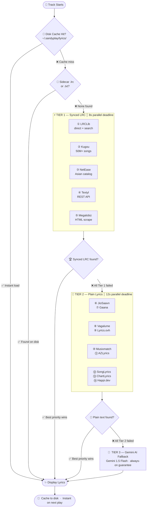
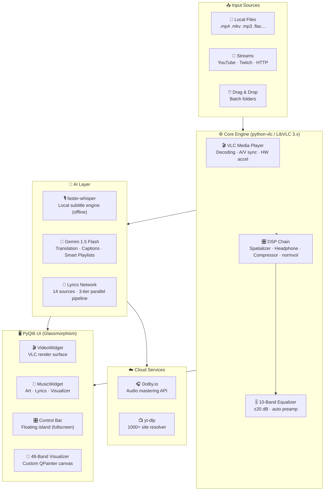

<!-- ╔══════════════════════════════════════════════════════════════════════════╗ -->
<!-- ║              SANDYPLAY — ENHANCED GITHUB README v2.0                    ║ -->
<!-- ╚══════════════════════════════════════════════════════════════════════════╝ -->

<div align="center">


</div>

<div align="center">


</div>

<br/>

<div align="center">

<!-- PULSE RING AROUND LOGO -->
<a href="https://github.com/sandytalks/SANDYPLAY/releases/download/Sandyplay/SandyPlay_Setup_v1.13.exe">

</a>

<br/><br/>


</div>

<br/>

<div align="center">

<!-- ══ BADGE ROW 1 ══ -->
[](https://github.com/itsyouhuman/SandyPlay/releases/latest)&ensp;[](https://github.com/itsyouhuman/SandyPlay/releases)&ensp;&ensp;&ensp;

<br/>

<!-- ══ BADGE ROW 2 ══ -->
&ensp;&ensp;&ensp;&ensp;[](https://github.com/itsyouhuman/SandyPlay/stargazers)

</div>

<br/>

<div align="center">

```
━━━━━━━━━━━━━━━━━━━━━━━━━━━━━━━━━━━━━━━━━━━━━━━━━━━━━━━━━━━━━━━━━━━━━━━━
  ◂ Why SandyPlay ▸  ◂ Features ▸  ◂ Lyrics Engine ▸  ◂ Showcase ▸
  ◂ Install ▸  ◂ Keyboard Ref ▸  ◂ Architecture ▸  ◂ Roadmap ▸  ◂ FAQ ▸
━━━━━━━━━━━━━━━━━━━━━━━━━━━━━━━━━━━━━━━━━━━━━━━━━━━━━━━━━━━━━━━━━━━━━━━━
```

</div>

<br/>

<div align="center">

</div>

<br/>

> [!NOTE]
> ### 🔷 SANDYPLAY v1.13 is not a media player — it is a complete AI multimedia production studio.
> Built on **LibVLC** for bulletproof decoding and **PyQt6** for silky-smooth glassmorphism UI, it integrates **OpenAI Whisper** (local, offline subtitles), **Google Gemini 1.5 Flash** (lyrics translation, smart playlists, AI captions), and **Dolby.io** (one-click cloud audio mastering) into a single, **free, open-source** application.
>
> `14+ lyrics sources` &nbsp;·&nbsp; `48-band visualizer` &nbsp;·&nbsp; `Dynamic ambient theming` &nbsp;·&nbsp; `DTS studio simulation` &nbsp;·&nbsp; `Hardware NVDEC acceleration` &nbsp;·&nbsp; **Everything. Free.**

<br/>

<div align="center">

</div>

<br/><br/>

<!-- ════════════════════════════════════════════════════════════════ -->
<!-- ║                    STATS SHOWCASE                            ║ -->
<!-- ════════════════════════════════════════════════════════════════ -->

<div align="center">

## 〔 By The Numbers 〕

<br/>

<table>
<tr>
<td align="center" width="19%">
<br/>
<br/><sub>Synced LRC · Plain · AI</sub>
<br/>&nbsp;
</td>
<td align="center" width="1%"><sub>┃</sub></td>
<td align="center" width="19%">
<br/>
<br/><sub>~30 fps real-time</sub>
<br/>&nbsp;
</td>
<td align="center" width="1%"><sub>┃</sub></td>
<td align="center" width="19%">
<br/>
<br/><sub>+ Unlimited custom HEX</sub>
<br/>&nbsp;
</td>
<td align="center" width="1%"><sub>┃</sub></td>
<td align="center" width="19%">
<br/>
<br/><sub>Stereo → Spatial 3D</sub>
<br/>&nbsp;
</td>
<td align="center" width="1%"><sub>┃</sub></td>
<td align="center" width="19%">
<br/>
<br/><sub>EN · TA · HI · TE · auto</sub>
<br/>&nbsp;
</td>
</tr>
</table>

</div>

<br/>

<div align="center">

</div>

<br/><br/>

<!-- ════════════════════════════════════════════════════════════════ -->
<!-- ║                   WHY SANDYPLAY                              ║ -->
<!-- ════════════════════════════════════════════════════════════════ -->

##  &nbsp; The Competition Table

<div align="center">

> No other free, open-source media player comes close. Here's the proof.

<br/>

| &nbsp;&nbsp;&nbsp;Feature&nbsp;&nbsp;&nbsp; | ◈ **SANDYPLAY** | VLC 3.0 | MPC-HC | foobar2000 | Winamp |
|:---|:---:|:---:|:---:|:---:|:---:|
| 🤖 **AI Local Subtitle** (Whisper, offline) | ✅ | ❌ | ❌ | ❌ | ❌ |
| ☁️ **Cloud Audio Mastering** (Dolby.io) | ✅ | ❌ | ❌ | ❌ | ❌ |
| 🎤 **Synced Lyrics** (14+ sources) | ✅ | ❌ | ❌ | ⚠️ plugin | ⚠️ plugin |
| 🌐 **Lyrics AI Translation** (5 langs) | ✅ | ❌ | ❌ | ❌ | ❌ |
| 🧠 **Natural Language Command Palette** | ✅ | ❌ | ❌ | ❌ | ❌ |
| 🎨 **Dynamic Ambient Video Theming** | ✅ | ❌ | ❌ | ❌ | ❌ |
| 🌊 **Built-in Audio Visualizer** (48-band) | ✅ | ❌ | ❌ | ⚠️ plugin | ✅ 14-band |
| 🔊 **DTS / Surround Simulation** | ✅ **5 modes** | ⚠️ basic | ⚠️ basic | ❌ | ❌ |
| 💾 **Named Session Snapshots** | ✅ | ❌ | ❌ | ⚠️ playlists | ⚠️ playlists |
| 📡 **YouTube / Twitch Streaming** | ✅ yt-dlp | ✅ | ❌ | ❌ | ❌ |
| 🎛️ **10-Band Parametric Equalizer** | ✅ | ⚠️ basic | ❌ | ✅ | ✅ |
| ⚡ **Hardware NVDEC / CUDA Decoding** | ✅ | ✅ | ✅ | ❌ | ❌ |
| 🖥️ **Glassmorphism UI** (12+ themes) | ✅ | ❌ | ❌ | ⚠️ skins | ⚠️ skins |
| 🔖 **Bookmarks + A-B Repeat** | ✅ | ✅ | ✅ | ❌ | ❌ |
| 🏷️ **AI Metadata Cleaner** | ✅ | ❌ | ❌ | ⚠️ plugin | ❌ |

</div>

<br/>

<div align="center">

</div>

<br/><br/>

<!-- ════════════════════════════════════════════════════════════════ -->
<!-- ║                  FEATURE BREAKDOWN                           ║ -->
<!-- ════════════════════════════════════════════════════════════════ -->

##  &nbsp; Complete Technical Deep Dive

<br/>

<table>
<tr>
<td width="50%" valign="top">

### 🤖 &nbsp; AI Intelligence Layer

```yaml
# ══════════════════════════════════════════════
# ◈  WHISPER LOCAL SUBTITLES  (100% Offline)
# ══════════════════════════════════════════════
Engine      : faster-whisper
Models      : tiny · base · small · medium · large-v3
Auto-detect : 99 languages with confidence score
Output      : .SRT with word-level timestamps
VAD filter  : 500ms silence-gap segmentation
Post-process: auto-translated to English
Storage     : ~/.sandyplay/subtitles/  (cached)
Reload      : instant on replays (no re-run)

# ══════════════════════════════════════════════
# ◈  GOOGLE GEMINI 1.5 FLASH  (Cloud AI)
# ══════════════════════════════════════════════
Lyrics Translate : auto-detect → EN/TA/HI/TE
LRC-Aware        : preserves [mm:ss] timestamps
                   after translation (synced!)
Bilingual View   : original + translation
                   interleaved line-by-line
Captions         : 2-sentence mood description
Smart Playlists  : vibe keyword semantic sort
                   "chill" · "workout" · "sad"
Command Palette  : natural language control
                   "play next" · "add classics"
Metadata Clean   : strip [Official Video] noise
AI Recommend     : fuzzy + semantic next-track
```

</td>
<td width="50%" valign="top">

### 🎧 &nbsp; Studio-Grade Audio Engine

```yaml
# ══════════════════════════════════════════════
# ◈  DOLBY.IO CLOUD MASTERING
# ══════════════════════════════════════════════
Auth     : OAuth2 App Key + App Secret
Upload   : dlb:// internal protocol
Process  : Dolby Enhance API
           (de-noise + master + normalize)
Output   : high-quality WAV file
Queue    : auto-inserted after current track
Status   : live progress in status bar

# ══════════════════════════════════════════════
# ◈  DTS STUDIO SIMULATION  (5 Modes)
# ══════════════════════════════════════════════
🎵 Music  : normvol DSP + Pop EQ curve
            → warm, balanced listening
🎬 Movies : spatializer + compressor + cinema EQ
            → wide soundstage, punchy dialogue
🎮 Games  : headphone 3D + compressor + air EQ
            → directional sound for gaming
⚙️ Custom : manual DSP toggle per filter
🔇 Off    : bypass all (pure VLC output)

# ══════════════════════════════════════════════
# ◈  10-BAND PARAMETRIC EQ
# ══════════════════════════════════════════════
Frequencies : 60 · 170 · 310 · 600 · 1k
              3k · 6k · 12k · 14k · 16k Hz
Range       : ±20 dB per band
Presets     : Flat · Bass Boost · Treble Boost
              Vocal Clarity · Rock · Pop
Preamp      : auto safety margin (12 − maxBoost)
```

</td>
</tr>
<tr>
<td width="50%" valign="top">

### 🌊 &nbsp; Glassmorphism UI System

```yaml
# ══════════════════════════════════════════════
# ◈  THEMES & AMBIENT COLOR ENGINE
# ══════════════════════════════════════════════
Built-in : 12 curated accent colors
  ○ Sky Blue      ○ Purple Haze    ○ Sunset Orange
  ○ Emerald       ○ Crimson        ○ Golden Glow
  ○ Hot Pink      ○ Deep Indigo    ○ Teal Surge
  ○ Ocean Cyan    ○ Copper         ○ Moonlight
Custom   : any HEX via Qt color picker
Ambient  : fires 2.5s after video loads
  Method : snapshot(128×72) → pixel-grid sample
           → HSL boost (sat+0.5, L clamp)
           → apply as new accent color

# ══════════════════════════════════════════════
# ◈  48-BAND REAL-TIME VISUALIZER
# ══════════════════════════════════════════════
Engine    : custom QPainter · 33ms tick (~30 fps)
Bars      : symmetric mirror · 48 total bands
Physics   : attack 75% · decay 18% per frame
            + ±0.04 organic noise floor
Peaks     : floating indicators · 0.018/frame fade
Palette   : accent color + 60-unit brightness boost
Display   : gradient (bright top → dim bottom)
            rounded bars + ellipse peak dots

# ══════════════════════════════════════════════
# ◈  PLUS SESSION MANAGER
# ══════════════════════════════════════════════
Auto-save   : every 2 min · atomic .tmp → rename
Snapshots   : named JSON · unlimited · timestamped
Restore     : queue + seek position on launch
Favorites   : per-track · Ctrl+Alt+F toggle
Recent      : last 35 tracks · played_at timestamp
Duplicates  : MD5-key dedupe · 1-click removal
HTML Export : full queue report with stats
```

</td>
<td width="50%" valign="top">

### 🎬 &nbsp; Playback & Streaming

```yaml
# ══════════════════════════════════════════════
# ◈  MEDIA ENGINE
# ══════════════════════════════════════════════
Core        : LibVLC 3.x / python-vlc binding
HW Decode   : NVDEC (NVIDIA) / system "any"
SW Decode   : FFmpeg CPU (always available)
Caching     : file 1000ms · network 1500ms
              live 1500ms · mux 800ms
Resampler   : SoX (force stereo downmix)
Frame drop  : enabled (maintains A/V sync)

# ══════════════════════════════════════════════
# ◈  STREAMING SUPPORT  (yt-dlp)
# ══════════════════════════════════════════════
Sites       : 1000+ supported platforms
  YouTube   : best video+audio combined format
  Twitch    : live stream (RTMP/HLS)
  SoundCloud: audio streams
  Playlists : auto-expand all entries
Direct URLs : HTTP(S) / RTSP / RTMP / MMS / FTP
Queue       : streams mix freely with local files

# ══════════════════════════════════════════════
# ◈  ADVANCED PLAYBACK FEATURES
# ══════════════════════════════════════════════
Loop        : single / off
Shuffle     : true random (randint over playlist)
Speed       : 0.25× – 4.0× pitch-locked via SoX
A-B Repeat  : set in / out points live
Frame Step  : step-by-step in paused mode
Bookmarks   : per-file · up to 40 marks · sorted
Seek        : ±10s / ±30s (Alt) · slider click
              hover tooltip shows HH:MM:SS

# ══════════════════════════════════════════════
# ◈  AUDIO / SUBTITLE TRACK CONTROL
# ══════════════════════════════════════════════
Audio cycle : X key — all embedded tracks
Sub cycle   : Z key — all embedded + Whisper
Sub load    : .srt / .ass / .vtt / .sub
Sub delay   : live ±5000ms slider
Audio delay : live ±5000ms slider
Speaker out : 10 channel routing modes
```

</td>
</tr>
</table>

<br/>

<div align="center">

</div>

<br/><br/>

<!-- ════════════════════════════════════════════════════════════════ -->
<!-- ║                   LYRICS ENGINE                              ║ -->
<!-- ════════════════════════════════════════════════════════════════ -->

##  &nbsp; The World's Most Advanced Open-Source Lyrics System

<div align="center">

> A **3-tier parallel fetch pipeline** — 14 live sources, smart disk caching, sidecar file support, and a Gemini AI fallback. No other free player comes close.

</div>

<br/>



<br/>

<div align="center">

### 〔 Source Directory 〕

<br/>

| &nbsp; # &nbsp; | Source | Type | Coverage | Method |
|:---:|:---|:---:|:---|:---|
| ① | **LRCLib** | `Synced LRC` | Global, growing rapidly | Free REST API · direct + search endpoints |
| ② | **Kugou** | `Synced LRC` | 50M+ songs · strongest Asian coverage | JSON API + base64 LRC decode |
| ③ | **NetEase** | `Synced LRC` | Chinese + international | JSON API with referer auth |
| ④ | **Textyl** | `Synced LRC` | English-heavy, fast | Lightweight REST API |
| ⑤ | **Megalobiz** | `Synced LRC` | International repository | HTML scrape → span extraction |
| ⑥ | **JioSaavn** | `Plain` | India's top — TA / HI / TE / ML | saavn.dev REST API chain |
| ⑦ | **Gaana** | `Plain` | Bollywood + South Indian deep catalog | HTML scrape + JSON-LD |
| ⑧ | **Vagalume** | `Plain` | Portuguese + international | Free REST API |
| ⑨ | **Lyrics.ovh** | `Plain` | Global, simple English | Free REST API |
| ⑩ | **Musixmatch** | `Plain` | Largest global catalog | HTML scrape |
| ⑪ | **AZLyrics** | `Plain` | Extensive English catalog | HTML scrape |
| ⑫ | **SongLyrics** | `Plain` | Indian + international | HTML scrape |
| ⑬ | **ChartLyrics** | `Plain` | Free, no key required | XML REST API |
| ⑭ | **Happi.dev** | `Plain` | Community-driven | REST API (demo key) |
| 🤖 | **Gemini AI** | `Fallback` | Anything Gemini knows | LLM prompt · guaranteed result |

</div>

<br/>

<div align="center">

</div>

<br/><br/>

<!-- ════════════════════════════════════════════════════════════════ -->
<!-- ║                  VISUAL SHOWCASE                             ║ -->
<!-- ════════════════════════════════════════════════════════════════ -->

##  &nbsp; See It In Action

<br/>

<div align="center">


<br/>


<br/><br/>


<br/>


</div>

<br/>

<div align="center">

</div>

<br/><br/>

<!-- ════════════════════════════════════════════════════════════════ -->
<!-- ║                    CHANGELOG                                 ║ -->
<!-- ════════════════════════════════════════════════════════════════ -->

## 

<br/>

<details>
<summary><b>&nbsp;📋 &nbsp; Click to expand the full v1.13 changelog &nbsp;&nbsp;▼</b></summary>

<br/>

> ### 🔴 &nbsp; Critical Fixes
>
> - Fixed `_is_video_mode` not initialised in `__init__` → caused progress bar, time display, and auto-advance to silently break on every tick
> - Added `getattr` guard in `update_ui` for belt-and-suspenders safety
> - Fixed `wait, FIRST_COMPLETED` only imported inside function on every call → moved to top-level module import

> ### 🟠 &nbsp; Lyrics Engine Overhaul
>
> - Completely rewrote `_run_fetch_chain` — now uses direct `executor.submit(fn, *args)` (zero lambda/closure risk)
> - Added `_fetch_lrclib` **direct endpoint** (`/api/get?track_name=…&duration=…`) to Tier 1 — was defined but never called
> - `wait()` now receives `list(remaining.keys())` instead of live dict-view — eliminates mutation-during-iteration race
> - Fail-cache TTL raised `10s → 30s` (aggressive 10s was blocking legitimate retries)
> - Tier 1 deadline extended `6s → 8s` · Tier 2 deadline `8s → 12s`

> ### 🟡 &nbsp; Reliability Fixes
>
> - `_http_get` default timeout raised `3.5s → 6.0s` (JioSaavn/Gaana regularly need 4–5s)
> - `_is_title_match` fuzzy threshold relaxed `0.82 → 0.72` (language suffixes no longer block matches)
> - `saavn.dev` now handles both `"data": {…}` (dict) and `"data": [{…}]` (list) response schemas

> ### ✨ &nbsp; New Features
>
> - Dedicated **Dolby Studio** tab in Control Panel
> - DTS mode now **stores and restores** across sessions
> - **Bookmarks persisted** in `config.json` — survive app restarts
> - `_run_tier()` helper reduces fetch-chain code by ~60 lines

</details>

<br/>

<div align="center">

</div>

<br/><br/>

<!-- ════════════════════════════════════════════════════════════════ -->
<!-- ║                    INSTALLATION                              ║ -->
<!-- ════════════════════════════════════════════════════════════════ -->

##  &nbsp; Read the Installation Steps Given Below Before Download 

<br/>

<div align="center">

<a href="https://github.com/sandytalks/SANDYPLAY/releases/download/Sandyplay/SandyPlay_Setup_v1.13.exe">

</a>

</div>

<br/>

```
╔══════════════════════════════════════════════════════════════════════════════╗
║  STEP 1   📥  DOWNLOAD                                                       ║
║           → Click the button above to download SandyPlay_Setup_v1.13.exe    ║
╠══════════════════════════════════════════════════════════════════════════════╣
║  STEP 2   🛠️  INSTALL                                                        ║
║           → Windows may show a blue SmartScreen warning.                    ║
║             Click "More Info" → "Run Anyway"  — it is 100% safe.            ║
║           → The installer auto-configures:                                  ║
║               ◈ VLC 3 Engine + all plugins                                  ║
║               ◈ Visual C++ runtimes                                         ║
║               ◈ Start Menu + Desktop shortcuts                              ║
╠══════════════════════════════════════════════════════════════════════════════╣
║  STEP 3   🚀  LAUNCH                                                         ║
║           → Open SANDYPLAY from the Desktop shortcut                        ║
╠══════════════════════════════════════════════════════════════════════════════╣
║  STEP 4   🎵  LOAD MEDIA                                                     ║
║           → Drag & drop files  ·  Ctrl+O (open file)  ·  Ctrl+D (folder)   ║
╠══════════════════════════════════════════════════════════════════════════════╣
║  STEP 5   🤖  AI SETUP  (optional)                                           ║
║           → Misc → AI Tools                                                 ║
║           → First Whisper use triggers a one-time model download (~1.5 GB)  ║
║           → After that: 100% offline, instant on replay                     ║
╚══════════════════════════════════════════════════════════════════════════════╝
```

<br/>

### System Requirements

<div align="center">

| &nbsp; | Minimum | Recommended |
|:---|:---|:---|
| **OS** | Windows 10 64-bit | Windows 11 64-bit |
| **CPU** | Any dual-core 2 GHz | Quad-core 3 GHz+ |
| **RAM** | 4 GB | 8 GB+ |
| **GPU** | Integrated graphics | NVIDIA GTX 1060+ (NVDEC) |
| **Storage** | 500 MB (app only) | 3 GB+ (with Whisper models) |
| **Network** | Optional | Required for Dolby.io / Gemini AI |

</div>

<br/>

> [!TIP]
> **AI First-run:** `faster-whisper` downloads the Whisper model once (~1.5 GB for `medium`). After that — **fully offline, zero internet needed, instant replays from cache**.
> For Gemini features: grab a free API key from [Google AI Studio](https://aistudio.google.com) — the free tier is more than enough.

> [!IMPORTANT]
> **Supported Formats:** `MP4 · MKV · AVI · MOV · WMV · WebM · FLV · M4V · MPEG · TS · VOB · 3GP · RM` and `MP3 · FLAC · WAV · AAC · M4A · OGG · WMA · OPUS · AC3 · EAC3 · THD · ALAC` — if LibVLC decodes it, SANDYPLAY plays it.

<br/>

<div align="center">

</div>

<br/><br/>

<!-- ════════════════════════════════════════════════════════════════ -->
<!-- ║                  KEYBOARD REFERENCE                          ║ -->
<!-- ════════════════════════════════════════════════════════════════ -->

##  &nbsp; Every Shortcut at a Glance

<br/>

<div align="center">

### ▸ Playback Control

| Key | Action | &nbsp;&nbsp; | Key | Action |
|:---:|:---|:---:|:---:|:---|
| <kbd>Space</kbd> | Play / Pause | | <kbd>S</kbd> | Stop |
| <kbd>N</kbd> | Next Track | | <kbd>B</kbd> | Previous Track |
| <kbd>→</kbd> | Seek +10 seconds | | <kbd>←</kbd> | Seek −10 seconds |
| <kbd>Alt</kbd>+<kbd>→</kbd> | Seek +30 seconds | | <kbd>Alt</kbd>+<kbd>←</kbd> | Seek −30 seconds |
| <kbd>↑</kbd> | Volume +5% | | <kbd>↓</kbd> | Volume −5% |
| <kbd>M</kbd> | Mute / Unmute | | <kbd>E</kbd> | Frame Step |
| <kbd>]</kbd> | Speed +0.1× | | <kbd>[</kbd> | Speed −0.1× |
| <kbd>L</kbd> | Toggle Loop | | <kbd>Shift</kbd>+<kbd>S</kbd> | Toggle Shuffle |

<br/>

### ▸ View & Display

| Key | Action | &nbsp;&nbsp; | Key | Action |
|:---:|:---|:---:|:---:|:---|
| <kbd>F</kbd> / <kbd>Enter</kbd> | Toggle Fullscreen | | <kbd>Ctrl</kbd>+<kbd>Enter</kbd> | Stretch Fullscreen |
| <kbd>Esc</kbd> | Exit Fullscreen | | <kbd>P</kbd> | Toggle Playlist Sidebar |
| <kbd>V</kbd> | Toggle Visualizer | | <kbd>C</kbd> | Cycle Crop Mode |
| <kbd>F5</kbd> | Effects & EQ Panel | | <kbd>F6</kbd> | Playlist Panel |

<br/>

### ▸ AI & Lyrics

| Key | Action | &nbsp;&nbsp; | Key | Action |
|:---:|:---|:---:|:---:|:---|
| <kbd>Ctrl</kbd>+<kbd>L</kbd> | Toggle Lyrics Panel | | <kbd>Ctrl</kbd>+<kbd>T</kbd> | Translate Lyrics → EN |
| <kbd>G</kbd> | Lyrics offset −0.3 s | | <kbd>H</kbd> | Lyrics offset +0.3 s |
| <kbd>X</kbd> | Cycle Audio Track | | <kbd>Z</kbd> | Cycle Subtitle Track |

<br/>

### ▸ Plus Session Tools

| Key | Action | &nbsp;&nbsp; | Key | Action |
|:---:|:---|:---:|:---:|:---|
| <kbd>Ctrl</kbd>+<kbd>Alt</kbd>+<kbd>F</kbd> | Toggle Favorite | | <kbd>Ctrl</kbd>+<kbd>Alt</kbd>+<kbd>R</kbd> | Restore Last Queue |
| <kbd>Ctrl</kbd>+<kbd>Alt</kbd>+<kbd>S</kbd> | Save Snapshot | | <kbd>Ctrl</kbd>+<kbd>Alt</kbd>+<kbd>P</kbd> | Resume Last Session |
| <kbd>Ctrl</kbd>+<kbd>Alt</kbd>+<kbd>D</kbd> | Remove Duplicates | | <kbd>Ctrl</kbd>+<kbd>Alt</kbd>+<kbd>E</kbd> | Export Queue HTML |
| <kbd>?</kbd> | Show all shortcuts | | <kbd>F1</kbd> | About dialog |

</div>

<br/>

<div align="center">

</div>

<br/><br/>

<!-- ════════════════════════════════════════════════════════════════ -->
<!-- ║                  SYSTEM ARCHITECTURE                         ║ -->
<!-- ════════════════════════════════════════════════════════════════ -->

##  &nbsp; How It All Connects



<br/>

<div align="center">

</div>

<br/><br/>

<!-- ════════════════════════════════════════════════════════════════ -->
<!-- ║                     TECH STACK                               ║ -->
<!-- ════════════════════════════════════════════════════════════════ -->

##  &nbsp; Built With the Best Tools

<br/>

<div align="center">


<br/><br/>

| Component | Technology | Version | Purpose |
|:---|:---|:---:|:---|
| 🖥️ **GUI Framework** | PyQt6 | 6.x | Glassmorphism UI, animations, custom painting |
| 🎬 **Media Engine** | python-vlc / LibVLC | 3.x | Decoding, playback, hardware acceleration |
| 🤖 **AI Subtitles** | faster-whisper | latest | Local on-device speech-to-text (offline) |
| 🧠 **LLM Engine** | Google Gemini 1.5 Flash | API | Translation, captions, AI smart tools |
| ☁️ **Cloud Audio** | Dolby.io REST API | v1 | Professional de-noise, master, normalize |
| 🎵 **Lyrics #1** | LRCLib | API | Synced LRC — primary global source |
| 🎵 **Lyrics #2** | Kugou | API | Synced LRC — 50M+ Asian catalog |
| 🎵 **Lyrics #3** | JioSaavn (saavn.dev) | API | Plain — India's largest catalog |
| 📡 **Streaming** | yt-dlp | latest | YouTube, Twitch, SoundCloud + 1000 sites |
| 🏷️ **Tag Reading** | mutagen | latest | ID3 / MP4 / FLAC metadata + artwork |
| 🔉 **Resampler** | SoX (via VLC) | — | Highest-quality pitch-locked audio |
| 📊 **Fuzzy Match** | difflib | stdlib | Title similarity for lyrics source matching |

</div>

<br/>

<div align="center">

</div>

<br/><br/>

<!-- ════════════════════════════════════════════════════════════════ -->
<!-- ║                      ROADMAP                                 ║ -->
<!-- ════════════════════════════════════════════════════════════════ -->

##  &nbsp; Where We're Headed

<br/>

<details>
<summary><b>&nbsp;🔮 &nbsp; Click to see the full feature roadmap &nbsp;&nbsp;▼</b></summary>

<br/>

| Status | Feature | Target |
|:---:|:---|:---:|
| ✅ **Done** | 3-tier parallel lyrics fetch with Gemini AI fallback | v1.13 |
| ✅ **Done** | Dolby.io one-click cloud audio mastering | v1.13 |
| ✅ **Done** | Whisper AI local subtitle generation (offline) | v1.12 |
| ✅ **Done** | DTS Studio simulation — Music / Movies / Games | v1.12 |
| 🔄 **In Progress** | Lyrics contributor mode — submit user corrections | v1.14 |
| 🔄 **In Progress** | Apple Music / Spotify album artwork fetch | v1.14 |
| 📋 **Planned** | Linux (Ubuntu / Debian) native build | v1.15 |
| 📋 **Planned** | Podcast mode with chapter markers | v1.15 |
| 📋 **Planned** | Watch Party — synchronized LAN playback | v1.16 |
| 💡 **Idea** | macOS support | TBD |
| 💡 **Idea** | Mobile companion app (Android) | TBD |
| 💡 **Idea** | Gemini-powered "DJ mode" auto-playlist | TBD |

</details>

<br/>

<div align="center">

</div>

<br/><br/>

<!-- ════════════════════════════════════════════════════════════════ -->
<!-- ║                       FAQ                                    ║ -->
<!-- ════════════════════════════════════════════════════════════════ -->

##  &nbsp; Frequently Asked Questions

<br/>

<details>
<summary><b>&nbsp;❓ &nbsp; Do I need a GPU to use SANDYPLAY? &nbsp;&nbsp;▼</b></summary>
<br/>

**No** — SANDYPLAY works perfectly with CPU-only decoding. An **NVIDIA GPU** unlocks hardware NVDEC acceleration (toggle with the `HW` button) for smoother 4K playback and significantly reduced CPU load, but it is completely optional.

</details>

<details>
<summary><b>&nbsp;❓ &nbsp; Does Whisper AI work offline? &nbsp;&nbsp;▼</b></summary>
<br/>

**Yes, 100%.** After the one-time model download (~1.5 GB for the `medium` model), Whisper runs entirely on your machine — **no internet connection required**. Generated subtitles are cached to disk and load instantly on every subsequent replay.

</details>

<details>
<summary><b>&nbsp;❓ &nbsp; What API keys do I need? &nbsp;&nbsp;▼</b></summary>
<br/>

| Feature | Key Required | Free? |
|:---|:---|:---:|
| Core playback, EQ, DTS simulation | None | ✅ |
| Lyrics fetching (all 14 sources) | None | ✅ |
| Whisper AI subtitles | None | ✅ |
| Gemini AI translation & captions | Google AI Studio key | ✅ free tier |
| Dolby.io cloud audio mastering | Dolby App Key + Secret | ✅ free tier |

</details>

<details>
<summary><b>&nbsp;❓ &nbsp; Why aren't lyrics showing for my track? &nbsp;&nbsp;▼</b></summary>
<br/>

1. **Check the status bar** — it shows exactly which tier is being searched in real time
2. **Try Manual Search** → `Misc → Search Lyrics Manually` → clean the title (remove "Official Video", "Remix", year tags, etc.)
3. **Paste manually** → `Misc → Paste Lyrics Text` — supports both plain text and LRC format
4. **Indian music tip** — JioSaavn and Gaana have the best Tamil/Hindi/Telugu/Malayalam coverage; they run in Tier 2 if Tier 1 synced sources miss

</details>

<details>
<summary><b>&nbsp;❓ &nbsp; Can I use SANDYPLAY as a YouTube / streaming client? &nbsp;&nbsp;▼</b></summary>
<br/>

**Absolutely.** Press `Ctrl+U`, paste any YouTube, Twitch, SoundCloud, or Dailymotion URL, and SANDYPLAY resolves and plays it via **yt-dlp** (supports 1000+ sites). Playlists auto-expand. Streams mix freely with local files in your queue.

</details>

<br/>

<div align="center">

</div>

<br/><br/>

<!-- ════════════════════════════════════════════════════════════════ -->
<!-- ║                     CONNECT                                  ║ -->
<!-- ════════════════════════════════════════════════════════════════ -->

##  &nbsp; Built With ❤️ by Sandytalks

<br/>

<div align="center">

```
━━━━━━━━━━━━━━━━━━━━━━━━━━━━━━━━━━━━━━━━━━━━━━━━━━━━━━━━━━━━━━━
   SANDYPLAY is crafted from scratch by Santhosh (Sandytalks)
   A solo developer building something truly extraordinary.
━━━━━━━━━━━━━━━━━━━━━━━━━━━━━━━━━━━━━━━━━━━━━━━━━━━━━━━━━━━━━━━
```

<br/>

[](https://www.instagram.com/itsyouhuman/)&emsp;[](https://github.com/itsyouhuman/SandyPlay)&emsp;[](https://github.com/sandytalks/SANDYPLAY/releases/download/Sandyplay/SandyPlay_Setup_v1.13.exe)

<br/><br/>

<!-- Star History -->
<picture>
  <source media="(prefers-color-scheme: dark)"
    srcset="https://api.star-history.com/svg?repos=itsyouhuman/SandyPlay&type=Date&theme=dark"/>
  <source media="(prefers-color-scheme: light)"
    srcset="https://api.star-history.com/svg?repos=itsyouhuman/SandyPlay&type=Date"/>
  
</picture>

<br/><br/>


<br/>

```
◈ ─────────────────────────────────────────────────────────── ◈
  ⭐  If SANDYPLAY elevated your listening or viewing experience,
      a star on GitHub means the world to this project.
      It helps others discover it — and fuels the next version.
◈ ─────────────────────────────────────────────────────────── ◈
```

</div>

<br/>

<!-- ════ FOOTER WAVE ════ -->

