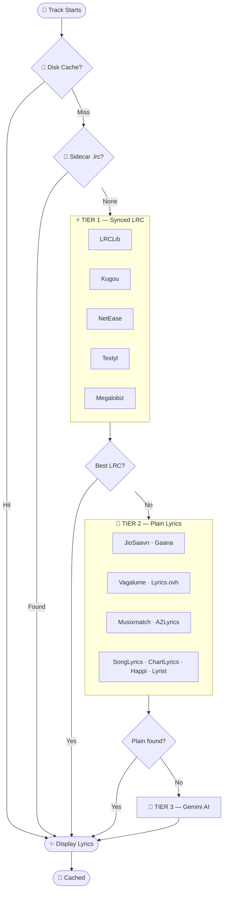
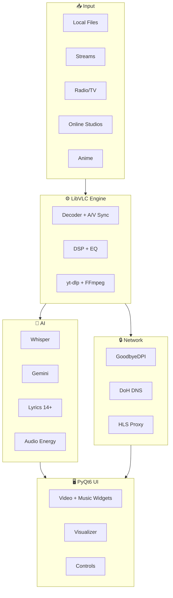

 

&nbsp;
&nbsp;
&nbsp;
&nbsp;
&nbsp;

  

<strong>A complete AI multimedia production studio — not just a media player.</strong>

OpenAI Whisper (offline subtitles) · Gemini AI (translation &amp; chat) · Dolby.io (cloud mastering) 
LibVLC engine · PyQt6 glassmorphism UI · 14+ lyrics sources · 48-band visualizer

 

 
Windows 10 / 11 · 64-bit · Self-contained · No Python install needed

 

---

## ⚡ Why SANDYPLAY?

<table>
<tr>
<td width="50%" valign="top">

<h3>What SANDYPLAY Does</h3>

<ul>
<li>🤖 <strong>AI Subtitles</strong> — Whisper generates subtitles offline in 99 languages</li>
<li>☁️ <strong>Dolby Mastering</strong> — One-click cloud audio enhancement</li>
<li>🎤 <strong>14+ Lyrics Sources</strong> — Synced karaoke with AI fallback</li>
<li>🌐 <strong>Lyrics Translation</strong> — Real-time bilingual display via Gemini</li>
<li>🌊 <strong>48-Band Visualizer</strong> — Real audio-synced at ~30fps</li>
<li>🔊 <strong>DTS Studio</strong> — 5 simulation modes for immersive audio</li>
<li>🎛️ <strong>10-Band EQ</strong> — Professional parametric equalizer</li>
<li>📡 <strong>Stream Anything</strong> — YouTube, Twitch, 1000+ sites via yt-dlp</li>
</ul>

</td>
<td width="50%" valign="top">

<h3>What Others Don't Have</h3>

<table>
<tr><th>Feature</th><th>SANDYPLAY</th><th>VLC</th><th>foobar</th></tr>
<tr><td>AI Offline Subtitles</td><td>✅</td><td>❌</td><td>❌</td></tr>
<tr><td>Cloud Audio Mastering</td><td>✅</td><td>❌</td><td>❌</td></tr>
<tr><td>Synced Lyrics (14+ src)</td><td>✅</td><td>❌</td><td>⚠️</td></tr>
<tr><td>Lyrics Translation</td><td>✅</td><td>❌</td><td>❌</td></tr>
<tr><td>AI Command Palette</td><td>✅</td><td>❌</td><td>❌</td></tr>
<tr><td>Anime Studio</td><td>✅</td><td>❌</td><td>❌</td></tr>
<tr><td>300+ Radio Stations</td><td>✅</td><td>❌</td><td>❌</td></tr>
<tr><td>Live IPTV</td><td>✅</td><td>❌</td><td>❌</td></tr>
</table>

</td>
</tr>
</table>

 

---

## 🧩 Feature Overview

<table>
<tr>
<td align="center" width="33%" valign="top">
<h3>🤖 AI Engine</h3>

Whisper local subtitles 
Gemini translation &amp; chat 
AI smart playlists 
AI video captions 
Natural language commands 
AI metadata cleaner

</td>
<td align="center" width="33%" valign="top">
<h3>🎧 Audio Engine</h3>

Dolby.io cloud mastering 
DTS 5-mode simulation 
10-band parametric EQ 
10 speaker modes 
SoX HiFi resampler 
0.25×–4.0× speed control

</td>
<td align="center" width="33%" valign="top">
<h3>🎬 Video Engine</h3>

LibVLC 3.x + NVDEC 
HDR simulation 
7 deinterlace modes 
8 aspect ratios 
Dynamic ambient theming 
External subtitle support

</td>
</tr>
<tr>
<td align="center" width="33%" valign="top">
<h3>🌊 UI &amp; Visualizer</h3>

12 glassmorphism themes 
Custom HEX color picker 
48-band real-time visualizer 
Music widget with album art 
Animated lyrics panel 
Quality picker popup

</td>
<td align="center" width="33%" valign="top">
<h3>📡 Online Studios</h3>

Music (5 sources) 
Video (YouTube trending) 
Podcasts (iTunes + RSS) 
Anime (8 languages) 
300+ radio stations 
IPTV (10 sources)

</td>
<td align="center" width="33%" valign="top">
<h3>💾 Session &amp; Tools</h3>

Auto-save every 2 min 
Named snapshots 
Favorites &amp; recent plays 
A-B repeat &amp; bookmarks 
ISP bypass (GoodbyeDPI) 
Mini player &amp; sleep timer

</td>
</tr>
</table>

 

---

## 🎤 Lyrics Engine

The most advanced open-source lyrics system built into a media player — **3-tier parallel pipeline** with guaranteed results.

<table>
<tr>
<td width="55%" valign="top">

<strong>Tier 1 — Synced LRC</strong> (8s parallel deadline) 
① LRCLib · ② Kugou (50M+) · ③ NetEase · ④ Textyl · ⑤ Megalobiz

<strong>Tier 2 — Plain Lyrics</strong> (12s parallel deadline) 
⑥ JioSaavn · ⑦ Gaana · ⑧ Vagalume · ⑨ Lyrics.ovh · ⑩ Musixmatch 
⑪ AZLyrics · ⑫ SongLyrics · ⑬ ChartLyrics · ⑭ Happi.dev · ⑮ Lyrist

<strong>Tier 3 — AI Fallback</strong> (always works) 
🤖 Gemini AI generates lyrics — guaranteed, never fails

</td>
<td width="45%" valign="top">

<strong>How it works:</strong>

<ul>
<li>Checks disk cache first (instant)</li>
<li>Then sidecar <code>.lrc</code> / <code>.txt</code> files</li>
<li>Runs Tier 1→2→3 in parallel</li>
<li>Best result wins + gets cached</li>
<li>MD5-keyed JSON per track</li>
<li>Fuzzy matching (ratio &gt; 0.72)</li>
<li>4 title variants per source</li>
<li>Batch mode: 200 files at once</li>
</ul>

</td>
</tr>
</table>

<strong>View lyrics pipeline flowchart</strong>

 

---

## 📻 Radio & TV

<table>
<tr>
<td width="50%" valign="top">

<h3>📻 Online Radio Studio</h3>

<strong>300+ curated stations across 9 genres:</strong>

<ul>
<li>🎵 <strong>Tamil</strong> — 32 stations (AIR, Ilayaraja, AR Rahman, Mirchi…)</li>
<li>🎶 <strong>Hindi</strong> — 8 stations (Vividh Bharati, Bollywood…)</li>
<li>🎤 <strong>100+ Artist Streams</strong> — Taylor Swift, BTS, Coldplay…</li>
<li>🌟 <strong>K-Pop</strong> — 30+ stations (BTS Radio, SBS PopAsia…)</li>
<li>🎼 <strong>Classical &amp; Jazz</strong> — BBC Radio 3, WQXR…</li>
<li>🎸 <strong>Rock &amp; Pop</strong> — KEXP, Radio Paradise…</li>
<li>📰 <strong>News</strong> — BBC World, NPR</li>
<li>💃 <strong>Electronic</strong> — SomaFM, 1.FM Trance</li>
<li>📡 <strong>Hardware SDR</strong> — RTL-SDR dongle for real FM</li>
</ul>

</td>
<td width="50%" valign="top">

<h3>📺 Online TV Studio (IPTV)</h3>

<strong>Live channels from 10 public sources:</strong>

<table>
<tr><td>🌐 <strong>All</strong></td><td>Searchable, auto-deduplicated</td></tr>
<tr><td>🎥 <strong>Genre</strong></td><td>News · Movies · Music · Kids · Sports</td></tr>
<tr><td>🗣️ <strong>Language</strong></td><td>Tamil · Hindi · English · Korean…</td></tr>
<tr><td>🌍 <strong>Region</strong></td><td>India (by state) · USA · UK · Japan…</td></tr>
<tr><td>❤️ <strong>Favorites</strong></td><td>Persistent across sessions</td></tr>
</table>

<strong>Sources:</strong> iptv-org · Free-TV · PlutoTV · Samsung TV+ 
Plex · Roku · PBS · Stirr · Tubi · LocalNow

</td>
</tr>
</table>

 

---

## 🎌 Anime Studio

Stream dubbed anime across **8 languages** — powered by AniNeko & AnimeSalt.

<table>
<tr>
<td width="50%" valign="top">

<h3>Languages</h3>

<table>
<tr><th>Indian</th><th>International</th></tr>
<tr><td>🇮🇳 Tamil — AnimeSalt</td><td>🇬🇧 English — AniNeko</td></tr>
<tr><td>🇮🇳 Hindi — AnimeSalt</td><td>🇪🇸 Spanish — AniNeko</td></tr>
<tr><td>🇮🇳 Telugu — AnimeSalt</td><td>🇫🇷 French — AniNeko</td></tr>
<tr><td>🇮🇳 Malayalam — AnimeSalt</td><td>🇧🇷 Portuguese — AniNeko</td></tr>
</table>

</td>
<td width="50%" valign="top">

<h3>Features</h3>

<ul>
<li>🔥 Recent &amp; popular anime tabs</li>
<li>🔍 Live search with autocomplete</li>
<li>📺 Episode viewer with direct streaming</li>
<li>❤️ Favorites &amp; custom playlists</li>
<li>🖼️ Poster grid with lazy image loading</li>
<li>🔒 Auto ISP bypass via GoodbyeDPI</li>
</ul>

</td>
</tr>
</table>

 

---

## 🎵 Online Studios

<table>
<tr>
<td align="center" width="25%" valign="top">
<h3>🎵 Music</h3>

YouTube Music 
JioSaavn · SoundCloud 
Apple Music  
Discover · Search 
Favorites · Playlists 
Download (MP3)

</td>
<td align="center" width="25%" valign="top">
<h3>🎥 Video</h3>

YouTube Trending 
Search by category 
Playlist-only mode  
Favorites · Playlists 
Quality: 144p–Original 
Download (MP4)

</td>
<td align="center" width="25%" valign="top">
<h3>🎙️ Podcasts</h3>

iTunes Discovery 
15+ categories 
9 language filters  
Custom RSS feeds 
Episode streaming 
Favorites &amp; downloads

</td>
<td align="center" width="25%" valign="top">
<h3>🌐 Web Tools</h3>

Built-in Browser 
(PyQt6 WebEngine)  
Sandytalks AI Chat 
(Gemini 2.5 Flash)

</td>
</tr>
</table>

 

---

## 🚀 Installation

 

<table>
<tr><td>📥 <strong>1</strong></td><td>Download the installer above</td></tr>
<tr><td>🛡️ <strong>2</strong></td><td>SmartScreen warning? → Click <strong>More Info</strong> → <strong>Run Anyway</strong></td></tr>
<tr><td>🚀 <strong>3</strong></td><td>Launch from Desktop shortcut</td></tr>
<tr><td>🎵 <strong>4</strong></td><td>Drag &amp; drop files, or <code>Ctrl+O</code> / <code>Ctrl+D</code></td></tr>
<tr><td>🤖 <strong>5</strong></td><td>First AI subtitle use downloads Whisper model (~1.5 GB, one-time)</td></tr>
</table>

 

### System Requirements

<table>
<tr><th></th><th>Minimum</th><th>Recommended</th></tr>
<tr><td><strong>OS</strong></td><td>Windows 10 64-bit</td><td>Windows 11 64-bit</td></tr>
<tr><td><strong>CPU</strong></td><td>Dual-core 2 GHz</td><td>Quad-core 3 GHz+</td></tr>
<tr><td><strong>RAM</strong></td><td>4 GB</td><td>8 GB+</td></tr>
<tr><td><strong>GPU</strong></td><td>Integrated</td><td>NVIDIA GTX 1060+ (NVDEC)</td></tr>
<tr><td><strong>Disk</strong></td><td>500 MB</td><td>3 GB+ (with Whisper model)</td></tr>
</table>

 

### What's Included

<table>
<tr><td>✅ Bundled</td><td>LibVLC + all codecs, Python runtime, SoX, VC++ runtimes</td></tr>
<tr><td>⬇️ Auto-download</td><td>Whisper AI model (~1.5 GB on first use)</td></tr>
<tr><td>🔑 Optional</td><td>Gemini API key (<a href="https://aistudio.google.com">get free</a>) · Dolby.io credentials (<a href="https://dolby.io">get free</a>)</td></tr>
</table>

 

---

## ❓ FAQ

<strong>Do I need a GPU?</strong>

No. CPU works fine. An NVIDIA GPU unlocks NVDEC hardware acceleration for smoother 4K — but it's optional.

<strong>Does Whisper work offline?</strong>

Yes, 100% offline after the one-time model download. Subtitles are cached per file — instant on replay.

<strong>What API keys do I need?</strong>

<strong>None</strong> for core playback, EQ, DTS, visualizer, lyrics, radio, IPTV, anime, and all online studios. Gemini (free) for translation/AI chat. Dolby.io (free tier) for cloud mastering.

<strong>Why aren't lyrics showing?</strong>

Check the status bar for search progress. Try <code>Misc → Search Lyrics Manually</code> with a cleaned title. For Indian music, JioSaavn/Gaana have the best coverage. You can also drop a <code>.lrc</code> sidecar file next to your audio.

<strong>Can I stream YouTube?</strong>

Yes. <code>Ctrl+U</code> → paste any URL. yt-dlp supports 1000+ sites. Playlists auto-expand and mix with local files.

<strong>Linux / macOS support?</strong>

Currently Windows-only. The stack is cross-platform but some components are Windows-specific. Community PRs welcome.

 

---

<strong>⌨️ Keyboard Shortcuts</strong>

 

<table>
<tr><th>Key</th><th>Action</th><th>Key</th><th>Action</th></tr>
<tr><td><code>Space</code></td><td>Play / Pause</td><td><code>N</code> / <code>B</code></td><td>Next / Previous</td></tr>
<tr><td><code>→</code> / <code>←</code></td><td>Seek ±10s</td><td><code>↑</code> / <code>↓</code></td><td>Volume ±5%</td></tr>
<tr><td><code>M</code></td><td>Mute</td><td><code>F</code></td><td>Fullscreen</td></tr>
<tr><td><code>V</code></td><td>Visualizer</td><td><code>P</code></td><td>Playlist</td></tr>
<tr><td><code>L</code></td><td>Loop</td><td><code>]</code> / <code>[</code></td><td>Speed ±0.1×</td></tr>
<tr><td><code>Ctrl+L</code></td><td>Lyrics</td><td><code>Ctrl+T</code></td><td>Translate</td></tr>
<tr><td><code>Ctrl+O</code></td><td>Open File</td><td><code>Ctrl+U</code></td><td>Open URL</td></tr>
<tr><td><code>Ctrl+Alt+F</code></td><td>Favorite</td><td><code>Ctrl+Alt+S</code></td><td>Snapshot</td></tr>
<tr><td><code>?</code></td><td>All Shortcuts</td><td></td><td></td></tr>
</table>

<strong>🏗️ Architecture</strong>

<strong>🛠️ Tech Stack</strong>

 

<table>
<tr><th></th><th>Technology</th><th>Purpose</th></tr>
<tr><td>🖥️</td><td>PyQt6</td><td>Glassmorphism UI</td></tr>
<tr><td>🎬</td><td>LibVLC 3.x</td><td>Media engine + NVDEC</td></tr>
<tr><td>🤖</td><td>faster-whisper</td><td>Offline AI subtitles</td></tr>
<tr><td>🧠</td><td>Gemini 1.5/2.5</td><td>Translation, AI chat</td></tr>
<tr><td>☁️</td><td>Dolby.io</td><td>Cloud audio mastering</td></tr>
<tr><td>📡</td><td>yt-dlp</td><td>1000+ site streaming</td></tr>
<tr><td>🛡️</td><td>GoodbyeDPI</td><td>ISP bypass</td></tr>
<tr><td>🏷️</td><td>mutagen</td><td>Media tag reading</td></tr>
</table>

<strong>🗂️ Project Structure</strong>

<pre>
SANDYPLAY/
├── sandyplay.py              # Entire app — single Python file
├── vpn/goodbyedpi.exe        # ISP bypass (optional)
├── rtl-sdr/x64/rtl_fm.exe    # Hardware FM (optional)
└── ~/.sandyplay/              # Auto-created
    ├── config.json            # Settings
    ├── plus/                  # Sessions & snapshots
    ├── lyrics/                # Cached lyrics
    ├── subtitles/             # Cached Whisper SRTs
    ├── cache/images/          # Thumbnails
    └── dolby/                 # Enhanced audio
</pre>

 

---

## 🗺️ Roadmap

<table>
<tr><th></th><th>Milestone</th><th>Version</th></tr>
<tr><td>✅</td><td>Lyrics engine · Dolby · Whisper · DTS · FM radio</td><td>v1.13</td></tr>
<tr><td>✅</td><td>Music studio · IPTV · session persistence</td><td>v1.14</td></tr>
<tr><td>✅</td><td>Anime · ISP bypass · Video/Podcast studios · Mini player · AI chat</td><td>v1.15</td></tr>
<tr><td>📋</td><td>Linux native build</td><td>v1.16</td></tr>
<tr><td>📋</td><td>Podcast chapters · Watch Party (LAN sync)</td><td>v1.17–18</td></tr>
<tr><td>💡</td><td>Discord presence · Cloud sync · DJ Mode · macOS · Android remote</td><td>Future</td></tr>
</table>

 

---

## 🤝 Contributing

SANDYPLAY is a <strong>solo project</strong> — every contribution makes a difference.

⭐ Star the repo · 🐛 Report bugs · 💡 Suggest features · 📻 Add radio stations · 🎌 Fix anime scrapers · 📣 Share with friends

&nbsp;&nbsp;
&nbsp;&nbsp;

 

---

## 📄 License

**MIT License** — Copyright © 2026 Santhosh (Sandytalks)

Third-party: VLC (LGPL) · FFmpeg (LGPL/GPL) · Whisper (MIT) · PyQt6 (GPL) · yt-dlp (Unlicense) · Dolby.io · Gemini API · GoodbyeDPI (MIT)

 

---

<strong>Built with ❤️ by <a href="https://www.instagram.com/itsyouhuman/">Santhosh</a></strong>

&nbsp;&nbsp;

  

