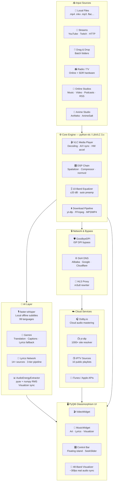

<div align="center">


</div>

<br/>

<div align="center">

> **SANDYPLAY v1.15** is a **complete AI multimedia production studio** for Windows — not just a media player.
>
> Powered by **LibVLC** + **PyQt6** glassmorphism UI, integrating **OpenAI Whisper** (100% offline subtitles in 99 languages), **Gemini AI** (translation, smart playlists, captions, in-app chat), and **Dolby.io** (one-click cloud audio mastering).
>
> `14+ lyrics sources` · `48-band visualizer` · `300+ radio stations` · `IPTV` · `online anime studio` · `DTS simulation` · `10-band EQ` · `ISP bypass`
>
> **Free. Open-source. Self-contained.**

</div>

<br/>

<div align="center">

[⚡ Why SANDYPLAY](#-why-sandyplay) &nbsp;·&nbsp;
[✨ Features](#-features) &nbsp;·&nbsp;
[🎤 Lyrics Engine](#-lyrics-engine) &nbsp;·&nbsp;
[📻 Radio & TV](#-online-radio-studio) &nbsp;·&nbsp;
[🎌 Anime Studio](#-online-anime-studio) &nbsp;·&nbsp;
[🎵 Online Studios](#-online-music-video--podcast-studios) &nbsp;·&nbsp;
[🚀 Install](#-installation) &nbsp;·&nbsp;
[❓ FAQ](#-faq)

</div>

---

## ⚡ Why SANDYPLAY?

> **No other free, open-source media player combines all of this in a single application.**

| Feature | ◈ **SANDYPLAY** | VLC | MPC-HC | foobar2000 |
|:---|:---:|:---:|:---:|:---:|
| 🤖 AI Local Subtitles (Whisper, offline) | ✅ | ❌ | ❌ | ❌ |
| ☁️ Cloud Audio Mastering (Dolby.io) | ✅ | ❌ | ❌ | ❌ |
| 🎤 Synced Karaoke Lyrics (14+ sources) | ✅ | ❌ | ❌ | ⚠️ |
| 🌐 Lyrics Translation (5 languages) | ✅ | ❌ | ❌ | ❌ |
| 🧠 AI Natural Language Command Palette | ✅ | ❌ | ❌ | ❌ |
| 🎨 Dynamic Ambient Color from Video | ✅ | ❌ | ❌ | ❌ |
| 🌊 48-Band Real-Time Visualizer | ✅ | ❌ | ❌ | ⚠️ |
| 🔊 DTS Studio Simulation (5 modes) | ✅ | ⚠️ | ⚠️ | ❌ |
| 🎌 Online Anime Studio (8 languages) | ✅ | ❌ | ❌ | ❌ |
| 📡 YouTube / Twitch / 1000+ Sites | ✅ | ✅ | ❌ | ❌ |
| 📻 300+ Radio + SDR FM Tuner | ✅ | ❌ | ❌ | ❌ |
| 📺 Live IPTV by Genre / Language / Region | ✅ | ❌ | ❌ | ❌ |

---

## ✨ Features

<details>
<summary><b>🤖 AI Intelligence Layer</b></summary>

<br/>

| Module | Details |
|:---|:---|
| **🎙️ Whisper Engine** | `faster-whisper` · 100% local & offline · models: `tiny` / `base` / `small` / `medium` / `large-v3` / `large-v3-turbo` |
| **🌍 Language Detection** | 99 languages with auto-detect · translated output in English |
| **📝 Subtitle Output** | `.SRT` with word-level timestamps · 500ms VAD segmentation · auto-audio-extract via ffmpeg |
| **⚡ Subtitle Caching** | Stored per MD5 hash · instant reload on replay |
| **🔄 Gemini Translation** | Auto-detect → EN / TA / HI / TE · chunked batches · LRC-aware timestamps |
| **📖 Bilingual Lyrics** | Original + translated lines interleaved in real time |
| **🧠 AI Smart Playlist** | Vibe-keyword semantic sort — `"chill"` · `"workout"` · `"sad"` |
| **🎞️ AI Video Captions** | Mood-aware 2-sentence description per video |
| **⌨️ AI Command Palette** | Natural language control — `"play next"` · `"pause"` · `"louder"` |
| **🏷️ AI Metadata Cleaner** | Strips `[Official Video]` `(Lyrics)` `4K` `HD` tags |

</details>

<details>
<summary><b>🎧 Studio-Grade Audio Engine</b></summary>

<br/>

| Module | Details |
|:---|:---|
| **☁️ Dolby.io Mastering** | OAuth2 auth · Dolby Enhance API · lossless WAV output |
| **🔊 DTS Modes** | Music · Movie · Game · Custom · Off — each with tailored DSP chain |
| **🎚️ 10-Band Equalizer** | 60 Hz – 16 kHz · ±20 dB · presets: Flat / Bass Boost / Treble / Vocal / Rock / Pop / Custom |
| **🔊 10 Speaker Modes** | Stereo · Reverse · Mono · 2.1 · Dolby Surround · 5.1 · 7.1 · Spatial 3D · Studio HiFi |
| **🎛️ DSP Filters** | Spatializer · Headphone 3D · Compressor · normvol |
| **🔊 Volume Boost** | 0 – 200% range with mute guard |
| **🎙️ SoX Resampler** | Highest-quality pitch-locked speed control (0.25× – 4.0×) |
| **🔁 A-B Repeat** | Set A → set B → loop indefinitely → one-tap reset |
| **⏱️ Sync Control** | Audio delay ±5000ms · subtitle delay ±5000ms |

</details>

<details>
<summary><b>🎬 Video & Display Engine</b></summary>

<br/>

| Module | Details |
|:---|:---|
| **⚙️ Decoder** | LibVLC 3.x · NVDEC hardware (NVIDIA GPU) · software CPU fallback |
| **🖥️ HDR Simulation** | Contrast · Brightness · Saturation · Gamma tuning via `VideoAdjustOption` |
| **🔀 Deinterlacing** | 7 modes: Blend · Bob · Yadif · Yadif 2x · Linear · Mean · X |
| **📐 Aspect Ratios** | 8 modes: Default · 16:9 · 4:3 · 21:9 · 16:10 · 1.85:1 · 2.35:1 · 1:1 |
| **🔍 Zoom** | 0.3× – 3.0× via Ctrl+Scroll |
| **📸 Screenshots** | PNG snapshots with save dialog |
| **🖥️ Fullscreen** | Floating island control bar · auto-hide with fade · cursor blanking |
| **🌅 Ambient Theming** | Auto-samples video frame and repaints UI accents to match |
| **📄 External Subtitles** | `.srt` · `.ass` · `.vtt` · `.sub` |

</details>

<details>
<summary><b>🌊 Glassmorphism UI & Visualizer</b></summary>

<br/>

| Module | Details |
|:---|:---|
| **🎨 12 Built-in Themes** | Sky Blue · Purple Haze · Sunset Orange · Emerald · Crimson · Golden Glow · Hot Pink · Deep Indigo · Teal Surge · Ocean Cyan · Copper · Moonlight |
| **🖌️ Custom Color** | Any HEX code via Qt color picker |
| **🌊 48-Band Visualizer** | Custom `QPainter` canvas · ~30fps · symmetric mirror bars from center |
| **🎵 Real Audio Sync** | `pyav` + `numpy` RMS energy extraction → real-time bar mapping |
| **🖼️ Music Widget** | Album art · NOW PLAYING badge · Title / Artist / Album labels · chip row |
| **📜 Lyrics Panel** | Custom delegate with multi-line centered paint · smooth animated scroll |
| **▶️ Continue Overlay** | "Continue from [timestamp]?" prompt on resume · auto-dismiss |
| **⏭️ Up Next Card** | Floating countdown overlay with "Play Now" shortcut |
| **🎬 Quality Picker** | Live video/audio quality switcher with instant re-play |

</details>

<details>
<summary><b>🎬 Playback & Queue Engine</b></summary>

<br/>

| Module | Details |
|:---|:---|
| **📦 Formats** | MP4 · MKV · AVI · MOV · WebM · FLV + MP3 · FLAC · WAV · AAC · M4A · OGG · OPUS · and more |
| **📡 Streaming** | yt-dlp resolver · selectable quality · playlist auto-expand · 1000+ sites |
| **🔖 Bookmarks** | Up to 40 per file · labeled · persisted in config |
| **🖱️ Drag & Drop** | Files + folders · recursive · skip duplicates |
| **🔢 Queue Management** | Drag-to-reorder · search filter · batch open |
| **🪟 Mini Player** | Compact floating mode for distraction-free listening |
| **⏱️ Sleep Timer** | Auto-shutdown playback after chosen minutes |

</details>

<details>
<summary><b>🔒 ISP Bypass & Network Engine</b></summary>

<br/>

| Module | Details |
|:---|:---|
| **🛡️ GoodbyeDPI** | WinDivert-based ISP DPI bypass · auto-detects if running · ref-counted |
| **🌐 DNS-over-HTTPS** | Alibaba → Google → Cloudflare fallback chain · thread-safe cache |
| **📡 HLS Stream Proxy** | Local server rewrites `.m3u8` segments through proxy · retry-on-fail |
| **⚙️ VPN Presets** | `-5` through `-9` preset flags for bypass aggressiveness |

</details>

<details>
<summary><b>💾 Session & Library</b></summary>

<br/>

| Module | Details |
|:---|:---|
| **💾 Auto-Save** | Every 120 seconds · JSON session state |
| **🔄 Session Restore** | Restores playlist + position + volume + speed + accent color |
| **📸 Named Snapshots** | `Ctrl+Alt+S` · unlimited `.json` snapshots |
| **❤️ Favorites** | `Ctrl+Alt+F` · browse from Plus menu · play directly |
| **🕐 Recently Played** | Last 35 tracks · timestamped |
| **📤 HTML Export** | Full queue report · `Ctrl+Alt+E` |

</details>

---

## 🎤 Lyrics Engine

> **The most advanced open-source lyrics system ever built into a media player.**
> 3-tier parallel pipeline · 14+ live sources · smart disk caching · guaranteed AI fallback

<details>
<summary><b>View Lyrics Pipeline Flowchart</b></summary>

<br/>


</details>

<details>
<summary><b>View All 16 Lyrics Sources</b></summary>

<br/>

| # | Source | Type | Strength |
|:---:|:---|:---:|:---|
| ① | **LRClib** | `Synced` | Global catalog, growing rapidly |
| ② | **Kugou** | `Synced` | 50M+ · strongest Asian catalog |
| ③ | **NetEase** | `Synced` | Chinese + international |
| ④ | **Textyl** | `Synced` | English-heavy, fastest response |
| ⑤ | **Megalobiz** | `Synced` | International community repository |
| ⑥ | **JioSaavn** | `Plain` | India — TA / HI / TE / ML |
| ⑦ | **Gaana** | `Plain` | Bollywood + South Indian |
| ⑧ | **Vagalume** | `Plain` | Portuguese + international |
| ⑨ | **Lyrics.ovh** | `Plain` | Global English |
| ⑩ | **Musixmatch** | `Plain` | Largest global catalog |
| ⑪ | **AZLyrics** | `Plain` | Extensive English catalog |
| ⑫ | **SongLyrics** | `Plain` | Indian + international |
| ⑬ | **ChartLyrics** | `Plain` | Free, no API key |
| ⑭ | **Happi.dev** | `Plain` | Community-driven |
| ⑮ | **Lyrist** | `Plain` | Fast REST alternative |
| 🤖 | **Gemini AI** | `Fallback` | Never fails — guaranteed result |

</details>

<details>
<summary><b>Lyrics Engine Technical Details</b></summary>

<br/>

- **Caching:** MD5-keyed JSON files — dual-path lookup via `hash(title+artist)` and `hash(filepath)`
- **Title variants:** Up to 4 cleaned variants per source — 8-stage regex pipeline
- **Fuzzy matching:** `difflib.SequenceMatcher` ratio > 0.72 for title acceptance
- **Fail cache:** 30-second cooldown per query signature
- **Batch mode:** `ThreadPoolExecutor(max_workers=4)` — up to 200 files auto-fetched on open
- **Sidecar priority:** `.lrc` and `.txt` in same folder always win before any network request

</details>

---

## 📻 Online Radio Studio

> **300+ curated stations · 9 genres · 100+ artist-dedicated streams · Hardware SDR FM tuner**

<details>
<summary><b>Tamil (32 stations)</b></summary>

AIR Madurai FM · AIR KODAI FM · Ilayaraja Radio · AR Rahman Radio · Sooriyan FM · Mirchi FM · Big FM Tamil · Thalapathy Vijay FM · Ajith FM · Chillax FM · Tamil 80s/90s Hits · Harris Jayaraj FM · KS Chitra · S Janaki · K J Yesudas · MS Viswanathan · Kannadasan Radio · Lankasri FM · and more

</details>

<details>
<summary><b>Hindi / Indian (8 stations)</b></summary>

AIR Vividh Bharati · Hits of Bollywood · Hits of Lata Mangeshkar · Hits of Mohammed Rafi · Radio Aashiqanaa · Radio Namkin · Radio Retro Bollywood 90s

</details>

<details>
<summary><b>International Artists (100+ streams)</b></summary>

Dedicated streams for: Adele · Ariana Grande · Beatles · Beyoncé · BTS · Coldplay · Drake · Ed Sheeran · Eminem · Imagine Dragons · Lady Gaga · Metallica · Michael Jackson · Pink Floyd · Queen · Rihanna · Taylor Swift · The Weeknd · and 80+ more artists

</details>

<details>
<summary><b>K-Pop (30+ stations)</b></summary>

BTS Radio · K-Pop 24 · SBS PopAsia · Mnet K-Pop · DFM K-POP · Hotmix K-Pop · Generacion Kpop · and more

</details>

<details>
<summary><b>Classical · Jazz · Rock · Pop · News · Electronic</b></summary>

**Classical & Jazz:** BBC Radio 3 · Jazz Radio · Radio Swiss Classic · WQXR Classical  
**Rock & Pop:** KEXP Seattle · Radio Paradise · ROCK FM · SomaFM Groove Salad  
**News:** BBC Radio 4 · BBC World Service · NPR News USA  
**Electronic:** 1.FM Chillout Lounge · 1.FM Trance · SomaFM Drone Zone

</details>

<details>
<summary><b>Hardware SDR FM Tuner</b></summary>

SANDYPLAY integrates with **RTL-SDR dongles** for real hardware FM radio. Place `rtl_fm.exe` in `rtl-sdr/x64/`, open FM Studio → Hardware SDR tab → enter frequency → tune & play. ±0.1 MHz nudge buttons, raw audio piped to local HTTP server → VLC.

</details>

---

## 📺 Online TV Studio (IPTV)

Live IPTV from **10 public playlist sources**, organized into a browsable 4-tab studio:

| Tab | Description |
|:---|:---|
| 🌐 **All Channels** | Searchable flat list with deduplication |
| 🎥 **By Genre** | News · Movies · Entertainment · Music · Kids · Sports |
| 🗣️ **By Language** | Tamil · Hindi · Malayalam · Telugu · English · Korean · Japanese · and more |
| 🌍 **By Region** | India (state-level) · USA · UK · Canada · France · Germany · Japan · and more |
| ❤️ **Favorites** | Persistent across sessions |

**Sources:** `iptv-org` · `Free-TV` · `PlutoTV` · `SamsungTVPlus` · `Plex` · `Roku` · `PBS` · `Stirr` · `Tubi` · `LocalNow` — auto-refreshes every 24 hours.

---

## 🎌 Online Anime Studio

> **Discover, search, and stream dubbed anime across 8 languages — powered by AniNeko & AnimeSalt**

| Language | Source | | Language | Source |
|:---:|:---|---|:---:|:---|
| 🇮🇳 Tamil | AnimeSalt | | 🇬🇧 English | AniNeko |
| 🇮🇳 Hindi | AnimeSalt | | 🇪🇸 Spanish | AniNeko |
| 🇮🇳 Telugu | AnimeSalt | | 🇫🇷 French | AniNeko |
| 🇮🇳 Malayalam | AnimeSalt | | 🇧🇷 Portuguese | AniNeko |

**Features:** Recent & popular tabs · live search autocomplete · episode viewer · favorites · custom playlists · poster grid with lazy loading · automatic ISP bypass via GoodbyeDPI

---

## 🎵 Online Music, Video & Podcast Studios

<details>
<summary><b>🎵 Online Music Studio</b></summary>

<br/>

- **Discover** — top songs by country, language, and genre via Apple iTunes RSS + `ytsearch200`
- **Search** — YouTube Music, YouTube Global, JioSaavn, SoundCloud, Apple Music in separate tabs
- **Playlists** — search JioSaavn/Apple Music/YouTube Music playlists and albums
- **Favorites + My Playlists** — save, create, play, and manage playlists locally
- **Download** — Low / Medium / High / Original quality · MP3 extraction via FFmpeg
- **Filters** — India (Hindi / Tamil / Telugu / Punjabi / Malayalam), Global, US, UK, Japan, France, and more

</details>

<details>
<summary><b>🎥 Online Video Studio</b></summary>

<br/>

- **Trending** — `ytsearch400` powered discovery by country, language, and category
- **Search** — videos, channels, topics, playlist-only mode
- **Playlists & Favorites** — persistent with thumbnail artwork
- **Quality downloads** — Low (≤480p), Medium (≤720p), High (≤1080p), Original
- **Streaming quality settings** — Video: Original / 1080p / 720p / 480p / 360p / 144p · Audio: Original / 320kbps / 256kbps / 128kbps / 64kbps

</details>

<details>
<summary><b>🎙️ Online Podcast Studio</b></summary>

<br/>

- **Discovery** — iTunes Search / Top Podcasts with country filters: US, GB, IN, AU, CA, DE, FR, JP, BR
- **Categories** — Arts, Business, Comedy, Education, Health, History, Music, News, Science, Sports, Technology, True Crime, and more
- **Language filter** — English, Tamil, Hindi, Malayalam, Telugu, Spanish, French, German
- **Episodes** — RSS episode list with show summaries, streaming, and downloads
- **Custom RSS** — paste any podcast feed URL and play directly
- **Favorites** — persistent and reloadable

</details>

<details>
<summary><b>🌐 Built-in Web Tools</b></summary>

<br/>

- **Web Browser** — in-app browser powered by PyQt6 WebEngine with navigation controls
- **Sandytalks AI** — Gemini 2.5 Flash chat dialog for quick questions inside the player

</details>

---

## 🚀 Installation

<div align="center">

<a href="https://github.com/sandytalks/SANDYPLAY/releases/download/Sandyplay/SandyPlay_Setup_v1.15.exe">

</a>

</div>

<br/>

| Step | Action |
|:---:|:---|
| **1** 📥 | **Download** — Click the button above |
| **2** 🛡️ | **Install** — SmartScreen? Click More Info → Run Anyway |
| **3** 🚀 | **Launch** — Open SANDYPLAY from your Desktop shortcut |
| **4** 🎵 | **Load Media** — Drag & drop files · `Ctrl+O` · `Ctrl+D` for folder |
| **5** 🤖 | **AI Setup** — Misc → AI Tools · First Whisper use downloads model (~1.5 GB) |

### System Requirements

| | Minimum | Recommended |
|:---|:---|:---|
| **OS** | Windows 10 64-bit | Windows 11 64-bit |
| **CPU** | Dual-core 2 GHz | Quad-core 3 GHz+ |
| **RAM** | 4 GB | 8 GB+ (16 GB for large Whisper models) |
| **GPU** | Integrated graphics | NVIDIA GTX 1060+ for NVDEC |
| **Storage** | 500 MB | 3 GB+ with Whisper `medium` model |
| **Network** | Optional | Required for online features |

---

## 📦 What Ships in the Installer

| Component | Bundled? | Notes |
|:---|:---:|:---|
| LibVLC 3.x + all codec plugins | ✅ | Hardware decode, every format |
| Visual C++ Runtimes | ✅ | Auto-installed silently |
| Python runtime | ✅ | No separate install needed |
| SoX resampler | ✅ | Pitch-locked speed control |
| Start Menu + Desktop shortcut | ✅ | Ready to launch |
| faster-whisper AI model | ⬇️ | ~1.5 GB one-time download on first use |
| Gemini API key | 🔑 | Free from [Google AI Studio](https://aistudio.google.com) |
| Dolby.io credentials | 🔑 | Free tier from [dolby.io](https://dolby.io) |

---

<details>
<summary><b>⌨️ Keyboard Reference</b></summary>

<br/>

<div align="center">

### 🎬 Playback

| Key | Action | Key | Action |
|:---:|:---|:---:|:---|
| `Space` | Play / Pause | `S` | Stop |
| `N` | Next Track | `B` | Previous Track |
| `→` | Seek +10s | `←` | Seek −10s |
| `↑` | Volume +5% | `↓` | Volume −5% |
| `M` | Mute / Unmute | `E` | Frame Step |
| `]` | Speed +0.1× | `[` | Speed −0.1× |
| `L` | Toggle Loop | `Shift+S` | Toggle Shuffle |

### 🖥️ View & Display

| Key | Action | Key | Action |
|:---:|:---|:---:|:---|
| `F` / `Enter` | Fullscreen | `Esc` | Exit Fullscreen |
| `V` | Toggle Visualizer | `C` | Cycle Crop Mode |
| `P` | Toggle Playlist | `F5` | Effects & EQ Panel |

### 🎤 Lyrics & AI

| Key | Action | Key | Action |
|:---:|:---|:---:|:---|
| `Ctrl+L` | Toggle Lyrics | `Ctrl+T` | Translate Lyrics |
| `G` | Lyrics offset −0.3s | `H` | Lyrics offset +0.3s |
| `X` | Cycle Audio Track | `Z` | Cycle Subtitle Track |

### 💾 Session & Utilities

| Key | Action | Key | Action |
|:---:|:---|:---:|:---|
| `Ctrl+Alt+F` | Toggle Favorite | `Ctrl+Alt+S` | Save Snapshot |
| `Ctrl+O` | Open File(s) | `Ctrl+D` | Open Folder |
| `Ctrl+U` | Open Stream URL | `Ctrl+S` | Save Playlist |
| `?` | Show All Shortcuts | | |

</div>

</details>

<details>
<summary><b>🏗️ Architecture</b></summary>

<br/>



</details>

<details>
<summary><b>🛠️ Tech Stack</b></summary>

<br/>

<div align="center">


</div>

<br/>

| Component | Technology | Purpose |
|:---|:---|:---|
| 🖥️ **GUI** | PyQt6 6.x | Glassmorphism UI, animations, custom painting |
| 🎬 **Media** | python-vlc / LibVLC 3.x | Decoding, playback, DSP, hardware acceleration |
| 🤖 **AI Subtitles** | faster-whisper | 100% local on-device speech-to-text |
| 🧠 **LLM** | Google Gemini 1.5 / 2.5 Flash | Translation, captions, smart tools, lyrics fallback |
| ☁️ **Cloud Audio** | Dolby.io REST API | De-noise, master, normalize audio |
| 📡 **Streaming** | yt-dlp | YouTube, Twitch, SoundCloud + 1000+ sites |
| 🏷️ **Tags** | mutagen | ID3 / MP4 / FLAC metadata + artwork |
| 🛡️ **ISP Bypass** | GoodbyeDPI + DoH DNS | Bypass DPI blocking, DNS poisoning |

</details>

<details>
<summary><b>🗂️ Project Structure</b></summary>

<br/>

```
SANDYPLAY/
├── sandyplay.py                  # Entire application — single Python file
├── vpn/
│   └── goodbyedpi.exe            # ISP bypass (optional)
├── rtl-sdr/x64/
│   └── rtl_fm.exe                # Hardware FM radio (optional)
└── ~/.sandyplay/                 # Auto-created on first run
    ├── config.json               # All settings
    ├── plus/                     # Sessions, snapshots, library, history
    ├── cache/images/             # Cached thumbnails/artwork
    ├── lyrics/                   # MD5-keyed lyrics JSON
    ├── artwork/                  # Cached album art
    ├── subtitles/                # Cached Whisper .srt files
    └── dolby/                    # Dolby.io enhanced WAV output
```

</details>

---

## 🗺️ Roadmap

| Status | Feature | Version |
|:---:|:---|:---:|
| ✅ | 3-tier lyrics fetch · Dolby mastering · Whisper AI · DTS simulation · FM radio | v1.13 |
| ✅ | Online Music Studio · IPTV · session persistence | v1.14 |
| ✅ | Anime Studio · ISP bypass · Video/Podcast Studios · Mini Player · Sleep Timer · Quality Picker · Browser · AI chat | v1.15 |
| 📋 | Linux (Ubuntu / Debian) native build | v1.16 |
| 📋 | Podcast chapter marker UI | v1.17 |
| 📋 | Watch Party — synchronized LAN playback | v1.18 |
| 💡 | Discord Rich Presence · Cloud sync · DJ Mode · macOS · Android remote | TBD |

---

## ❓ FAQ

<details>
<summary><b>Do I need a GPU?</b></summary>
<br/>
No. SANDYPLAY works perfectly on CPU. An NVIDIA GPU unlocks NVDEC hardware acceleration for smoother 4K — but it's optional.
</details>

<details>
<summary><b>Does Whisper AI work offline?</b></summary>
<br/>
Yes, 100% offline after the one-time model download (~1.5 GB for <code>medium</code>). Subtitles are cached per file and load instantly on replay.
</details>

<details>
<summary><b>What API keys do I need?</b></summary>
<br/>

| Feature | Key Required | Free? |
|:---|:---|:---:|
| Core playback, EQ, DTS, visualizer, lyrics, radio, IPTV, anime, studios | None | ✅ |
| Gemini translation, captions, AI chat | Google AI Studio key | ✅ |
| Dolby.io cloud mastering | Dolby App Key + Secret | ✅ free tier |
</details>

<details>
<summary><b>Why aren't lyrics showing?</b></summary>
<br/>

1. Watch the status bar — it shows which tier is being searched
2. Try `Misc → Search Lyrics Manually` — clean the title
3. Paste manually via `Misc → Paste Lyrics Text` (supports LRC)
4. For Indian music — JioSaavn and Gaana have the best coverage
5. Drop a `.lrc` sidecar file in the same folder as your audio
</details>

<details>
<summary><b>Can I use it as a YouTube client?</b></summary>
<br/>
Yes. Press <code>Ctrl+U</code>, paste any URL. SANDYPLAY resolves it via yt-dlp (1000+ sites). Playlists auto-expand. Streams mix with local files in your queue.
</details>

<details>
<summary><b>How does ISP bypass work?</b></summary>
<br/>
<b>GoodbyeDPI</b> prevents ISPs from detecting streaming traffic via WinDivert. <b>DNS-over-HTTPS</b> retries via Alibaba → Google → Cloudflare if standard DNS fails. Both are optional and only activate during anime/stream fetching.
</details>

<details>
<summary><b>Does it work on macOS or Linux?</b></summary>
<br/>
The stack is cross-platform, but SANDYPLAY is primarily tested for Windows. Some components are Windows-specific. Community PRs for Linux/macOS are welcome.
</details>

<details>
<summary><b>Is it truly free and open-source?</b></summary>
<br/>
Yes — MIT licensed. Every line of code is open. Fork it, study it, build on it.
</details>

---

## 🤝 Contributing

> SANDYPLAY is a solo project — every star, bug report, and pull request makes a genuine difference.

- ⭐ **Star the repo** — helps others discover the project
- 🐛 **Report bugs** — open an Issue with steps to reproduce
- 💡 **Suggest features** — open a Discussion tagged `enhancement`
- 📻 **Add radio stations** — PR a new entry to `STATIONS` dict
- 🎌 **Add anime sources** — suggest new platforms or fix scrapers
- 🌍 **Improve lyrics** — suggest new sources or fix scrapers
- 📣 **Share it** — tell your audiophile and cinephile friends

<div align="center">

[](https://github.com/sandytalks/SANDYPLAY/issues)
[](https://github.com/sandytalks/SANDYPLAY/pulls)
[](https://github.com/sandytalks/SANDYPLAY/discussions)

</div>

---

## 📄 License

```
MIT License — Copyright (c) 2026 Santhosh (Sandytalks)
```

**Third-party:** VLC (LGPL) · FFmpeg (LGPL/GPL) · OpenAI Whisper (MIT) · PyQt6 (GPL/Commercial) · yt-dlp (Unlicense) · Dolby.io (commercial, free tier) · Google Gemini API (commercial, free tier) · GoodbyeDPI (MIT)

---

<div align="center">

**Built from scratch with ❤️ by Santhosh — [Sandytalks](https://www.instagram.com/itsyouhuman/)**

*A solo developer crafting something truly extraordinary.*

<br/>

[](https://www.instagram.com/itsyouhuman/)
[](https://github.com/sandytalks/SANDYPLAY)

<br/>

### ⭐ Star History

<picture>
  <source media="(prefers-color-scheme: dark)" srcset="https://api.star-history.com/svg?repos=sandytalks/SANDYPLAY&type=Date&theme=dark"/>
  <source media="(prefers-color-scheme: light)" srcset="https://api.star-history.com/svg?repos=sandytalks/SANDYPLAY&type=Date"/>
  
</picture>

<br/><br/>

> ⭐ **If SANDYPLAY elevated your listening or viewing experience, a GitHub star means the world.**

</div>


