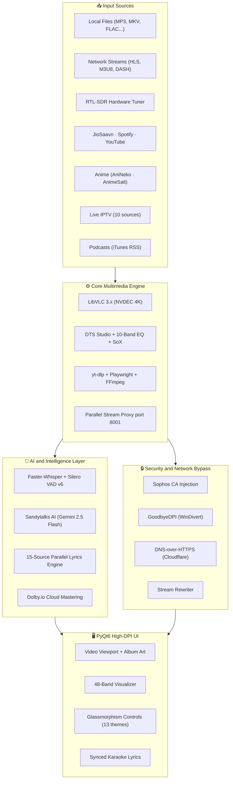

<div align="center">

<!-- HEADER BANNER -->


<br/>

<!-- BADGES BAR -->
<p align="center">
  <a href="https://github.com/sandytalks/SANDYPLAY/releases/latest"></a>&nbsp;
  <a href="https://github.com/sandytalks/SANDYPLAY/releases"></a>&nbsp;
  <a href="LICENSE"></a>&nbsp;
  <a href="https://github.com/sandytalks/SANDYPLAY/stargazers"></a>&nbsp;
  <a href="https://github.com/sandytalks/SANDYPLAY/releases/latest"></a>&nbsp;
  <a href="https://python.org"></a>
</p>

<p align="center">
  <b>Faster-Whisper</b> (99-Language Offline AI Subtitles &bull; Silero VAD v6) &nbsp;&bull;&nbsp; <b>Sandytalks AI</b> (Gemini 2.5 Flash)<br/>
  <b>Dolby.io</b> (Cloud Audio Mastering) &nbsp;&bull;&nbsp; <b>JioSaavn 320kbps &amp; Spotify</b> (pyDes Decrypted) &nbsp;&bull;&nbsp; <b>LibVLC 3.x</b> (NVDEC 4K)<br/>
  <b>RTL-SDR Hardware FM</b> &nbsp;&bull;&nbsp; <b>GoodbyeDPI + DoH</b> (ISP &amp; Campus Bypass) &nbsp;&bull;&nbsp; <b>15-Provider Lyrics Engine</b> &nbsp;&bull;&nbsp; <b>48-Band Visualizer</b>
</p>

<br/>

<p align="center">
  <a href="https://github.com/sandytalks/SANDYPLAY/releases/download/Sandyplay/SandyPlay_Setup_v1.17.exe">
    
  </a>
  <br/><br/>
  <a href="https://github.com/sandytalks/SANDYPLAY/releases/download/Sandyplay/SandyPlay_Setup_v1.17.exe"><b>Direct Download Link: SandyPlay_Setup_v1.17.exe</b></a> (380 MB Standalone Windows Installer)
</p>

<sub>⚡ <b>Self-Contained Installer</b> &bull; Windows 10 / 11 (64-bit) &bull; No Python or external dependencies required</sub>

</div>

<br/>

---

<h2 id="what-makes-sandyplay-unique">🧠 What Makes SANDYPLAY Unique?</h2>

<blockquote>
SANDYPLAY is not a media player. It is a <b>complete multimedia studio</b> &mdash; engineered from the ground up with AI-native architecture, hardware integration, enterprise-grade network bypass, audiophile DSP, and a full online content ecosystem. Everything runs locally, offline-capable, and without subscriptions.
</blockquote>

<br/>

---

<h2 id="the-definitive-comparison">🏆 The Definitive Comparison</h2>

<p><em>How SANDYPLAY stacks up against the best in the world.</em></p>

<table width="100%">
<thead>
<tr>
  <th align="left">Feature</th>
  <th align="center">🏅 SANDYPLAY</th>
  <th align="center">VLC 3.x</th>
  <th align="center">PotPlayer</th>
  <th align="center">MPC-HC</th>
  <th align="center">foobar2000</th>
  <th align="center">Kodi</th>
  <th align="center">MPV</th>
</tr>
</thead>
<tbody>
<tr><td><b>Offline AI Subtitles (Whisper + VAD)</b></td><td align="center">✅ 99 langs</td><td align="center">❌</td><td align="center">❌</td><td align="center">❌</td><td align="center">❌</td><td align="center">❌</td><td align="center">❌</td></tr>
<tr><td><b>Instant AI Video Caption</b></td><td align="center">✅ Gemini</td><td align="center">❌</td><td align="center">❌</td><td align="center">❌</td><td align="center">❌</td><td align="center">❌</td><td align="center">❌</td></tr>
<tr><td><b>Bilingual Lyrics + AI Translation</b></td><td align="center">✅ 2 langs</td><td align="center">❌</td><td align="center">❌</td><td align="center">❌</td><td align="center">❌</td><td align="center">❌</td><td align="center">❌</td></tr>
<tr><td><b>AI Smart Playlist Generator</b></td><td align="center">✅</td><td align="center">❌</td><td align="center">❌</td><td align="center">❌</td><td align="center">⚠️ plugin</td><td align="center">⚠️ addon</td><td align="center">❌</td></tr>
<tr><td><b>AI Metadata Auto-Cleaner</b></td><td align="center">✅ Gemini</td><td align="center">❌</td><td align="center">❌</td><td align="center">❌</td><td align="center">❌</td><td align="center">❌</td><td align="center">❌</td></tr>
<tr><td><b>AI Lyrics Summarizer</b></td><td align="center">✅</td><td align="center">❌</td><td align="center">❌</td><td align="center">❌</td><td align="center">❌</td><td align="center">❌</td><td align="center">❌</td></tr>
<tr><td><b>AI Command Palette</b></td><td align="center">✅</td><td align="center">❌</td><td align="center">❌</td><td align="center">❌</td><td align="center">❌</td><td align="center">❌</td><td align="center">❌</td></tr>
<tr><td><b>Dolby.io Cloud Audio Mastering</b></td><td align="center">✅</td><td align="center">❌</td><td align="center">❌</td><td align="center">❌</td><td align="center">❌</td><td align="center">❌</td><td align="center">❌</td></tr>
<tr><td><b>10 Hardware Speaker DSP Profiles</b></td><td align="center">✅ full DSP</td><td align="center">⚠️ basic</td><td align="center">⚠️ basic</td><td align="center">❌</td><td align="center">⚠️ plugin</td><td align="center">❌</td><td align="center">❌</td></tr>
<tr><td><b>DTS Studio (Music / Movies / Games)</b></td><td align="center">✅</td><td align="center">❌</td><td align="center">❌</td><td align="center">❌</td><td align="center">❌</td><td align="center">❌</td><td align="center">❌</td></tr>
<tr><td><b>10-Band Parametric EQ</b></td><td align="center">✅</td><td align="center">⚠️ basic</td><td align="center">✅</td><td align="center">❌</td><td align="center">✅</td><td align="center">⚠️ addon</td><td align="center">❌</td></tr>
<tr><td><b>Crossfade (Adjustable Duration)</b></td><td align="center">✅ E/W keys</td><td align="center">❌</td><td align="center">❌</td><td align="center">❌</td><td align="center">✅</td><td align="center">⚠️</td><td align="center">❌</td></tr>
<tr><td><b>SoX HiFi Resampler</b></td><td align="center">✅</td><td align="center">❌</td><td align="center">❌</td><td align="center">❌</td><td align="center">⚠️ plugin</td><td align="center">❌</td><td align="center">❌</td></tr>
<tr><td><b>0.25x – 4.0x Pitch-Preserved Speed</b></td><td align="center">✅</td><td align="center">✅</td><td align="center">✅</td><td align="center">❌</td><td align="center">❌</td><td align="center">⚠️</td><td align="center">✅</td></tr>
<tr><td><b>48-Band Real-Time Visualizer</b></td><td align="center">✅</td><td align="center">⚠️ basic</td><td align="center">⚠️</td><td align="center">❌</td><td align="center">✅</td><td align="center">⚠️</td><td align="center">❌</td></tr>
<tr><td><b>15-Source Lyrics Engine (Synced LRC)</b></td><td align="center">✅</td><td align="center">❌</td><td align="center">❌</td><td align="center">❌</td><td align="center">⚠️ plugin</td><td align="center">⚠️ addon</td><td align="center">❌</td></tr>
<tr><td><b>JioSaavn 320kbps Streaming</b></td><td align="center">✅ DES decrypted</td><td align="center">❌</td><td align="center">❌</td><td align="center">❌</td><td align="center">❌</td><td align="center">❌</td><td align="center">❌</td></tr>
<tr><td><b>Spotify Catalog Discovery</b></td><td align="center">✅ zero-auth</td><td align="center">❌</td><td align="center">❌</td><td align="center">❌</td><td align="center">⚠️ plugin</td><td align="center">⚠️ addon</td><td align="center">❌</td></tr>
<tr><td><b>YouTube Trending + Search</b></td><td align="center">✅ yt-dlp</td><td align="center">⚠️ manual URL</td><td align="center">❌</td><td align="center">❌</td><td align="center">❌</td><td align="center">⚠️ addon</td><td align="center">❌</td></tr>
<tr><td><b>Podcast Discovery (iTunes RSS)</b></td><td align="center">✅</td><td align="center">❌</td><td align="center">❌</td><td align="center">❌</td><td align="center">❌</td><td align="center">⚠️ addon</td><td align="center">❌</td></tr>
<tr><td><b>Live IPTV (10 Global Sources)</b></td><td align="center">✅</td><td align="center">⚠️ manual</td><td align="center">⚠️ manual</td><td align="center">❌</td><td align="center">❌</td><td align="center">✅ addon</td><td align="center">❌</td></tr>
<tr><td><b>Anime Studio (8 Languages)</b></td><td align="center">✅</td><td align="center">❌</td><td align="center">❌</td><td align="center">❌</td><td align="center">❌</td><td align="center">⚠️ addon</td><td align="center">❌</td></tr>
<tr><td><b>300+ Online Radio Stations</b></td><td align="center">✅</td><td align="center">⚠️ manual</td><td align="center">❌</td><td align="center">❌</td><td align="center">⚠️ plugin</td><td align="center">⚠️ addon</td><td align="center">❌</td></tr>
<tr><td><b>RTL-SDR Hardware FM Tuner</b></td><td align="center">✅ 76–108 MHz</td><td align="center">❌</td><td align="center">❌</td><td align="center">❌</td><td align="center">❌</td><td align="center">❌</td><td align="center">❌</td></tr>
<tr><td><b>Sophos SSL + GoodbyeDPI Bypass</b></td><td align="center">✅ auto</td><td align="center">❌</td><td align="center">❌</td><td align="center">❌</td><td align="center">❌</td><td align="center">❌</td><td align="center">❌</td></tr>
<tr><td><b>DNS-over-HTTPS (DoH)</b></td><td align="center">✅</td><td align="center">❌</td><td align="center">❌</td><td align="center">❌</td><td align="center">❌</td><td align="center">❌</td><td align="center">❌</td></tr>
<tr><td><b>Named Session Snapshots</b></td><td align="center">✅</td><td align="center">❌</td><td align="center">❌</td><td align="center">❌</td><td align="center">❌</td><td align="center">❌</td><td align="center">❌</td></tr>
<tr><td><b>Integrated Web Browser</b></td><td align="center">✅</td><td align="center">❌</td><td align="center">❌</td><td align="center">❌</td><td align="center">❌</td><td align="center">❌</td><td align="center">❌</td></tr>
<tr><td><b>Integrated Download Manager</b></td><td align="center">✅ yt-dlp</td><td align="center">❌</td><td align="center">❌</td><td align="center">❌</td><td align="center">❌</td><td align="center">❌</td><td align="center">❌</td></tr>
<tr><td><b>13 Themes + Custom HEX Picker</b></td><td align="center">✅</td><td align="center">❌</td><td align="center">⚠️ skins</td><td align="center">⚠️ skins</td><td align="center">⚠️ themes</td><td align="center">⚠️ skins</td><td align="center">❌</td></tr>
<tr><td><b>NVDEC 4K Hardware Acceleration</b></td><td align="center">✅</td><td align="center">✅</td><td align="center">✅</td><td align="center">✅</td><td align="center">❌</td><td align="center">✅</td><td align="center">✅</td></tr>
<tr><td><b>7 Deinterlace Algorithms</b></td><td align="center">✅</td><td align="center">✅</td><td align="center">✅</td><td align="center">✅</td><td align="center">❌</td><td align="center">⚠️</td><td align="center">✅</td></tr>
<tr><td><b>Sleep Timer</b></td><td align="center">✅</td><td align="center">❌</td><td align="center">✅</td><td align="center">❌</td><td align="center">⚠️ plugin</td><td align="center">⚠️ addon</td><td align="center">❌</td></tr>
<tr><td><b>Queue HTML Export</b></td><td align="center">✅</td><td align="center">❌</td><td align="center">❌</td><td align="center">❌</td><td align="center">❌</td><td align="center">❌</td><td align="center">❌</td></tr>
<tr><td><b>Setup Required / Addons Needed</b></td><td align="center">🟢 Zero</td><td align="center">🟢 Zero</td><td align="center">🟢 Zero</td><td align="center">🟡 Codec packs</td><td align="center">🔴 Many plugins</td><td align="center">🔴 Many addons</td><td align="center">🟡 Scripts</td></tr>
</tbody>
</table>

<p><em>✅ = Native built-in &nbsp;&bull;&nbsp; ⚠️ = Partial / Plugin-required &nbsp;&bull;&nbsp; ❌ = Not available</em></p>

<br/>

---

<h2 id="ai-and-intelligence-layer">🤖 AI &amp; Intelligence Layer</h2>

<table width="100%">
<tr>
<td width="50%" valign="top">

<h3>🎤 Faster-Whisper Subtitle Engine</h3>

<p><b>100% offline</b> &bull; 99 languages &bull; Silero VAD v6 neural silence filter</p>

<ul>
  <li><b>Model selection:</b> Tiny &rarr; Large-v3 (auto-cached on first use, ~1.5 GB)</li>
  <li><b>Silero VAD v6:</b> Strips silence before transcription for maximum accuracy</li>
  <li><b>SRT output:</b> Permanently cached per track &mdash; zero re-transcription on replay</li>
  <li><b>Auto-trigger:</b> For video files &mdash; subtitles appear automatically</li>
  <li><b>Manual override:</b> <code>Ctrl+T</code> or AI Tools menu</li>
  <li><b>Sub sync hotkeys:</b> <code>R</code> / <code>Shift+R</code> (&minus;0.1s / &minus;0.5s), <code>T</code> / <code>Shift+T</code> (+0.1s / +0.5s)</li>
  <li><b>Subtitle track cycle:</b> <code>Z</code></li>
</ul>

</td>
<td width="50%" valign="top">

<h3>✨ Sandytalks AI (Gemini 2.5 Flash)</h3>

<p><em>Media-aware chatbot grounded in live ID3 tags and LRCLib lyrics</em></p>

<table width="100%">
<thead>
<tr>
  <th align="left">AI Tool</th>
  <th align="left">What It Does</th>
</tr>
</thead>
<tbody>
<tr><td><b>AI Clean Metadata</b></td><td>Auto-corrects title, artist, album via Gemini</td></tr>
<tr><td><b>AI Smart Playlist</b></td><td>Generates mood/genre-matched queue</td></tr>
<tr><td><b>AI Recommend Next</b></td><td>Suggests next track from listening history</td></tr>
<tr><td><b>AI Summarize Lyrics</b></td><td>Poetic Gemini-powered lyric meaning card</td></tr>
<tr><td><b>AI Command Palette</b></td><td>Natural language media commands</td></tr>
<tr><td><b>Translate Lyrics &rarr; EN</b></td><td>Full lyrics &rarr; English via Gemini</td></tr>
<tr><td><b>Translate Lyrics &rarr; TA</b></td><td>Full lyrics &rarr; Tamil via Gemini</td></tr>
<tr><td><b>Translate Caption &rarr; EN/TA</b></td><td>Whisper subtitle translation</td></tr>
<tr><td><b>Bilingual Lyrics View</b></td><td>Side-by-side original + translated panel</td></tr>
<tr><td><b>Instant Video Caption</b></td><td>One-click Gemini scene description</td></tr>
</tbody>
</table>

</td>
</tr>
</table>

<br/>

---

<h2 id="3-tier-parallel-lyrics-engine">🎤 3-Tier Parallel Lyrics Engine</h2>

<p><b>15 providers &bull; 3 tiers &bull; Guaranteed delivery every time</b></p>

<table width="100%">
<tr>
<td width="55%" valign="top">

<p><b>⚡ Tier 1 &mdash; Synced LRC</b> <i>(8-second parallel deadline)</i><br/>
&emsp;① LRCLib &bull; ② Kugou (50M+ tracks) &bull; ③ NetEase &bull; ④ Textyl &bull; ⑤ Megalobiz</p>

<p><b>📝 Tier 2 &mdash; Plain Lyrics</b> <i>(12-second parallel deadline)</i><br/>
&emsp;⑥ JioSaavn &bull; ⑦ Gaana &bull; ⑧ Vagalume &bull; ⑨ Lyrics.ovh &bull; ⑩ Musixmatch<br/>
&emsp;⑪ AZLyrics &bull; ⑫ SongLyrics &bull; ⑬ ChartLyrics &bull; ⑭ Happi.dev &bull; ⑮ Lyrist</p>

<p><b>🤖 Tier 3 &mdash; Sandytalks AI Synthesis</b> <i>(100% guaranteed)</i><br/>
&emsp;When all 14 providers return empty, Gemini 2.5 Flash synthesizes exact lyrics from the track's ID3 title, artist, and album metadata.</p>

</td>
<td width="45%" valign="top">

<h4>Pipeline Intelligence:</h4>

<ul>
  <li>📂 <b>Instant disk cache:</b> MD5-keyed JSON per track</li>
  <li>📄 <b>Sidecar support:</b> Auto-detects <code>.lrc</code> and <code>.txt</code> files</li>
  <li>⚡ <b>Parallel execution:</b> Multi-provider query (no serial waiting)</li>
  <li>🎯 <b>Fuzzy matching:</b> Levenshtein ratio &gt; 0.72</li>
  <li>🔄 <b>4 title variant queries</b> per provider</li>
  <li>📦 <b>Batch pre-fetch:</b> 200 tracks simultaneously</li>
  <li>⏱️ <b>Manual sync:</b> <code>G</code> / <code>Shift+G</code> (&minus;0.3s / &minus;1.0s), <code>H</code> / <code>Shift+H</code> (+0.3s / +1.0s)</li>
  <li>🎵 <b>Synced karaoke panel</b> with word-level highlight</li>
</ul>

</td>
</tr>
</table>

<details>
<summary><strong>🔍 Click to expand &mdash; Lyrics Pipeline Flowchart</strong></summary>
<br/>


</details>

<br/>

---

<h2 id="audiophile-dsp-engine">🎧 Audiophile DSP Engine</h2>

<table width="100%">
<tr>
<td width="50%" valign="top">

<h3>🔊 10 Hardware Speaker Profiles</h3>

<p><em>Each profile applies dedicated acoustic EQ curves + real-time DSP spatializer (extracted from <code>_speaker_audio_profile</code> in <code>player54.py</code>):</em></p>

<table width="100%">
<thead>
<tr>
  <th align="left">Mode</th>
  <th align="left">DSP Signature</th>
</tr>
</thead>
<tbody>
<tr><td><b>Stereo</b></td><td>Natural Pristine Stereo (flat)</td></tr>
<tr><td><b>Reverse Stereo</b></td><td>L/R Swapped + Spatial Phase</td></tr>
<tr><td><b>Left (Mono)</b></td><td>Left Mono Balanced</td></tr>
<tr><td><b>Right (Mono)</b></td><td>Right Mono Balanced</td></tr>
<tr><td><b>Surround 2.1</b></td><td>Subwoofer LFE Pump + Satellite Separation</td></tr>
<tr><td><b>Dolby Surround</b></td><td>Cinema Center Dialog + Surround Matrix</td></tr>
<tr><td><b>Surround 5.1</b></td><td>3D Virtual Theater + Deep Subwoofer LFE</td></tr>
<tr><td><b>Surround 7.1</b></td><td>360&deg; IMAX Dome Immersion + Ultra LFE</td></tr>
<tr><td><b>Spatial 3D Audio</b></td><td>Binaural HRTF Virtualization (Out-of-Head)</td></tr>
<tr><td><b>Studio High-Fidelity</b></td><td>Audiophile Master Reference (Transparent)</td></tr>
</tbody>
</table>

</td>
<td width="50%" valign="top">

<h3>🎛️ DTS Studio + DSP Processing</h3>

<p><b>DTS Content Modes</b> <em>(simulated with live DSP from <code>player54.py</code>):</em></p>

<table width="100%">
<thead>
<tr>
  <th align="left">Mode</th>
  <th align="left">DSP Effect</th>
</tr>
</thead>
<tbody>
<tr><td>🎵 <b>Music</b></td><td>+2 dB 62 Hz bass + +2 dB 8 kHz air</td></tr>
<tr><td>🎬 <b>Movies</b></td><td>+3 dB sub-bass + +2.5 dB vocal clarity</td></tr>
<tr><td>🎮 <b>Games</b></td><td>+3 dB 4 kHz + +3.5 dB 8 kHz spatial</td></tr>
<tr><td>⭐ <b>Custom Audio</b></td><td>Manual EQ takes full control</td></tr>
<tr><td>❌ <b>Off</b></td><td>Flat DSP passthrough</td></tr>
</tbody>
</table>

<h4>Additional Processing:</h4>
<ul>
  <li>🎚️ <b>10-Band Parametric EQ</b> with per-band fine control</li>
  <li>🔊 <b>Dynamic Punch Expander:</b> +2.5 dB 62 Hz, +1.5 dB 1 kHz vocal</li>
  <li>🎵 <b>SoX HiFi Resampler:</b> Transparent upsampling</li>
  <li>☁️ <b>Dolby.io Cloud Mastering:</b> Loudness normalization, noise suppression</li>
  <li>⚡ <b>0.25&times; &ndash; 4.0&times;</b> pitch-preserved speed (<code>[</code> / <code>]</code> keys)</li>
</ul>

</td>
</tr>
</table>

<br/>

---

<h2 id="playback-engine-and-video-controls">🎬 Playback Engine &amp; Video Controls</h2>

<table width="100%">
<tr>
<td width="50%" valign="top">

<h3>⚙️ Core Engine</h3>
<ul>
  <li><b>LibVLC 3.x</b> &mdash; Battle-tested C++ multimedia core</li>
  <li><b>NVDEC 4K hardware acceleration</b> &mdash; GPU-decoded video on NVIDIA</li>
  <li><b>yt-dlp</b> &mdash; 1000+ site stream extractor</li>
  <li><b>Playwright</b> &mdash; Headless Chromium for DRM-lite stream resolution</li>
  <li><b>Parallel Stream Proxy (port 8001)</b> &mdash; Real-time mux of split video + audio CDN streams</li>
</ul>

<h3>▶️ Playback Controls</h3>
<ul>
  <li>Play / Pause &bull; Stop &bull; Next / Previous</li>
  <li><b>Crossfade to Next:</b> <code>E</code> &bull; <b>Crossfade to Prev:</b> <code>W</code></li>
  <li><b>Crossfade Duration:</b> <code>Shift+E</code> (+1s) &bull; <code>Shift+W</code> (&minus;1s)</li>
  <li><b>Seek:</b> &minus;10s / +10s (<code>&larr;</code>/<code>&rarr;</code>) &bull; &minus;30s / +30s (<code>Alt+&larr;</code>/<code>Alt+&rarr;</code>)</li>
  <li><b>Volume:</b> <code>&uarr;</code> / <code>&darr;</code> &bull; <b>Mute:</b> <code>M</code></li>
  <li><b>Speed:</b> <code>[</code> / <code>]</code> &bull; <b>Loop:</b> <code>L</code> &bull; <b>Stop:</b> <code>S</code></li>
  <li><b>Cycle Audio Track:</b> <code>X</code> &bull; <b>Cycle Subtitle Track:</b> <code>Z</code></li>
</ul>

</td>
<td width="50%" valign="top">

<h3>🎬 Video Processing</h3>

<p><b>8 Aspect Ratios:</b><br/>
<code>16:9</code> &bull; <code>4:3</code> &bull; <code>21:9</code> &bull; <code>16:10</code> &bull; <code>1.85:1</code> &bull; <code>2.35:1</code> &bull; <code>1:1</code> &bull; <code>Original</code></p>

<p><b>5 Crop Modes (cycle with <code>C</code>):</b><br/>
<code>16:9</code> &bull; <code>4:3</code> &bull; <code>21:9</code> &bull; <code>1:1</code> &bull; <code>Original</code></p>

<p><b>7 Deinterlace Algorithms:</b><br/>
<code>Yadif</code> &bull; <code>Blend</code> &bull; <code>Bob</code> &bull; <code>Discard</code> &bull; <code>Linear</code> &bull; <code>Mean</code> &bull; <code>X</code></p>

<h4>Live Video Adjustments:</h4>
<ul>
  <li>Contrast &bull; Brightness &bull; Saturation &bull; Gamma &bull; Hue</li>
  <li>Zoom In/Out (<code>Ctrl+Scroll</code>) &bull; Reset Zoom</li>
  <li>Frame Size &rarr; Aspect Ratio &rarr; Window Size menus</li>
  <li><b>Subtitle Rendering:</b> External <code>.srt</code> / <code>.ass</code> / <code>.vtt</code> / <code>.sub</code></li>
  <li><b>Sub Delay Sync:</b> <code>R/T</code> (&plusmn;0.1s), <code>Shift+R/T</code> (&plusmn;0.5s)</li>
  <li><b>Screenshot:</b> <code>Video &rarr; Screenshot</code> (saves full-res frame)</li>
</ul>

</td>
</tr>
</table>

<h3>🎵 Supported Formats</h3>

<table width="100%">
<tr>
<td width="50%" valign="top">
  <h4>Audio (12+ formats)</h4>
  <code>mp3</code> <code>flac</code> <code>wav</code> <code>m4a</code> <code>aac</code> <code>ogg</code> <code>opus</code> <code>alac</code> <code>wma</code> <code>ac3</code> <code>eac3</code> <code>thd</code>
</td>
<td width="50%" valign="top">
  <h4>Video (15+ formats)</h4>
  <code>mp4</code> <code>mkv</code> <code>avi</code> <code>mov</code> <code>webm</code> <code>flv</code> <code>wmv</code> <code>m4v</code> <code>mpeg</code> <code>mpg</code> <code>ts</code> <code>vob</code> <code>3gp</code> <code>rm</code> <code>rmvb</code>
</td>
</tr>
</table>

<br/>

---

<h2 id="online-music-studio">🎵 Online Music Studio</h2>

<p><b>One unified search across JioSaavn (320kbps) &bull; YouTube &bull; Spotify catalog</b></p>

<table width="100%">
<tr>
<td width="50%" valign="top">

<h3>🎵 JioSaavn 320kbps Engine</h3>
<ul>
  <li><b>jiosaavnpy + pyDes decryption:</b> Fetches and decrypts CDN URLs locally</li>
  <li><b>Direct 320 kbps <code>.m4a</code> streams:</b> No quality cap</li>
  <li><b>Search:</b> By song, album, artist, or playlist</li>
  <li><b>Metadata:</b> Artwork, duration, and ID3 tags fetched simultaneously</li>
</ul>

<h3>🎧 Spotify Catalog Discovery</h3>
<ul>
  <li><b>Zero authentication:</b> No account required</li>
  <li><b>Browse:</b> Tracks, albums, artists, and playlists</li>
  <li><b>Resolution:</b> Resolves to playable streams via yt-dlp</li>
  <li><b>Campus ready:</b> Works seamlessly with GoodbyeDPI ISP bypass</li>
</ul>

</td>
<td width="50%" valign="top">

<h3>▶️ YouTube Music &amp; Video</h3>
<ul>
  <li><b>Search + Trending:</b> In one unified panel</li>
  <li><b>Resolution selector:</b> 360p &rarr; 4K UHD</li>
  <li><b>Auto-queue:</b> Playlists and channels</li>
  <li><b>Stream proxy:</b> Real-time mux of split video + audio CDN streams</li>
</ul>

<h3>🎙️ iTunes Podcast Discovery</h3>
<ul>
  <li><b>Global directory:</b> Browse with iTunes RSS feeds</li>
  <li><b>Category-based discovery:</b> News, Tech, Comedy, Science</li>
  <li><b>Direct playback:</b> Instant streaming with full seek support</li>
  <li><b>Auto-artwork:</b> High-resolution cover art &amp; episode info</li>
</ul>

</td>
</tr>
</table>

<br/>

---

<h2 id="online-tv---live-iptv-studio">📺 Online TV &mdash; Live IPTV Studio</h2>

<p><b>10 aggregated public IPTV networks &bull; Searchable &bull; Auto-deduplicated</b></p>

<table width="100%">
<tr>
<td width="55%" valign="top">

<h4>10 Aggregated Sources:</h4>

<table width="100%">
<thead>
<tr>
  <th align="left">Source</th>
  <th align="left">Coverage</th>
</tr>
</thead>
<tbody>
<tr><td><b>iptv-org</b></td><td>Global community directory</td></tr>
<tr><td><b>Free-TV</b></td><td>Free-to-air international channels</td></tr>
<tr><td><b>PlutoTV</b></td><td>200+ US streaming live channels</td></tr>
<tr><td><b>Samsung TV+</b></td><td>Samsung Smart TV free content</td></tr>
<tr><td><b>Plex</b></td><td>Plex free live TV catalog</td></tr>
<tr><td><b>Roku</b></td><td>Roku Channel live streams</td></tr>
<tr><td><b>PBS</b></td><td>US public broadcasting</td></tr>
<tr><td><b>Stirr</b></td><td>Sinclair Broadcasting streams</td></tr>
<tr><td><b>Tubi</b></td><td>Tubi live TV library</td></tr>
<tr><td><b>LocalNow</b></td><td>Local and regional US news</td></tr>
</tbody>
</table>

</td>
<td width="45%" valign="top">

<h4>Browse &amp; Filter:</h4>

<ul>
  <li>🌐 <b>All Channels:</b> Complete deduplicated directory</li>
  <li>🎥 <b>Genre Wise:</b> News &bull; Movies &bull; Music &bull; Kids &bull; Sports</li>
  <li>🗣️ <b>Language Wise:</b> Tamil &bull; Hindi &bull; English &bull; Korean &bull; Spanish...</li>
  <li>🌍 <b>Region Wise:</b> India (state-level) &bull; USA &bull; UK &bull; Japan</li>
  <li>❤️ <b>Favorites:</b> Persistent across restarts</li>
  <li>🔍 <b>Instant fuzzy search:</b> Real-time filtering</li>
  <li>🖼️ <b>Channel logos:</b> Auto-fetched and cached</li>
</ul>

</td>
</tr>
</table>

<br/>

---

<h2 id="fm-studio---hardware--300-online-stations">📻 FM Studio &mdash; Hardware + 300+ Online Stations</h2>

<table width="100%">
<tr>
<td width="50%" valign="top">

<h3>📡 RTL-SDR Hardware FM Tuner</h3>
<ul>
  <li>Plug in any <b>RTL-SDR USB dongle</b> for true over-the-air FM</li>
  <li>Frequency range: <b>76 MHz &ndash; 108 MHz</b></li>
  <li>Fine-tune with nudge controls</li>
  <li><code>F8</code> opens the FM Studio instantly</li>
  <li>Favorites panel with persistent station memory</li>
  <li>Station logo auto-fetch via Radio Browser API</li>
</ul>

</td>
<td width="50%" valign="top">

<h3>🌐 300+ Online Stations</h3>

<table width="100%">
<thead>
<tr>
  <th align="left">Category</th>
  <th align="left">Count &amp; Highlights</th>
</tr>
</thead>
<tbody>
<tr><td>🎶 <b>Tamil</b></td><td>32 (AIR, Ilayaraja Hits, AR Rahman 24/7, Mirchi)</td></tr>
<tr><td>🎵 <b>Hindi</b></td><td>8 (Vividh Bharati, Mirchi Top 20, Bollywood Retro)</td></tr>
<tr><td>🎤 <b>Artists</b></td><td>100+ (Taylor Swift, BTS, Coldplay, Anirudh, Yuvan)</td></tr>
<tr><td>🌟 <b>K-Pop</b></td><td>30+ (BTS Radio, SBS PopAsia, K-Rock)</td></tr>
<tr><td>🎼 <b>Classical</b></td><td>BBC Radio 3, WQXR, Jazz24, Calm Radio</td></tr>
<tr><td>🎸 <b>Rock</b></td><td>KEXP Seattle, Radio Paradise, 1.FM</td></tr>
<tr><td>📰 <b>News</b></td><td>BBC World Service, NPR News, France Info</td></tr>
<tr><td>💃 <b>EDM</b></td><td>SomaFM, 1.FM Trance, Defected Radio</td></tr>
</tbody>
</table>

</td>
</tr>
</table>

<br/>

---

<h2 id="anime-studio---8-languages">🎌 Anime Studio &mdash; 8 Languages</h2>

<p><b>Direct video extraction via AniNeko &amp; AnimeSalt &mdash; dubbed + subbed</b></p>

<table width="100%">
<tr>
<td width="50%" valign="top">

<table width="100%">
<thead>
<tr>
  <th align="left">Indian Regional</th>
  <th align="left">International</th>
</tr>
</thead>
<tbody>
<tr><td>🇮🇳 Tamil &mdash; AnimeSalt</td><td>🇬🇧 English &mdash; AniNeko</td></tr>
<tr><td>🇮🇳 Hindi &mdash; AnimeSalt</td><td>🇪🇸 Spanish &mdash; AniNeko</td></tr>
<tr><td>🇮🇳 Telugu &mdash; AnimeSalt</td><td>🇫🇷 French &mdash; AniNeko</td></tr>
<tr><td>🇮🇳 Malayalam &mdash; AnimeSalt</td><td>🇯🇵 Japanese &mdash; AniNeko</td></tr>
</tbody>
</table>

</td>
<td width="50%" valign="top">

<ul>
  <li>🔥 <b>Popular &amp; Ongoing feeds:</b> Updated hourly</li>
  <li>🔍 <b>Instant fuzzy search:</b> With category tags</li>
  <li>📺 <b>Multi-quality streams:</b> 360p &ndash; 1080p</li>
  <li>❤️ <b>Persistent favorites:</b> And custom watchlists</li>
  <li>🖼️ <b>High-DPI anime posters:</b> With lazy caching</li>
  <li>🔒 <b>Zero blocking:</b> DNS-over-HTTPS always active</li>
</ul>

</td>
</tr>
</table>

<br/>

---

<h2 id="network-and-security-layer">🛡️ Network &amp; Security Layer</h2>

<p><em>Built for college campus networks and corporate firewalls &mdash; SANDYPLAY <b>always connects</b>.</em></p>

<table width="100%">
<tr>
<td width="33%" valign="top">

<h3>🔒 Sophos SSL Injection</h3>
<p>Auto-detects <code>SecurityAppliance_SSL_CA.pem</code> and injects it into:</p>
<ul>
  <li>Python default SSL context</li>
  <li><code>requests</code> session CA bundle</li>
  <li><code>yt-dlp</code> HTTPS verification</li>
</ul>
<p><em>Zero manual setup &mdash; plug and stream on any corporate network.</em></p>

</td>
<td width="33%" valign="top">

<h3>🚫 GoodbyeDPI (WinDivert)</h3>
<ul>
  <li>Bypasses ISP <b>deep packet inspection</b> throttling</li>
  <li>Preset <code>-7</code> mode &mdash; optimal for media streaming</li>
  <li>WinDivert kernel driver for packet-level bypass</li>
  <li>Auto-starts before stream fetch, auto-stops after</li>
</ul>

</td>
<td width="33%" valign="top">

<h3>🌐 DNS-over-HTTPS</h3>
<ul>
  <li>All DNS queries routed over HTTPS (encrypted)</li>
  <li>Providers: <b>Cloudflare</b> (1.1.1.1) + Alibaba fallback</li>
  <li>Prevents DNS-based content blocking</li>
  <li>Essential for anime, radio, and IPTV in restricted regions</li>
</ul>

</td>
</tr>
</table>

<br/>

---

<h2 id="themes-and-ui">🎨 Themes &amp; UI</h2>

<table width="100%">
<tr>
<td width="50%" valign="top">

<h3>🎨 13 Glassmorphism Theme Presets</h3>

<p><em>(Defined as <code>COLOR_THEME_PRESETS</code> in <code>player54.py</code>)</em></p>

<table width="100%">
<thead>
<tr>
  <th align="left">Theme</th>
  <th align="left">Accent HEX</th>
</tr>
</thead>
<tbody>
<tr><td><span style="color:#b593fa;">●</span> <b>Lavender</b></td><td><code>#b593fa</code></td></tr>
<tr><td><span style="color:#0ea5e9;">●</span> <b>Sky Blue</b></td><td><code>#0ea5e9</code></td></tr>
<tr><td><span style="color:#8b5cf6;">●</span> <b>Purple Haze</b></td><td><code>#8b5cf6</code></td></tr>
<tr><td><span style="color:#f97316;">●</span> <b>Sunset Orange</b></td><td><code>#f97316</code></td></tr>
<tr><td><span style="color:#22c55e;">●</span> <b>Emerald</b></td><td><code>#22c55e</code></td></tr>
<tr><td><span style="color:#ef4444;">●</span> <b>Crimson</b></td><td><code>#ef4444</code></td></tr>
<tr><td><span style="color:#eab308;">●</span> <b>Golden Glow</b></td><td><code>#eab308</code></td></tr>
<tr><td><span style="color:#ec4899;">●</span> <b>Hot Pink</b></td><td><code>#ec4899</code></td></tr>
<tr><td><span style="color:#4f46e5;">●</span> <b>Deep Indigo</b></td><td><code>#4f46e5</code></td></tr>
<tr><td><span style="color:#14b8a6;">●</span> <b>Teal Surge</b></td><td><code>#14b8a6</code></td></tr>
<tr><td><span style="color:#06b6d4;">●</span> <b>Ocean Cyan</b></td><td><code>#06b6d4</code></td></tr>
<tr><td><span style="color:#b45309;">●</span> <b>Copper</b></td><td><code>#b45309</code></td></tr>
<tr><td><span style="color:#e2e8f0;">●</span> <b>Moonlight</b></td><td><code>#e2e8f0</code></td></tr>
<tr><td>🌈 <b>Custom HEX</b></td><td><em>Any color you want</em></td></tr>
</tbody>
</table>

</td>
<td width="50%" valign="top">

<h3>🖥️ UI Features</h3>

<ul>
  <li><b>Dark glassmorphism base:</b> Midnight <code>#0F172A</code> background</li>
  <li><b>Custom accent color:</b> Applied globally everywhere</li>
  <li><b>48-band real-time visualizer:</b> <code>V</code> key toggle</li>
  <li><b>Synced karaoke panel:</b> Word-level lyric highlight, <code>Ctrl+L</code></li>
  <li><b>Fullscreen:</b> <code>F</code> &bull; <b>Fullscreen Stretch:</b> <code>Ctrl+Enter</code></li>
  <li><b>Playlist sidebar toggle:</b> <code>P</code></li>
  <li><b>Floating OSD:</b> On-screen display for volume/speed changes</li>
  <li><b>Sleep Timer:</b> Auto-pause at scheduled time</li>
  <li><b>Album art display:</b> High-DPI with smooth lazy loading</li>
  <li><b>Queue management:</b> Shuffle, dedup, sort, same-folder mix</li>
  <li><b>Export Queue HTML:</b> <code>Ctrl+Alt+E</code></li>
</ul>

</td>
</tr>
</table>

<br/>

---

<h2 id="plus-features">➕ Plus Features</h2>

<table width="100%">
<tr>
<td width="50%" valign="top">

<h3>💾 Named Session Snapshots</h3>
<ul>
  <li>Save queue, position, EQ, speaker profile, DTS mode, theme &amp; volume</li>
  <li><code>Ctrl+Alt+S</code> &mdash; Save Snapshot with custom name</li>
  <li><b>Load Snapshot</b> submenu &mdash; Instant restore</li>
  <li>Stored locally in <code>%APPDATA%\SandyPlay\plus\</code></li>
</ul>

<h3>❤️ Favorites &amp; History</h3>
<ul>
  <li><code>Ctrl+Alt+F</code> &mdash; Toggle current track as favorite</li>
  <li><b>Favorites</b> submenu &mdash; Browse and play any starred track</li>
  <li><b>Recently Played</b> submenu &mdash; Full history with timestamps</li>
</ul>

</td>
<td width="50%" valign="top">

<h3>🧹 Queue Intelligence</h3>
<ul>
  <li><b>Add Same-Folder Mix:</b> Auto-adds all files in current folder</li>
  <li><b>Remove Duplicates (<code>Ctrl+Alt+D</code>):</b> Hash-based deduplication</li>
  <li><b>Remove Missing Files:</b> Cleans dead queue entries</li>
  <li><b>Queue Stats:</b> Track count, total duration, format breakdown</li>
  <li><b>Export Queue HTML (<code>Ctrl+Alt+E</code>):</b> Shareable playlist page</li>
  <li><b>Copy Current Path:</b> Instant clipboard copy</li>
  <li><b>Open Current Folder:</b> Jumps to Explorer at current file</li>
</ul>

</td>
</tr>
</table>

<br/>

---

<h2 id="complete-keyboard-shortcuts">⌨️ Complete Keyboard Shortcuts</h2>

<details>
<summary><strong>Click to expand &mdash; All 40+ Shortcuts</strong></summary>
<br/>

<table width="100%">
<thead>
<tr><th align="left">Category</th><th align="left">Key</th><th align="left">Action</th></tr>
</thead>
<tbody>
<tr><td rowspan="14"><b>Playback</b></td><td><code>Space</code></td><td>Play / Pause</td></tr>
<tr><td><code>N</code> / <code>B</code></td><td>Next / Previous Track</td></tr>
<tr><td><code>E</code> / <code>W</code></td><td>Crossfade to Next / Previous</td></tr>
<tr><td><code>Shift+E</code> / <code>Shift+W</code></td><td>Increase / Decrease Crossfade Duration &plusmn;1s</td></tr>
<tr><td><code>S</code></td><td>Stop Playback</td></tr>
<tr><td><code>&rarr;</code> / <code>&larr;</code></td><td>Seek &plusmn;10 seconds</td></tr>
<tr><td><code>Alt+&rarr;</code> / <code>Alt+&larr;</code></td><td>Seek &plusmn;30 seconds</td></tr>
<tr><td><code>&uarr;</code> / <code>&darr;</code></td><td>Volume Up / Down</td></tr>
<tr><td><code>[</code> / <code>]</code></td><td>Speed Down / Up</td></tr>
<tr><td><code>M</code></td><td>Mute / Unmute</td></tr>
<tr><td><code>L</code></td><td>Toggle Loop Mode</td></tr>
<tr><td><code>X</code></td><td>Cycle Audio Track</td></tr>
<tr><td><code>Z</code></td><td>Cycle Subtitle Track</td></tr>
<tr><td><code>R/T &bull; Shift+R/T</code></td><td>Sub Sync &plusmn;0.1s / &plusmn;0.5s</td></tr>
<tr><td rowspan="6"><b>View</b></td><td><code>F</code> / <code>Enter</code></td><td>Toggle Fullscreen</td></tr>
<tr><td><code>Ctrl+Enter</code></td><td>Fullscreen Stretch</td></tr>
<tr><td><code>P</code></td><td>Toggle Playlist Sidebar</td></tr>
<tr><td><code>V</code></td><td>Toggle 48-Band Visualizer</td></tr>
<tr><td><code>C</code></td><td>Cycle Crop Mode</td></tr>
<tr><td><code>?</code></td><td>Show Keyboard Shortcuts Dialog</td></tr>
<tr><td rowspan="3"><b>Lyrics / Sub</b></td><td><code>Ctrl+L</code></td><td>Toggle Synced Lyrics Panel</td></tr>
<tr><td><code>Ctrl+T</code></td><td>Toggle Whisper CC Subtitles</td></tr>
<tr><td><code>G/H &bull; Shift+G/H</code></td><td>Lyrics Sync &plusmn;0.3s / &plusmn;1.0s</td></tr>
<tr><td rowspan="6"><b>Files</b></td><td><code>Ctrl+O</code> / <code>F3</code></td><td>Open File(s)</td></tr>
<tr><td><code>Ctrl+D</code></td><td>Open Folder</td></tr>
<tr><td><code>Ctrl+U</code></td><td>Open URL / Stream</td></tr>
<tr><td><code>Ctrl+P</code></td><td>Open Playlist</td></tr>
<tr><td><code>Ctrl+S</code></td><td>Save Playlist</td></tr>
<tr><td><code>F8</code></td><td>Open FM Radio &amp; SDR Tuner</td></tr>
<tr><td rowspan="4"><b>Plus</b></td><td><code>Ctrl+Alt+S</code></td><td>Save Session Snapshot</td></tr>
<tr><td><code>Ctrl+Alt+F</code></td><td>Toggle Current Track Favorite</td></tr>
<tr><td><code>Ctrl+Alt+D</code></td><td>Remove Duplicate Queue Items</td></tr>
<tr><td><code>Ctrl+Alt+E</code></td><td>Export Queue as HTML</td></tr>
<tr><td rowspan="3"><b>Info</b></td><td><code>F5</code></td><td>Preferences / Effects Panel</td></tr>
<tr><td><code>F1</code></td><td>About Dialog</td></tr>
<tr><td><code>Ctrl+F1</code></td><td>Media &amp; Codec Info</td></tr>
</tbody>
</table>

</details>

<br/>

---

<h2 id="architecture">🏗️ Architecture</h2>

<details>
<summary><strong>Click to expand &mdash; Application Architecture Diagram</strong></summary>
<br/>



</details>

<details>
<summary><strong>🛠️ Complete Technology Stack</strong></summary>
<br/>

<table width="100%">
<thead>
<tr>
  <th align="left">Component</th>
  <th align="left">Technology</th>
  <th align="left">Purpose</th>
</tr>
</thead>
<tbody>
<tr><td>🖥️ <b>GUI</b></td><td>PyQt6 + QtWebEngine</td><td>Glassmorphism UI, themes, embedded browser</td></tr>
<tr><td>🎬 <b>Media Core</b></td><td>LibVLC 3.x</td><td>Hardware-accelerated playback (NVDEC)</td></tr>
<tr><td>🤖 <b>AI Speech</b></td><td>faster-whisper + ONNX</td><td>Offline multilingual subtitle generation</td></tr>
<tr><td>🎙️ <b>VAD</b></td><td>Silero VAD v6</td><td>Neural voice activity detection</td></tr>
<tr><td>🧠 <b>LLM</b></td><td>Google Gemini 2.5 Flash</td><td>Sandytalks AI, metadata, translation</td></tr>
<tr><td>🎵 <b>HD Music</b></td><td>jiosaavnpy + pyDes</td><td>JioSaavn 320kbps decryption</td></tr>
<tr><td>🎧 <b>Spotify</b></td><td>spotify_scraper</td><td>Zero-auth catalog lookup</td></tr>
<tr><td>☁️ <b>Mastering</b></td><td>Dolby.io REST APIs</td><td>Cloud audio mastering</td></tr>
<tr><td>📡 <b>Streams</b></td><td>yt-dlp + Playwright</td><td>Universal extractor + DOM solver</td></tr>
<tr><td>📻 <b>Hardware</b></td><td>RTL-SDR x64</td><td>USB software-defined FM radio</td></tr>
<tr><td>🛡️ <b>Bypass</b></td><td>Sophos SSL + GoodbyeDPI</td><td>Campus/ISP unblocking</td></tr>
<tr><td>🏷️ <b>Tags</b></td><td>mutagen</td><td>ID3v2, FLAC, Vorbis, MP4 metadata</td></tr>
<tr><td>🔊 <b>Resample</b></td><td>SoX</td><td>HiFi transparent resampler</td></tr>
</tbody>
</table>

</details>

<details>
<summary><strong>🗂️ Directory Structure</strong></summary>
<br/>

```
SANDYPLAY/
├── player54.py                     # Main application (v1.17 · 32,000+ lines)
├── sandbox_ai.py                   # AI background worker subprocess
├── vlc.py & vlc_bin/               # LibVLC bindings & native 64-bit DLLs
├── vpn/goodbyedpi.exe              # GoodbyeDPI & WinDivert engine
├── rtl-sdr/x64/rtl_fm.exe         # Hardware RTL-SDR FM receiver
├── SecurityAppliance_SSL_CA.pem   # Enterprise SSL certificate (auto-detected)
└── %APPDATA%/SandyPlay/           # Persistent user data
    ├── config.json                 # Settings, EQ, theme, speaker mode
    ├── plus/                       # Snapshots, history, library, favorites
    ├── lyrics/                     # MD5-keyed JSON lyrics cache
    ├── subtitles/                  # Whisper-generated .srt files
    └── cache/images/               # Album covers & anime poster cache
```

</details>

<br/>

---

<h2 id="installation">🚀 Installation</h2>

<div align="center">

<p align="center">
  <a href="https://github.com/sandytalks/SANDYPLAY/releases/download/Sandyplay/SandyPlay_Setup_v1.17.exe">
    
  </a>
  <br/><br/>
  <a href="https://github.com/sandytalks/SANDYPLAY/releases/download/Sandyplay/SandyPlay_Setup_v1.17.exe"><b>Click Here to Download: SandyPlay_Setup_v1.17.exe</b></a>
</p>

</div>

<br/>

<table width="100%">
<thead>
<tr>
  <th align="left">Step</th>
  <th align="left">Instruction</th>
</tr>
</thead>
<tbody>
<tr><td>📥 <b>Step 1</b></td><td>Download <code>SandyPlay_Setup_v1.17.exe</code> from the badge or link above</td></tr>
<tr><td>🛡️ <b>Step 2</b></td><td>If Windows SmartScreen prompts: <b>More Info &rarr; Run Anyway</b></td></tr>
<tr><td>🚀 <b>Step 3</b></td><td>Launch <b>SANDYPLAY</b> from the Desktop shortcut or Start Menu</td></tr>
<tr><td>🎵 <b>Step 4</b></td><td>Drag &amp; drop files/folders, or press <code>Ctrl+O</code> / <code>Ctrl+U</code> for URL streams</td></tr>
<tr><td>🤖 <b>Step 5</b></td><td>First AI subtitle use caches the Whisper model (~1.5 GB, one-time)</td></tr>
</tbody>
</table>

<h3>⚙️ System Requirements</h3>

<table width="100%">
<thead>
<tr>
  <th align="left">Component</th>
  <th align="left">Minimum</th>
  <th align="left">Recommended</th>
</tr>
</thead>
<tbody>
<tr><td><b>OS</b></td><td>Windows 10 64-bit (Build 17763+)</td><td>Windows 11 64-bit</td></tr>
<tr><td><b>CPU</b></td><td>Dual-Core 2.0 GHz x64</td><td>Quad-Core 3.0 GHz+</td></tr>
<tr><td><b>RAM</b></td><td>4 GB</td><td>8 GB+</td></tr>
<tr><td><b>GPU</b></td><td>DirectX 11</td><td>NVIDIA GTX 1060+ (NVDEC 4K)</td></tr>
<tr><td><b>Storage</b></td><td>500 MB app</td><td>3 GB+ (Whisper models + cache)</td></tr>
</tbody>
</table>

<br/>

---

<h2 id="faq">❓ FAQ</h2>

<details>
<summary><strong>Do I need an NVIDIA GPU?</strong></summary>
<p>No. SANDYPLAY runs on any modern Intel/AMD CPU. NVIDIA with NVDEC is optional &mdash; only needed for hardware-accelerated 4K decoding.</p>
</details>

<details>
<summary><strong>Does Whisper work offline?</strong></summary>
<p>Yes &mdash; 100% offline after the one-time model download. Silero VAD v6 and faster-whisper process audio locally. Generated SRT files are permanently cached per track.</p>
</details>

<details>
<summary><strong>How does Sophos / campus network bypass work?</strong></summary>
<p>SANDYPLAY auto-detects <code>SecurityAppliance_SSL_CA.pem</code> in the install directory and injects it into all SSL contexts, requests sessions, and yt-dlp &mdash; preventing HTTPS failures on filtered campus networks. GoodbyeDPI handles ISP-level DPI throttling.</p>
</details>

<details>
<summary><strong>Do I need API keys?</strong></summary>
<p><b>No API keys</b> needed for any core feature &mdash; playback, 10 speaker modes, DTS, 48-band visualizer, 15-source lyrics, JioSaavn/Spotify streaming, anime, radio, IPTV, or sleep timer. A built-in key powers Sandytalks AI out-of-the-box.</p>
</details>

<details>
<summary><strong>Can I stream YouTube playlists and live streams?</strong></summary>
<p>Yes. Press <code>Ctrl+U</code>, paste any YouTube, Twitch, HLS, or M3U8 link. YouTube playlists auto-unpack into your queue. Live streams work via the Parallel Stream Proxy.</p>
</details>

<details>
<summary><strong>How does crossfade work?</strong></summary>
<p>Press <code>E</code> to crossfade to the next track, <code>W</code> to crossfade back. Use <code>Shift+E</code> / <code>Shift+W</code> to adjust crossfade duration by &plusmn;1 second. SANDYPLAY fades out the current track while fading in the next &mdash; fully gapless.</p>
</details>

<br/>

---

<h2 id="roadmap">🗺️ Roadmap</h2>

<table width="100%">
<thead>
<tr>
  <th align="left">Status</th>
  <th align="left">Milestone</th>
  <th align="left">Version</th>
</tr>
</thead>
<tbody>
<tr><td>✅ <b>Done</b></td><td>Lyrics &bull; Dolby.io &bull; Whisper &bull; DTS &bull; Hardware FM</td><td>v1.14</td></tr>
<tr><td>✅ <b>Done</b></td><td>Music Studio &bull; IPTV &bull; Session snapshots</td><td>v1.15</td></tr>
<tr><td>✅ <b>Done</b></td><td>Anime Studio &bull; ISP bypass &bull; Video/Podcast studios</td><td>v1.16</td></tr>
<tr><td>✅ <b>Done</b></td><td>JioSaavn 320kbps &bull; Spotify &bull; Sophos SSL &bull; Silero VAD v6</td><td>v1.17</td></tr>
<tr><td>📋 <b>Building</b></td><td><b>Online OTT Studio</b></td><td><b>v1.19</b></td></tr>
<tr><td>💡 <b>Planned</b></td><td>Discord Rich Presence &bull; Watch Party &bull; DJ Mode &bull; macOS</td><td>Future</td></tr>
</tbody>
</table>

<br/>

---

<h2 id="contributing">🤝 Contributing</h2>

<p>SANDYPLAY is open-source. Every contribution matters.</p>

<p align="center">
⭐ Star the repo &nbsp;&bull;&nbsp; 🐛 Report bugs &nbsp;&bull;&nbsp; 💡 Suggest features &nbsp;&bull;&nbsp; 📻 Add radio stations &nbsp;&bull;&nbsp; 🎌 Fix anime scrapers &nbsp;&bull;&nbsp; 📣 Share with friends
</p>

<div align="center">

<p align="center">
  <a href="https://github.com/sandytalks/SANDYPLAY/issues"></a>&nbsp;&nbsp;
  <a href="https://github.com/sandytalks/SANDYPLAY/pulls"></a>&nbsp;&nbsp;
  <a href="https://github.com/sandytalks/SANDYPLAY/discussions"></a>
</p>

</div>

<br/>

---

<h2 id="license">📄 License</h2>

<p><b>GPL 3.0 License</b> &mdash; Copyright &copy; 2026 Sandytalks Devops</p>

<sub>Third-party: LibVLC (LGPL) &bull; FFmpeg (LGPL/GPL) &bull; Faster-Whisper (MIT) &bull; PyQt6 (GPL) &bull; yt-dlp (Unlicense) &bull; Dolby.io &bull; Google Gemini API &bull; GoodbyeDPI (MIT) &bull; Silero VAD (MIT)</sub>

<br/><br/>

---

<div align="center">

<p><strong>Built with ❤️ by <a href="https://www.instagram.com/sandyfromindia/">Santhosh</a></strong></p>

<p align="center">
  <a href="https://www.instagram.com/sandyfromindia/"></a>&nbsp;&nbsp;
  <a href="https://github.com/sandytalks/SANDYPLAY"></a>
</p>

<br/>

<picture>
  <source media="(prefers-color-scheme: dark)" srcset="https://api.star-history.com/svg?repos=sandytalks/SANDYPLAY&amp;type=Date&amp;theme=dark"/>
  <source media="(prefers-color-scheme: light)" srcset="https://api.star-history.com/svg?repos=sandytalks/SANDYPLAY&amp;type=Date"/>
  
</picture>

<br/><br/>

<p>⭐ <b>If SANDYPLAY elevated your media experience &mdash; star the repo to fuel the next version!</b></p>

</div>

<br/>

<!-- FOOTER BANNER -->

