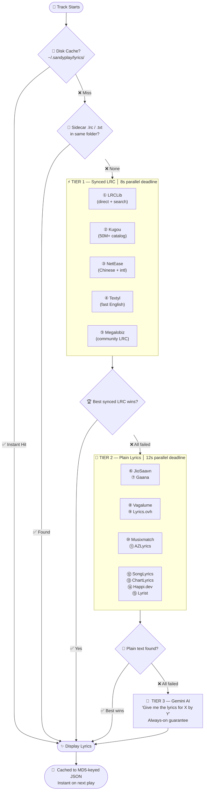
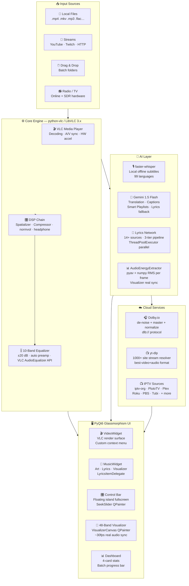

<div align="center">


</div>

<br/>

<div align="center">


</div>

<br/>

<div align="center">

[](https://github.com/sandytalks/SANDYPLAY/releases/latest)
[](https://github.com/sandytalks/SANDYPLAY/releases)
[](https://github.com/sandytalks/SANDYPLAY/releases/latest)
[](https://python.org)
[](LICENSE)

</div>

<div align="center">

[](https://aistudio.google.com)
[](https://dolby.io)
[](https://videolan.org)
[](https://github.com/yt-dlp/yt-dlp)
[](https://github.com/sandytalks/SANDYPLAY/stargazers)

</div>

<br/>

<div align="center">

[⚡ Why SANDYPLAY](#-why-sandyplay) &nbsp;·&nbsp;
[✨ Features](#-complete-feature-breakdown) &nbsp;·&nbsp;
[🎤 Lyrics Engine](#-lyrics-engine) &nbsp;·&nbsp;
[📻 Radio & TV](#-online-radio-studio) &nbsp;·&nbsp;
[🚀 Install](#-installation) &nbsp;·&nbsp;
[⌨️ Keybinds](#-keyboard-reference) &nbsp;·&nbsp;
[🏗️ Architecture](#-architecture) &nbsp;·&nbsp;
[🗺️ Roadmap](#-roadmap) &nbsp;·&nbsp;
[❓ FAQ](#-faq) &nbsp;·&nbsp;
[🤝 Contributing](#-contributing)

</div>

<br/>


<br/>

> [!NOTE]
> **SANDYPLAY v1.15** is not just a media player — it is a **complete AI multimedia production studio** for Windows, built by a solo developer from scratch.
> Powered by **LibVLC** + **PyQt6** glassmorphism UI, integrating **OpenAI Whisper** (100% offline subtitles), **Gemini 1.5 Flash** (translation, smart playlists, AI captions), and **Dolby.io** (one-click professional cloud audio mastering).
>
> **Free. Open-source. Self-contained.**
> `14+ lyrics sources` · `48-band real-time visualizer` · `dynamic ambient theming` · `DTS studio simulation` · `NVDEC hardware acceleration` · `300+ radio stations` · `IPTV by region`

<br/>


<br/>

## 〔 Studio-Grade. Zero Cost. 〕

<div align="center">

```
 ╔══════════════╦═══════════════╦════════════════╦═══════════════╦═══════════════╦═══════════════╗
 ║      14+     ║      48       ║      12+       ║      10       ║      5+       ║     300+      ║
 ║ Lyrics Srcs  ║ Visualizer    ║ Built-in       ║ Speaker       ║ AI Languages  ║ Radio Streams ║
 ║              ║ Bands         ║ Themes         ║ Modes         ║               ║               ║
 ║ Synced · AI  ║ ~30fps Live   ║ + Unlimited    ║ Stereo → 3D   ║ EN·TA·HI·TE  ║ FM·Online·SDR ║
 ╚══════════════╩═══════════════╩════════════════╩═══════════════╩═══════════════╩═══════════════╝
```

</div>

<br/>


<br/>

## ⚡ Why SANDYPLAY?

<div align="center">

> **No other free, open-source media player combines all of this in a single application.**

</div>

<br/>

| Feature | ◈ **SANDYPLAY** | VLC 3.0 | MPC-HC | foobar2000 | Winamp |
|:---|:---:|:---:|:---:|:---:|:---:|
| 🤖 AI Local Subtitles (Whisper, fully offline) | ✅ | ❌ | ❌ | ❌ | ❌ |
| ☁️ Cloud Audio Mastering (Dolby.io) | ✅ | ❌ | ❌ | ❌ | ❌ |
| 🎤 Synced Karaoke Lyrics (14+ sources) | ✅ | ❌ | ❌ | ⚠️ plugin | ⚠️ plugin |
| 🌐 Lyrics Translation (5 languages, Gemini) | ✅ | ❌ | ❌ | ❌ | ❌ |
| 🧠 Natural Language AI Command Palette | ✅ | ❌ | ❌ | ❌ | ❌ |
| 🎨 Dynamic Ambient Color from Video | ✅ | ❌ | ❌ | ❌ | ❌ |
| 🌊 48-Band Real-Time Visualizer | ✅ | ❌ | ❌ | ⚠️ plugin | ✅ 14-band |
| 🔊 DTS Studio Simulation (5 modes) | ✅ | ⚠️ basic | ⚠️ basic | ❌ | ❌ |
| 💾 Named JSON Session Snapshots | ✅ | ❌ | ❌ | ⚠️ playlists | ⚠️ playlists |
| 📡 YouTube / Twitch / 1000+ Site Streaming | ✅ | ✅ | ❌ | ❌ | ❌ |
| 🎛️ 10-Band Parametric Equalizer | ✅ | ⚠️ basic | ❌ | ✅ | ✅ |
| ⚡ Hardware NVDEC / GPU Decoding | ✅ | ✅ | ✅ | ❌ | ❌ |
| 🖥️ Glassmorphism UI (12+ themes) | ✅ | ❌ | ❌ | ⚠️ skins | ⚠️ skins |
| 📻 300+ Online Radio Stations + SDR FM | ✅ | ❌ | ❌ | ❌ | ❌ |
| 📺 Live IPTV by Genre / Language / Region | ✅ | ❌ | ❌ | ❌ | ❌ |
| 🔖 Per-file Bookmarks + A-B Repeat | ✅ | ✅ | ✅ | ❌ | ❌ |
| 🏷️ AI Metadata Cleaner | ✅ | ❌ | ❌ | ⚠️ plugin | ❌ |
| 🎵 Bilingual Lyrics View (Original + Translation) | ✅ | ❌ | ❌ | ❌ | ❌ |

<br/>


<br/>

## 🎯 Perfect For

<div align="center">

| 🎬 Cinephiles | 🎵 Audiophiles | 🧑‍💻 Developers | 🌏 Multi-language Users |
|:---:|:---:|:---:|:---:|
| AI subtitles in any language, HDR simulation, hardware-accelerated 4K playback | Dolby mastering, 10-band EQ, DTS modes, SoX HiFi resampling, 200% volume boost | Open-source Python + LibVLC stack, extensible architecture, single-file app | Tamil · Hindi · Telugu · Malayalam lyrics & real-time Gemini translation |

</div>

<br/>


<br/>

## ✨ Complete Feature Breakdown

<details open>
<summary><b>🤖 AI Intelligence Layer</b></summary>

<br/>

| Module | Details |
|:---|:---|
| **🎙️ Whisper Engine** | `faster-whisper` · 100% local & offline · auto-download on first use · models: `tiny` / `base` / `small` / `medium` / `large-v3` / `large-v3-turbo` |
| **🌍 Language Detection** | 99 languages with auto-detect confidence · translated output always in English |
| **📝 Subtitle Output** | `.SRT` with word-level timestamps · 500ms VAD silence-gap segmentation · auto-audio-extract via ffmpeg |
| **⚡ Subtitle Caching** | Stored to `~/.sandyplay/subtitles/` per MD5 hash · instant zero-re-run reload on replay |
| **🔄 Gemini Translation** | Auto-detect → EN / TA / HI / TE · chunked 4500-char batches · LRC-aware (preserves `[mm:ss.xx]` timestamps) |
| **📖 Bilingual Lyrics** | Original + translated lines interleaved in real time · detects source language automatically |
| **🧠 AI Smart Playlist** | Vibe-keyword semantic queue sort — `"chill"` · `"workout"` · `"sad"` · `"love"` · `"devotional"` |
| **🎞️ AI Video Captions** | Mood-aware 2-sentence description per video · uses 7 mood categories (romantic / melancholic / energetic / dreamy…) |
| **⌨️ AI Command Palette** | Natural language control — `"play next"` · `"pause"` · `"louder"` · `"fullscreen"` · `"smart chill"` |
| **🏷️ AI Metadata Cleaner** | Strips `[Official Video]` `(Lyrics)` `4K` `HD` `Remastered` `feat.` · regex + artist/title split |
| **🎵 AI Recommend Next** | Fuzzy similarity between track names via `difflib.SequenceMatcher` · plus keyword overlap score |
| **📋 AI Lyrics Summary** | Top-5 keyword theme extraction + first-line main idea + progression line |

</details>

<details open>
<summary><b>🎧 Studio-Grade Audio Engine</b></summary>

<br/>

| Module | Details |
|:---|:---|
| **☁️ Dolby.io Mastering** | OAuth2 app-key auth · `dlb://` upload protocol · Dolby Enhance API · outputs lossless WAV · auto-inserts after current track |
| **🎵 DTS Music Mode** | `normvol` DSP + Pop EQ curve → warm, balanced listening |
| **🎬 DTS Movie Mode** | Spatializer + compressor + cinema-tuned EQ → wide soundstage, punchy dialogue |
| **🎮 DTS Game Mode** | Headphone 3D + compressor + air-band EQ → directional gaming audio |
| **⚙️ DTS Custom Mode** | Each DSP filter toggleable individually — full granular control |
| **❌ DTS Off** | Pure passthrough, no DSP injection |
| **🎚️ 10-Band Equalizer** | 60 · 170 · 310 · 600 · 1k · 3k · 6k · 12k · 14k · 16k Hz · range ±20 dB · VLC native `AudioEqualizer` API |
| **📻 EQ Presets** | Flat · Bass Boost · Treble Boost · Vocal Clarity · Rock · Pop · Custom |
| **🛡️ Auto Preamp** | Safety ceiling: `12 − maxBoostdB` to prevent clipping at all boost levels |
| **🔊 10 Speaker Modes** | Stereo · Reverse Stereo · Left-Mono · Right-Mono · 2.1 · Dolby Surround · 5.1 · 7.1 · Spatial 3D Audio · Studio High-Fidelity |
| **🎛️ DSP Filters** | Spatializer · Headphone 3D · Compressor · normvol · dynamic deduplication |
| **🎶 Audio Transform** | Built-in compressor/expander filter toggled via `--audio-filter` VLC option at media load |
| **🔊 Volume Boost** | 0 – 200% range · `audio_set_volume` with mute guard |
| **🎙️ SoX Resampler** | `--audio-resampler=soxr` · highest-quality pitch-locked speed control |
| **⚡ Speed Control** | 0.25× – 4.0× · `set_rate()` · pitch-locked · persisted to config |
| **🔁 A-B Repeat** | Set point A · set point B · loops indefinitely · one-tap reset |
| **⏱️ Sync Control** | Audio delay ±5000ms · subtitle delay ±5000ms · live real-time sliders |

</details>

<details open>
<summary><b>🎬 Video & Display Engine</b></summary>

<br/>

| Module | Details |
|:---|:---|
| **⚙️ Decoder** | LibVLC 3.x · NVDEC hardware (NVIDIA GPU) · software CPU fallback · toggle mid-session |
| **📦 Caching** | file 1000ms · network 1500ms · live 1500ms · mux 800ms — buttery stream buffering |
| **🖥️ HDR Simulation** | Contrast 1.18 · Brightness 1.06 · Saturation 1.28 · Gamma 0.92 via `VideoAdjustOption` |
| **🎨 Color Controls** | Brightness · Contrast · Saturation · Hue · Gamma — all adjustable live while playing |
| **🔀 Deinterlacing** | Disable · Blend · Bob · Yadif · Yadif 2x · Linear · Mean · X modes via `video_set_deinterlace` |
| **📐 Aspect Ratios** | Default · 16:9 · 4:3 · 21:9 · 16:10 · 1.85:1 · 2.35:1 · 1:1 — 8-mode cycle |
| **✂️ Crop Modes** | Default · 16:9 · 4:3 · 21:9 · 1:1 — 5-mode cycle (key `C`) |
| **🔍 Zoom** | 0.3× – 3.0× via `video_set_scale` · Ctrl+Scroll on video frame |
| **📸 Screenshots** | `video_take_snapshot()` → PNG · save dialog |
| **🖥️ Fullscreen** | Floating island control bar · 2.5s auto-hide with fade · cursor blanking |
| **🌅 Ambient Theming** | 128×72 snapshot sampled after 2.5s · pixel-grid HSL boost (sat+0.5, L clamp 0.4–0.6) → applied as accent |
| **📺 Multi-track** | Cycle audio tracks `X` · cycle subtitle tracks `Z` · all described from VLC API |
| **📄 External Subtitles** | Load `.srt` · `.ass` · `.vtt` · `.sub` · `video_set_subtitle_file()` |
| **🪟 Window Sizing** | 0.5× / 1.0× / 1.5× / 2.0× video size presets · fit-to-video |

</details>

<details open>
<summary><b>🌊 Glassmorphism UI & Visualizer</b></summary>

<br/>

| Module | Details |
|:---|:---|
| **🎨 12 Built-in Themes** | Sky Blue · Purple Haze · Sunset Orange · Emerald · Crimson · Golden Glow · Hot Pink · Deep Indigo · Teal Surge · Ocean Cyan · Copper · Moonlight |
| **🖌️ Custom Color** | Any HEX code via Qt color picker — truly unlimited theming |
| **🌊 48-Band Visualizer** | Custom `QPainter` canvas · 33ms tick (~30fps) · symmetric mirror bars from center |
| **⚛️ Visualizer Physics** | Beat detection via real audio energy (`AudioEnergyExtractor` thread) · ±0.04 organic noise floor · floating peak dots · 0.018/frame fade · gradient bright→dim |
| **🎵 Real Audio Sync** | `pyav` + `numpy` extracts RMS energy per frame → maps to bar heights in real time |
| **📊 Bar Rendering** | Per-bar alpha distance falloff · rounded caps · 3-stop gradient shader per bar |
| **🖼️ Music Widget** | Album art (240×240 rounded) · NOW PLAYING badge · Title / Artist / Album labels · chip row (Format · Duration · VIS · Lyrics) |
| **📜 Lyrics Panel** | `QListWidget` with `LyricsItemDelegate` for custom multi-line centered paint · smooth animated scroll |
| **🔎 Lyrics Search** | In-panel filter box — instant hide/show by query |
| **🎛️ Control Bar** | Floating island in fullscreen (auto-positioned, auto-sized) · docked at bottom in windowed |
| **⏱️ Seek Slider** | Custom `SeekSlider` (QPainter) · hover-expand (4px → 8px) · HH:MM:SS tooltip · draggable handle |
| **🔊 Volume Slider** | Same custom `SeekSlider` · 0–200% range · icon updates per level |
| **🪞 Glass Cards** | `QGraphicsDropShadowEffect` on artwork · radial gradient backgrounds · `rgba` borders |
| **📊 Dashboard** | 4-card stats header (Total / Music / Video / Lyrics) · batch fetch progress bar |

</details>

<details open>
<summary><b>🎬 Playback & Queue Engine</b></summary>

<br/>

| Module | Details |
|:---|:---|
| **📦 Formats** | MP4 · MKV · AVI · MOV · WMV · WebM · FLV · M4V · MPEG · TS · VOB · 3GP + MP3 · FLAC · WAV · AAC · M4A · OGG · WMA · OPUS · AC3 · EAC3 · THD · ALAC |
| **📡 Streaming** | yt-dlp resolver · best-video+audio format selection · playlist auto-expand · all streams mix with local files |
| **🏎️ Speed** | 0.25× – 4.0× pitch-locked · `]` / `[` keys · `set_rate()` API · synced to tempo spin control |
| **🔁 Loop / Shuffle** | Per-session persistent · shuffle uses `random.randint` for true randomness |
| **🔖 Bookmarks** | Up to 40 per file · `[mm:ss]` labeled · jump-to · clear · persisted in `config.json` |
| **⏩ A-B Repeat** | Set A → set B → auto-rewind at B → reset all in one tap |
| **🖱️ Drag & Drop** | Files + folders · recursive `.walk()` · skip duplicates by `os.path.normcase` key |
| **🔢 Queue Management** | Drag-to-reorder (internal move) · search filter · batch open · numbered items |
| **⚡ Frame Step** | `next_frame()` · auto-pause before |
| **📂 Playlist Save** | `#EXTM3U` format |
| **⏱️ Progress** | Custom `SeekSlider` · click-to-seek · hover-tooltip · `set_position()` |
| **📣 OSD** | Centered overlay with fade animation · `QGraphicsOpacityEffect` + `QPropertyAnimation` |
| **🪟 Mini Player** | Compact floating mode for distraction-free listening |
| **⏱️ Sleep Timer** | Auto-shutdown playback after a chosen number of minutes |

</details>

<details open>
<summary><b>💾 Session & Library (Plus System)</b></summary>

<br/>

| Module | Details |
|:---|:---|
| **💾 Auto-Save** | Every 120 seconds · `plus_save_last_session()` · JSON to `~/.sandyplay/plus/last_session.json` |
| **🔄 Session Restore** | Offered on startup if queue is empty · restores playlist + position + volume + speed + accent color |
| **📸 Named Snapshots** | `Ctrl+Alt+S` · unlimited named `.json` snapshots in `~/.sandyplay/plus/snapshots/` |
| **❤️ Favorites** | `Ctrl+Alt+F` · stored in `library.json` · browse from Plus menu · play directly |
| **🕐 Recently Played** | Last 35 tracks · timestamped · accessible from Plus > Recently Played menu |
| **🔖 Bookmarks** | Per-file timestamp list (up to 40) · jump-to · labeled `[mm:ss]` · stored in `config.json` |
| **🧹 Duplicate Remover** | MD5 path-key dedup · preserves current track · `Ctrl+Alt+D` |
| **🗑️ Missing File Cleaner** | Scans all local paths · removes dead entries · confirms before action |
| **📁 Same-Folder Mix** | Auto-adds all media siblings from current track's directory (up to 150) |
| **📊 Queue Stats** | Total · Music · Video · URLs · Missing · Favorites · Top 5 folders |
| **📤 HTML Export** | Full queue report with status · favorite · current markers · `Ctrl+Alt+E` |
| **📋 Copy Path** | Copy current track full path to clipboard |
| **📂 Open Folder** | Open current track's folder in Windows Explorer |

</details>

<br/>


<br/>

## 🎤 Lyrics Engine - World's 🥇 Lyrics Fetching System by Sandytalks

<div align="center">

> **The most advanced open-source lyrics system ever built into a media player.**
> 3-tier parallel pipeline · 14+ live sources · smart disk caching · sidecar support · guaranteed AI fallback

</div>

<br/>



<br/>

<div align="center">

| # | Source | Type | Strength | Method |
|:---:|:---|:---:|:---|:---|
| ① | **LRClib** | `Synced LRC` | Global catalog, growing rapidly | Free REST API — direct `/api/get` + `/api/search` |
| ② | **Kugou** | `Synced LRC` | 50M+ · strongest Asian catalog | JSON search API + base64 LRC decode |
| ③ | **NetEase** | `Synced LRC` | Chinese + international | JSON API with Referer auth |
| ④ | **Textyl** | `Synced LRC` | English-heavy, fastest response | Lightweight REST API |
| ⑤ | **Megalobiz** | `Synced LRC` | International community repository | HTML scrape → `<span id="lrc_…">` extraction |
| ⑥ | **JioSaavn** | `Plain` | India — TA / HI / TE / ML | `saavn.dev` REST chain: search → detail → lyrics |
| ⑦ | **Gaana** | `Plain` | Bollywood + South Indian | HTML scrape + JSON-LD extraction |
| ⑧ | **Vagalume** | `Plain` | Portuguese + international | Free REST API |
| ⑨ | **Lyrics.ovh** | `Plain` | Global English | Free REST API |
| ⑩ | **Musixmatch** | `Plain` | Largest global catalog | HTML scrape, `data-lyrics-container` |
| ⑪ | **AZLyrics** | `Plain` | Extensive English catalog | HTML scrape, commented div |
| ⑫ | **SongLyrics** | `Plain` | Indian + international | HTML scrape, `#songLyricsDiv` |
| ⑬ | **ChartLyrics** | `Plain` | Free, no API key | XML REST `SearchLyricDirect` |
| ⑭ | **Happi.dev** | `Plain` | Community-driven | REST API (demo key) |
| ⑮ | **Lyrist** | `Plain` | Fast REST alternative | `lyrist.vercel.app` API |
| 🤖 | **Gemini AI** | `Fallback` | Anything Gemini 1.5 knows | LLM prompt · guaranteed result · never fails |

</div>

<br/>

### 🔧 Lyrics Engine Technical Details

- **Caching:** MD5-keyed JSON files in `~/.sandyplay/lyrics/` — two keys per track: `hash(title+artist)` and `hash(filepath)` for instant dual-path lookup
- **Title variants:** Up to 4 cleaned variants tried per source — strips `[Official Video]`, `(Remix)`, `feat.`, year tags etc. via 8-stage regex pipeline
- **Fuzzy matching:** `difflib.SequenceMatcher` ratio > 0.72 for title acceptance across all scrapers
- **Fail cache:** 30-second cooldown per query signature — prevents hammering on real misses
- **Batch mode:** `ThreadPoolExecutor(max_workers=4)` for entire queue — up to 200 files auto-fetched on open
- **Sidecar priority:** `.lrc` and `.txt` in same folder always win before any network request
- **LRC parser:** Handles `[mm:ss.xx]` and `[mm:ss:xx]` · strips `♪♫♬🎵` · strips spam domains · strips meta tags · 110% proportional line height in lyrics panel

<br/>


<br/>

## 📻 Online Radio Studio

<div align="center">

> **300+ curated stations · 9 genres · 100+ artist-dedicated streams · Hardware SDR FM tuner**

</div>

<details>
<summary><b>🎵 Tamil (32 stations)</b></summary>

<br/>

| Station | Stream Type |
|:---|:---:|
| AIR Madurai FM / AIR KODAI FM | HLS |
| Ilayaraja Radio + Lite Radio + Super Beats | HTTP |
| AR Rahman Radio + AR Rahman Lite Radio | HTTP |
| Sooriyan FM · Mirchi FM · Big FM Tamil | HTTP |
| Thalapathy Vijay FM · Ajith FM · Chillax FM | Zeno |
| Tamil 80s/90s Hits · AR Rahman Hits · Harris Jayaraj FM | Zeno |
| KS Chitra · S Janaki · K J Yesudas · MS Viswanathan | Zeno |
| Kannadasan Radio · Ilayaraja Lite Radio | HTTP |
| Lankasri FM · Jei FM Klang Tamil · JN FM Tamil Classic | HTTP |
| Radio Paramankurichi · Tamil Panpalai Gold | HTTP |
| 89.4 Tamil FM · Kalai FM · VSVP Tech FM | HTTP |

</details>

<details>
<summary><b>🎶 Hindi / Indian (8 stations)</b></summary>

<br/>

AIR Vividh Bharati · Hits of Bollywood · Hits of Lata Mangeshkar · Hits of Mohammed Rafi · MY CLUB REMIX · Radio Aashiqanaa · Radio Namkin · Radio Retro Bollywood 90s

</details>

<details>
<summary><b>🎤 International Artists (100+ dedicated streams)</b></summary>

<br/>

50 Cent · ABBA · Adele · Aerosmith · Andy Williams · Arctic Monkeys · Aretha Franklin · Ariana Grande · Avicii · Avril Lavigne · Backstreet Boys · Bad Bunny · Beyoncé · Billy Joel · Bing Crosby · Black Sabbath · Blur · Bob Dylan · Bob Marley · Bon Jovi · Bruno Mars · Bryan Adams · Calvin Harris · Camila Cabello · Celine Dion · Charlie Puth · Cher · Chicago · Christina Aguilera · Coldplay · David Bowie · Dean Martin · Def Leppard · Depeche Mode · Diana Ross · Dire Straits · Donna Summer · Dr Dre · Drake · Dua Lipa · Duran Duran · Eagles · Ed Sheeran · Ella Fitzgerald · Elton John · Elvis Presley · Eminem · Enrique Iglesias · Eric Clapton · Eurythmics · Fleetwood Mac · Frank Sinatra · Garth Brooks · Genesis · George Michael · Green Day · Guns N Roses · Harry Styles · Imagine Dragons · Iron Maiden · Jennifer Lopez · Johnny Cash · Journey · Justin Bieber · Justin Timberlake · Kanye West · Katy Perry · Kelly Clarkson · Kendrick Lamar · Kings of Leon · Lady Gaga · Led Zeppelin · Linda Ronstadt · Louis Armstrong · Madonna · Mariah Carey · Maroon 5 · Metallica · Michael Jackson · Miley Cyrus · Muse · Nat King Cole · New Order · Nirvana · Oasis · One Direction · Paul McCartney · Pet Shop Boys · Phil Collins · Pink Floyd · Post Malone · Prince · Queen · Radiohead · Rihanna · Rod Stewart · Roxette · Santana · Shakira · Shania Twain · Sia · Spice Girls · Stevie Wonder · Taylor Swift · Tears for Fears · The Cure · The Killers · The Weeknd · The Who · Tina Turner · Tom Petty · Tony Bennett · Travis Scott · Twenty One Pilots · U2 · Whitney Houston · + more

</details>

<details>
<summary><b>🌟 K-Pop (30+ stations)</b></summary>

<br/>

0N K-Pop · Asian World Radio · Big B Radio KPOP · BTS Radio · CBS Power Radio · Conexion Kpop · DFM K-POP · Exclusively BTS · Fred Film Radio Korean · Generacion Kpop · Hotmix K-Pop · JeonjuFM · K-Pop 24 · K-RADIO · LibertyMP KPop · Listen.moe Kpop · MapoFM · Mnet K-Pop · OnlyHit K-Pop · REYFM Kpop · SBS PopAsia · Vibe Radio Kpop · + more

</details>

<details>
<summary><b>🎼 Classical & Jazz + 🎸 Rock & Pop + 📰 News + 💃 Electronic</b></summary>

<br/>

**Classical & Jazz:** BBC Radio 3 · Jazz Radio Classic Jazz · Radio Swiss Classic · Rai Radio 3 · SomaFM Lush · WQXR Classical · Your Classical Relax

**Rock & Pop:** Big R Radio 80s Metal FM · KEXP Seattle · Radio Caroline · Radio Paradise Rock · ROCK FM · Rockabilly-Radio · SomaFM Groove Salad · Russian Rock

**News & Talk:** BBC Radio 4 · BBC World Service · NPR News USA

**Electronic / Dance:** 1.FM Chillout Lounge · 1.FM Trance · SomaFM Drone Zone · SomaFM Secret Agent

</details>

<details>
<summary><b>🌍 English UK/USA (25+ stations)</b></summary>

<br/>

BBC Radio 1 / 2 / 3 / 4 / 5 Live / 6 Music · BBC World Service · BBC News HD (720p HLS) · KEXP Seattle · NPR News · WNYC New York · Radio Paradise Mellow + Rock · SomaFM Underground 80s (128k + 256k) · Darusalam Radio · FUNKY RADIO · Mega 96.3 LA · Z 92 Miami

</details>

<br/>

### 📡 Hardware SDR FM Tuner

SANDYPLAY integrates with **RTL-SDR dongles** for real hardware FM radio:

```
Place rtl_fm.exe (RTL-SDR binary) → rtl-sdr/x64/ in the app directory
Open FM Studio → Hardware SDR tab → Enter frequency → Tune & Play
±0.1 MHz nudge buttons · RTL-FM pipes raw audio to local HTTP server → VLC
```

<br/>


<br/>

## 📺 Online TV Studio (IPTV)

SANDYPLAY fetches live IPTV from **10 public playlist sources** and organizes them into a browsable 4-tab studio:

| Tab | Description |
|:---|:---|
| 🌐 **All Channels** | Searchable flat list of all channels with deduplication |
| 🎥 **By Genre** | News · Movies · Entertainment · Music · Kids · Sports · Uncategorized |
| 🗣️ **By Language** | Tamil · Hindi · Malayalam · Telugu · Kannada · Marathi · Bengali · English · French · Spanish · Korean · Japanese · Arabic · Urdu · + more |
| 🌍 **By Region** | India (state-level: Tamil Nadu / Kerala / Karnataka / Andhra / Maharashtra / West Bengal / Gujarat / Punjab) · USA · UK · Canada · Australia · France · Germany · Russia · Brazil · Japan · Korea · UAE · + more |
| ❤️ **Favorites** | Save any channel locally · persists across sessions |

**Sources loaded:** `iptv-org` · `Free-TV` · `PlutoTV` · `SamsungTVPlus` · `Plex` · `Roku` · `PBS` · `Stirr` · `Tubi` · `LocalNow`

Channels **auto-refresh every 24 hours** from cached `iptv_playlist.m3u`. Adult content is filtered automatically. India channels get full regional language detection.

<br/>


<br/>

## 🎵 Online Music & Video Studios

### Online Music Studio
- **🔥 Discover tab** — trending by country + language + genre (Apple iTunes RSS feed)
- **🎵 YouTube Music** — `ytsearch10` audio results with thumbnails
- **📺 YouTube Global** — `ytsearch15` general results
- **🎧 JioSaavn** — `autocomplete.get` API → 500×500 artwork
- **☁️ SoundCloud** — `scsearch15` results
- **🍎 Apple Music** — iTunes search API (15 tracks)
- Grid view with 200×150 thumbnail icons · double-click to resolve + play
- Language filters: India (Hindi / Tamil / Telugu…) · Global (English / Korean…) · Japan · France · Germany · Brazil

### Online Video Studio
- **🔥 Trending Videos** — country + language + category filters
- **🔍 Search Results** — `ytsearch100` results with 280×157 thumbnails
- Categories: All · Music · Gaming · News · Movies · Sports
- Plays video via yt-dlp best-quality stream resolver

<br/>


<br/>

## 📦 What Ships in the Installer

<div align="center">

| Component | Bundled? | Notes |
|:---|:---:|:---|
| LibVLC 3.x + all codec plugins | ✅ | Hardware decode, every format |
| Visual C++ Runtimes | ✅ | Auto-installed silently |
| Python runtime | ✅ | No separate Python install needed |
| SoX resampler | ✅ | Pitch-locked speed control |
| Start Menu + Desktop shortcut | ✅ | Ready to launch immediately |
| RTL-SDR binaries | ❌ | Download separately if using hardware FM |
| faster-whisper AI model | ⬇️ | ~1.5 GB one-time download on first AI subtitle use |
| Gemini API key | 🔑 | Free — get from Google AI Studio |
| Dolby.io credentials | 🔑 | Free tier — get from dolby.io |

</div>

<br/>


<br/>

## 🚀 Installation - Read the Steps Before Installation

<div align="center">

<a href="https://github.com/sandytalks/SANDYPLAY/releases/download/Sandyplay/SandyPlay_Setup_v1.15.exe">

</a>

</div>

<br/>

```
  ┌─────────────────────────────────────────────────────────────────────────┐
  │  STEP 1  📥  Download   →  Click the button above                       │
  │  STEP 2  🛡️  Install    →  SmartScreen? Click More Info → Run Anyway    │
  │                            (Installer configures VLC + runtimes)        │
  │  STEP 3  🚀  Launch     →  Open SANDYPLAY from your Desktop shortcut    │
  │  STEP 4  🎵  Load Media →  Drag & drop files · Ctrl+O · Ctrl+D folder  │
  │  STEP 5  🤖  AI Setup   →  Misc → AI Tools · First Whisper use         │
  │                            downloads model once (~1.5 GB) · offline ✅  │
  └─────────────────────────────────────────────────────────────────────────┘
```

### System Requirements

<div align="center">

| | Minimum | Recommended |
|:---|:---|:---|
| **OS** | Windows 10 64-bit | Windows 11 64-bit |
| **CPU** | Dual-core 2 GHz | Quad-core 3 GHz+ |
| **RAM** | 4 GB | 8 GB+ (16 GB for large Whisper models) |
| **GPU** | Integrated graphics | NVIDIA GTX 1060+ for NVDEC |
| **Storage** | 500 MB | 3 GB+ with Whisper `medium` model |
| **Network** | Optional | Required for radio / TV / Dolby / Gemini |

</div>

<br/>

<br/>


<br/>

## 🗂️ Project Structure

```
SANDYPLAY/
├── sandyplay.py                  # Entire application — single Python file
├── rtl-sdr/
│   └── x64/
│       └── rtl_fm.exe            # RTL-SDR binary (optional, hardware FM radio)
└── ~/.sandyplay/                 # Auto-created on first run
    ├── config.json               # All settings (EQ, theme, bookmarks, DTS mode…)
    ├── iptv_playlist.m3u         # Cached IPTV playlist (auto-refreshes daily)
    ├── radio_favorites.json      # Saved FM radio favorites
    ├── tv_favorites.json         # Saved TV channel favorites
    ├── plus/
    │   ├── last_session.json     # Auto-saved session (every 2 min)
    │   ├── library.json          # Favorites + Recently Played (35 tracks)
    │   └── snapshots/            # Named session snapshots (unlimited)
    │       └── *.json
    ├── lyrics/                   # Cached lyrics — MD5-keyed JSON per track
    │   └── <md5hash>.json
    ├── artwork/                  # Cached album artwork — MD5-keyed PNG/JPG
    │   └── <md5hash>.jpg
    ├── subtitles/                # Cached Whisper .srt subtitles per file
    │   └── <md5hash>_en.srt
    └── dolby/                    # Dolby.io cloud-enhanced WAV output
        └── enhanced_<name>.wav
```

<br/>


<br/>

## 🎨 Theme System

SANDYPLAY ships with **12 built-in color themes** and supports any custom HEX color. Every UI element — gradients, borders, badges, chips, buttons, lyrics highlights, visualizer bars, and OSD — is recolored live:

| | Theme | HEX | | Theme | HEX |
|:---:|:---|:---:|:---:|:---|:---:|
| 🔵 | Sky Blue | `#0ea5e9` | 🟣 | Purple Haze | `#8b5cf6` |
| 🟠 | Sunset Orange | `#f97316` | 🟢 | Emerald | `#22c55e` |
| 🔴 | Crimson | `#ef4444` | 🟡 | Golden Glow | `#eab308` |
| 🩷 | Hot Pink | `#ec4899` | 🔷 | Deep Indigo | `#4f46e5` |
| 🩵 | Teal Surge | `#14b8a6` | 🌊 | Ocean Cyan | `#06b6d4` |
| 🟤 | Copper | `#b45309` | ⚪ | Moonlight | `#e2e8f0` |

**Ambient Video Theming:** 2.5 seconds after a video starts, SANDYPLAY grabs a `128×72` thumbnail, samples a pixel grid, computes the average hue, boosts saturation by +0.5 and clamps lightness to 0.4–0.6, then instantly repaints all UI accents to match the video's dominant mood color.

<br/>


<br/>

## ⌨️ Keyboard Reference

<div align="center">

### 🎬 Playback

| Key | Action | Key | Action |
|:---:|:---|:---:|:---|
| `Space` | Play / Pause | `S` | Stop Playback |
| `N` | Next Track | `B` | Previous Track |
| `→` | Seek +10s | `←` | Seek −10s |
| `Alt+→` | Seek +30s | `Alt+←` | Seek −30s |
| `↑` | Volume +5% | `↓` | Volume −5% |
| `M` | Mute / Unmute | `E` | Frame Step |
| `]` | Speed +0.1× | `[` | Speed −0.1× |
| `L` | Toggle Loop | `Shift+S` | Toggle Shuffle |

### 🖥️ View & Display

| Key | Action | Key | Action |
|:---:|:---|:---:|:---|
| `F` / `Enter` | Toggle Fullscreen | `Ctrl+Enter` | Stretch Fullscreen |
| `Esc` | Exit Fullscreen | `P` | Toggle Playlist Sidebar |
| `V` | Toggle Visualizer | `C` | Cycle Crop Mode |
| `F5` | Effects & EQ Panel | `F6` | Playlist Panel |
| `F8` | FM Radio & SDR | `F1` | About Dialog |
| `F3` | Open File | `F4` | Stop Playback |

### 🎤 Lyrics & AI

| Key | Action | Key | Action |
|:---:|:---|:---:|:---|
| `Ctrl+L` | Toggle Lyrics Panel | `Ctrl+T` | Translate Lyrics |
| `G` | Lyrics offset −0.3s | `H` | Lyrics offset +0.3s |
| `X` | Cycle Audio Track | `Z` | Cycle Subtitle Track |

### 💾 Session & Utilities

| Key | Action | Key | Action |
|:---:|:---|:---:|:---|
| `Ctrl+Alt+F` | Toggle Favorite | `Ctrl+Alt+R` | Restore Last Queue |
| `Ctrl+Alt+S` | Save Snapshot | `Ctrl+Alt+P` | Resume Session |
| `Ctrl+Alt+D` | Remove Duplicates | `Ctrl+Alt+E` | Export Queue HTML |
| `Ctrl+O` | Open File(s) | `Ctrl+D` | Open Folder |
| `Ctrl+U` | Open Stream URL | `Ctrl+S` | Save Playlist |
| `Ctrl+F1` | Media & Codec Info | `?` | Show All Shortcuts |

</div>

<br/>


<br/>

## 🏗️ Architecture



<br/>


<br/>

## 🛠️ Tech Stack

<div align="center">


<br/><br/>

| Component | Technology | Purpose |
|:---|:---|:---|
| 🖥️ **GUI Framework** | PyQt6 6.x | Glassmorphism UI, animations, custom painting |
| 🎬 **Media Engine** | python-vlc / LibVLC 3.x | Decoding, playback, DSP, hardware acceleration |
| 🤖 **AI Subtitles** | faster-whisper | 100% local on-device speech-to-text |
| 🧠 **LLM Engine** | Google Gemini 1.5 Flash API | Translation, captions, smart tools, lyrics fallback |
| ☁️ **Cloud Audio** | Dolby.io REST API v1 | De-noise, master, normalize audio |
| 🎵 **Lyrics #1** | LRCLib (free REST API) | Synced LRC — primary global source |
| 🎵 **Lyrics #2** | Kugou (JSON API) | Synced LRC — 50M+ Asian catalog |
| 🎵 **Lyrics #3** | JioSaavn via saavn.dev | Plain — India's largest music catalog |
| 📡 **Streaming** | yt-dlp (latest) | YouTube, Twitch, SoundCloud + 1000+ sites |
| 🏷️ **Tag Reading** | mutagen | ID3 / MP4 / FLAC metadata + artwork URL |
| 📊 **Audio Energy** | pyav + numpy | RMS frame extraction for visualizer sync |
| 🔉 **Resampler** | SoX via VLC `--audio-resampler=soxr` | Pitch-locked speed, highest quality |
| 📊 **Fuzzy Match** | difflib (stdlib) | Title similarity scoring for lyric matching |
| 🔐 **Hashing** | hashlib MD5 (stdlib) | Cache key generation for lyrics/art/subtitles |

</div>

<br/>


<br/>

## 🗺️ Roadmap


<br/>

| Status | Feature | Target |
|:---:|:---|:---:|
| ✅ Done | 3-tier parallel lyrics fetch with Gemini AI fallback | v1.13 |
| ✅ Done | Dolby.io one-click cloud audio mastering | v1.13 |
| ✅ Done | Whisper AI local subtitle generation (offline) | v1.13 |
| ✅ Done | DTS Studio simulation — Music / Movies / Games | v1.13 |
| ✅ Done | Online FM and Hardware SDR FM Tuner for Offline(RTL-SDR) | v1.13 |
| ✅ Done | Online Music Studio (YouTube + JioSaavn + SoundCloud + Apple) | v1.14 |
| ✅ Done | Online TV Studio (IPTV by Genre / Language / Region) | v1.14 |
| ✅ Done | DTS mode + bookmarks persist across sessions | v1.14 |
| ✅ Done | Stunning Modern Installer UI with custom AI Banners & Typography | v1.15 |
| ✅ Done | Multi-thread concurrency engine & Portable FFmpeg detection | v1.15 |
| ✅ Done | Mini Player / compact floating window | v1.15 |
| ✅ Done | Sleep Timer — auto-shutdown playback | v1.15 |
| 📋 Planned | Linux (Ubuntu / Debian) native build | v1.16 |
| 📋 Planned | Podcast mode with RSS feed + chapter markers | v1.16 |
| 📋 Planned | Watch Party — synchronized LAN playback | v1.17 |
| 💡 Idea | Discord Rich Presence — "Now Playing" on profile | TBD |
| 💡 Idea | Cloud sync for settings, queues, and playlists | TBD |
| 💡 Idea | Custom JSON Theme Engine | TBD |
| 💡 Idea | Gemini-powered "DJ Mode" — smart auto-playlist | TBD |
| 💡 Idea | macOS support | TBD |
| 💡 Idea | Android companion remote control app | TBD |

</details>

<br/>


<br/>

## ❓ FAQ

<details>
<summary><b>Do I need a GPU?</b></summary>
<br/>
No. SANDYPLAY works perfectly on CPU-only machines. An NVIDIA GPU unlocks NVDEC hardware acceleration (toggle with the <code>HW</code> button in the control bar) for smoother 4K and lower CPU usage — but it is completely optional.
</details>

<details>
<summary><b>Does Whisper AI work offline?</b></summary>
<br/>
Yes, 100% offline after the one-time model download (~1.5 GB for <code>medium</code>). No internet required for any subsequent use. Subtitles are cached per file and load instantly on replay — zero transcription delay.
</details>

<details>
<summary><b>What API keys do I need?</b></summary>
<br/>

| Feature | Key Required | Free? |
|:---|:---|:---:|
| Core playback, EQ, DTS, visualizer | None | ✅ |
| All 14 lyrics sources | None | ✅ |
| Whisper AI subtitles | None | ✅ |
| FM Radio (300+ streams) | None | ✅ |
| IPTV (1000s of channels) | None | ✅ |
| Gemini translation & captions | Google AI Studio key | ✅ |
| Dolby.io cloud mastering | Dolby App Key + Secret | ✅ free tier |
</details>

<details>
<summary><b>Why aren't lyrics showing for my track?</b></summary>
<br/>

1. **Watch the status bar** — it shows which tier is being searched in real time
2. **Try Manual Search** → `Misc → Search Lyrics Manually` — clean the title (remove "Official Video", "(Remix)", year tags etc.)
3. **Paste manually** → `Misc → Paste Lyrics Text` — supports both plain text and `.lrc` synced format
4. **Indian music** — JioSaavn and Gaana (Tier 2) have the best Tamil / Hindi / Telugu / Malayalam coverage
5. **Check sidecar** — drop a `.lrc` file with the same name as your audio file in the same folder
</details>

<details>
<summary><b>Can I use SANDYPLAY as a YouTube / streaming client?</b></summary>
<br/>
Yes. Press <code>Ctrl+U</code>, paste any YouTube, Twitch, SoundCloud, Dailymotion, or direct stream URL. SANDYPLAY resolves and plays it via <strong>yt-dlp</strong> (1000+ sites supported). Playlists auto-expand. Streams mix freely with local files in your queue.
</details>

<details>
<summary><b>Whisper is slow on the first run — is that normal?</b></summary>
<br/>
Yes. The first use downloads the model weights (~1.5 GB for <code>medium</code>). After that, it loads from disk in a few seconds. Subtitles for that file are then cached permanently — subsequent plays are instant.

Choose a smaller model (tiny / base / small) from <code>Misc → AI Tools → Whisper model</code> for faster generation if speed matters more than accuracy.
</details>

<details>
<summary><b>Does it work on macOS or Linux?</b></summary>
<br/>
The Python + PyQt6 + LibVLC stack is cross-platform, but SANDYPLAY is primarily tested and packaged for Windows. Some components (RTL-SDR binary path, Windows registry VLC detection, Win32 hwnd rendering) are Windows-specific. Community PRs for Linux/macOS are welcome.
</details>

<details>
<summary><b>Is it truly free and open-source?</b></summary>
<br/>
Yes — MIT licensed. Every line of code is open. Fork it, study it, build on it. The only external costs are optional: Dolby.io has a generous free tier, and Gemini API keys are free from Google AI Studio. All 14 lyrics sources are free with no API key required.
</details>

<br/>


<br/>

## 🤝 Contributing

> SANDYPLAY is a solo project — every star, bug report, and pull request makes a genuine difference.

Here's how you can help:

- ⭐ **Star the repo** — helps others discover the project
- 🐛 **Report bugs** — open an Issue with steps to reproduce
- 💡 **Suggest features** — open a Discussion tagged `enhancement`
- 📻 **Add radio stations** — PR a new entry to `STATIONS` dict
- 📺 **Add TV channels** — PR a new entry to `TV_CHANNELS` dict
- 🌍 **Improve lyrics coverage** — suggest new sources or fix scrapers
- 📣 **Share it** — tell your audiophile and cinephile friends

<div align="center">

[](https://github.com/sandytalks/SANDYPLAY/issues)
[](https://github.com/sandytalks/SANDYPLAY/pulls)
[](https://github.com/sandytalks/SANDYPLAY/discussions)

</div>

<br/>


<br/>

## 📄 License

```
MIT License

Copyright (c) 2026 Santhosh (Sandytalks)

Permission is hereby granted, free of charge, to any person obtaining a copy
of this software and associated documentation files (the "Sandyplay"), to deal
in the Software without restriction, including without limitation the rights
to use, copy, modify, merge, publish, distribute, sublicense, and/or sell
copies of the Software, and to permit persons to whom the Software is
furnished to do so, subject to the following conditions:

The above copyright notice and this permission notice shall be included in all
copies or substantial portions of the Software.
```

**Third-party acknowledgements:**  
VLC (LGPL) · FFmpeg (LGPL/GPL) · OpenAI Whisper (MIT) · PyQt6 (GPL/Commercial) · yt-dlp (Unlicense)  
Dolby.io REST APIs (commercial, free tier) · Google Gemini API (commercial, free tier)

<br/>


<br/>

## 🔗 Connect with the Creator

<div align="center">

**Built from scratch with ❤️ by Santhosh — [Sandytalks](https://www.instagram.com/itsyouhuman/)**

*A solo developer crafting something truly extraordinary.*

<br/>

[](https://www.instagram.com/itsyouhuman/)
[](https://github.com/sandytalks/SANDYPLAY)

<br/>

### ⭐ Star History

<picture>
  <source media="(prefers-color-scheme: dark)" srcset="https://api.star-history.com/svg?repos=sandytalks/SANDYPLAY&type=Date&theme=dark"/>
  <source media="(prefers-color-scheme: light)" srcset="https://api.star-history.com/svg?repos=sandytalks/SANDYPLAY&type=Date"/>
  
</picture>

<br/><br/>


<br/>

> ⭐ **If SANDYPLAY elevated your listening or viewing experience, a GitHub star means the world.**
>
> It helps others discover the project — and keeps the motivation alive for the next version.

<br/>

</div>


