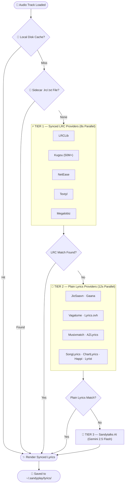
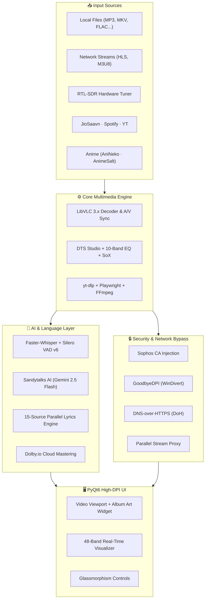

<!-- HEADER BANNER -->

 

<!-- BADGES BAR -->
&nbsp;
&nbsp;
&nbsp;
&nbsp;
&nbsp;

  

<h3>✨ Next-Generation Desktop AI Media Studio &amp; Hardware Receiver</h3>

<b>OpenAI Faster-Whisper</b> (Offline Subtitles + Silero VAD v6) · <b>Sandytalks AI</b> (Google Gemini 2.5 Flash) 
<b>Dolby.io</b> (Cloud Mastering) · <b>JioSaavn &amp; Spotify</b> (320kbps HD Streaming) · <b>LibVLC 3.x</b> (NVDEC 4K Engine) 
<b>RTL-SDR</b> (Hardware FM Tuner) · <b>Sophos SSL / DoH Bypass</b> · <b>15 Lyrics Providers</b> · <b>48-Band Visualizer</b>

 

<!-- PRIMARY CTA DOWNLOAD BUTTON -->

  
⚡ <b>Self-Contained Installer</b> · Windows 10 / 11 (64-bit) · No Python or external dependencies required

 

---

## ⚡ Why SANDYPLAY?

<table>
<tr>
<td width="52%" valign="top">

### 🌟 What SANDYPLAY Delivers

<ul>
<li>🤖 <b>Faster-Whisper Subtitles</b> — 100% offline AI speech recognition with Silero VAD v6 across 99 languages.</li>
<li>💬 <b>Sandytalks AI Music Assistant</b> — Powered by Gemini 2.5 Flash with live ID3 audio context &amp; LRCLib grounding.</li>
<li>☁️ <b>Dolby.io Cloud Audio Mastering</b> — Professional dynamic EQ, leveling &amp; noise suppression.</li>
<li>🎵 <b>Lossless &amp; 320kbps Streaming</b> — Direct JioSaavn (pyDes decrypted) &amp; Spotify catalog exploration.</li>
<li>🎤 <b>15-Source Parallel Lyrics Engine</b> — Synced LRC karaoke with instant fallback to Gemini AI synthesis.</li>
<li>🔊 <b>10 Immersive Speaker Modes</b> — Spatial 3D Audio, Studio Hi-Fi, Dolby Surround, 7.1, 5.1 &amp; 2.1 setups.</li>
<li>🎛️ <b>DTS Studio &amp; 10-Band EQ</b> — Real-time parametric equalizers and SoX HiFi audio resampling.</li>
<li>🛡️ <b>Enterprise Firewall &amp; ISP Bypass</b> — Sophos CA SSL injection, GoodbyeDPI, and DNS-over-HTTPS (DoH).</li>
<li>📻 <b>Hardware RTL-SDR + 300+ Stations</b> — Physical over-the-air FM tuner + Tamil, Hindi, K-Pop &amp; Global Radio.</li>
<li>📺 <b>Live IPTV &amp; 8-Language Anime</b> — 10 public IPTV sources + AnimeSalt &amp; AniNeko multi-audio streams.</li>
</ul>

</td>
<td width="48%" valign="top">

### 🏆 Comparison Matrix

<table>
<thead>
<tr>
<th>Feature</th>
<th align="center">SANDYPLAY</th>
<th align="center">VLC</th>
<th align="center">foobar</th>
</tr>
</thead>
<tbody>
<tr><td>Offline AI Subtitles (Whisper)</td><td align="center">✅</td><td align="center">❌</td><td align="center">❌</td></tr>
<tr><td>Cloud Audio Mastering (Dolby.io)</td><td align="center">✅</td><td align="center">❌</td><td align="center">❌</td></tr>
<tr><td>JioSaavn 320kbps &amp; Spotify</td><td align="center">✅</td><td align="center">❌</td><td align="center">❌</td></tr>
<tr><td>Synced Lyrics (15 Providers)</td><td align="center">✅</td><td align="center">❌</td><td align="center">⚠️</td></tr>
<tr><td>Sandytalks AI Media Chatbot</td><td align="center">✅</td><td align="center">❌</td><td align="center">❌</td></tr>
<tr><td>Sophos SSL &amp; ISP Bypass (DoH)</td><td align="center">✅</td><td align="center">❌</td><td align="center">❌</td></tr>
<tr><td>RTL-SDR Hardware FM Tuner</td><td align="center">✅</td><td align="center">❌</td><td align="center">❌</td></tr>
<tr><td>Anime Studio (8 Languages)</td><td align="center">✅</td><td align="center">❌</td><td align="center">❌</td></tr>
<tr><td>300+ Radio Stations</td><td align="center">✅</td><td align="center">❌</td><td align="center">❌</td></tr>
<tr><td>Live IPTV (10 Global Sources)</td><td align="center">✅</td><td align="center">❌</td><td align="center">❌</td></tr>
<tr><td>48-Band Real-Time Visualizer</td><td align="center">✅</td><td align="center">⚠️</td><td align="center">✅</td></tr>
<tr><td>Glassmorphism Modern Themes</td><td align="center">✅</td><td align="center">❌</td><td align="center">❌</td></tr>
</tbody>
</table>

</td>
</tr>
</table>

 

---

## 🧩 Complete Feature Matrix

<table>
<tr>
<td align="center" width="33%" valign="top">

<h3>🤖 AI &amp; Voice Studio</h3>

<b>Faster-Whisper</b> offline subtitle generation 
<b>Silero VAD v6</b> neural silence filter 
<b>Sandytalks AI</b> (Gemini 2.5 Flash) 
Media-aware chat &amp; ID3 extraction 
Real-time lyrics translator 
Smart metadata cleaner

</td>
<td align="center" width="33%" valign="top">

<h3>🎧 Audiophile DSP Engine</h3>

<b>10 Speaker Output Modes</b> 
<b>DTS Studio</b> (Music, Movies, Gaming) 
<b>Dolby.io</b> cloud audio mastering 
<b>10-Band EQ</b> with customizable presets 
<b>SoX HiFi</b> resampler 
<b>0.25×–4.0×</b> pitch-preserved speed

</td>
<td align="center" width="33%" valign="top">

<h3>🎬 4K Video &amp; Playback</h3>

<b>LibVLC 3.x</b> + NVDEC hardware accel 
<b>8 Aspect Ratios</b> (16:9, 21:9, 4:3...) 
<b>5 Crop Modes</b> &amp; 7 Deinterlace filters 
Live Contrast, Brightness, Saturation 
<b>Playwright</b> headless stream extractor 
yt-dlp 1000+ site video engine

</td>
</tr>
<tr>
<td align="center" width="33%" valign="top">

<h3>🌊 UI &amp; Visualizer</h3>

<b>12 Glassmorphism themes</b> 
Custom HEX accent color picker 
<b>48-band real-time visualizer</b> 
Floating music widget with album art 
Synced karaoke lyrics panel 
Instant resolution &amp; audio picker

</td>
<td align="center" width="33%" valign="top">

<h3>📡 Online Studios Hub</h3>

<b>Music Studio</b> (JioSaavn, Spotify, YT) 
<b>Video Studio</b> (YouTube trending/search) 
<b>Podcasts</b> (iTunes Discovery + RSS) 
<b>Anime Studio</b> (8 languages) 
<b>300+ Live Radio Stations</b> 
<b>IPTV Studio</b> (10 global sources)

</td>
<td align="center" width="33%" valign="top">

<h3>🛡️ Network &amp; Hardware</h3>

<b>Sophos CA SSL injection</b> 
<b>GoodbyeDPI</b> (WinDivert) ISP bypass 
<b>DNS-over-HTTPS</b> (Cloudflare/Alibaba) 
<b>RTL-SDR</b> Hardware Tuner (x64) 
Named snapshots &amp; auto-save 
Mini player &amp; sleep timer

</td>
</tr>
</table>

 

---

## 🎤 3-Tier Lyrics Engine

The most resilient lyrics pipeline ever engineered into a desktop media player — guaranteed synced or plain lyrics every time.

<table>
<tr>
<td width="55%" valign="top">

<strong>⚡ Tier 1 — Synced LRC</strong> (8s parallel deadline) 
① LRCLib · ② Kugou (50M+ tracks) · ③ NetEase · ④ Textyl · ⑤ Megalobiz

<strong>📝 Tier 2 — Plain Lyrics</strong> (12s parallel deadline) 
⑥ JioSaavn · ⑦ Gaana · ⑧ Vagalume · ⑨ Lyrics.ovh · ⑩ Musixmatch 
⑪ AZLyrics · ⑫ SongLyrics · ⑬ ChartLyrics · ⑭ Happi.dev · ⑮ Lyrist

<strong>🤖 Tier 3 — Sandytalks AI Fallback</strong> (100% Guaranteed) 
When online scrapers yield no results, <b>Sandytalks AI (Gemini 2.5 Flash)</b> synthesizes exact, verified lyrics using audio ID3 tags and acoustic metadata.

</td>
<td width="45%" valign="top">

<strong>Pipeline Intelligence:</strong>

<ul>
<li>Instant disk cache validation</li>
<li>Sidecar <code>.lrc</code> and <code>.txt</code> file detection</li>
<li>Parallel multi-provider execution</li>
<li>MD5-keyed JSON cache per track</li>
<li>Fuzzy title matching (Levenshtein ratio &gt; 0.72)</li>
<li>4 title variants per source query</li>
<li>Batch pre-fetching: 200 files simultaneously</li>
</ul>

</td>
</tr>
</table>

<strong>🔍 Click to expand Mermaid Lyrics Pipeline Flowchart</strong>

 

 

---

## 🎧 Supported Audio & Video Codecs

Natively powered by LibVLC, SANDYPLAY plays virtually every file format without needing K-Lite or third-party codec packs.

<table>
<tr>
<td width="50%" valign="top">

### 🎵 Audio Formats (12+)
<ul>
<li><code>.mp3</code> <code>.flac</code> <code>.wav</code> <code>.m4a</code> <code>.aac</code> <code>.ogg</code></li>
<li><code>.opus</code> <code>.alac</code> <code>.wma</code> <code>.ac3</code> <code>.eac3</code> <code>.thd</code></li>
</ul>

<strong>10 Speaker Output Presets:</strong>

<ul>
<li>Stereo / Reverse Stereo</li>
<li>Left (Mono) / Right (Mono)</li>
<li>Dolby Surround Pro Logic</li>
<li>Surround 2.1 / 5.1 / 7.1</li>
<li>Spatial 3D Audio</li>
<li>Studio High-Fidelity Reference</li>
</ul>

</td>
<td width="50%" valign="top">

### 🎬 Video Formats (15+)
<ul>
<li><code>.mp4</code> <code>.mkv</code> <code>.avi</code> <code>.mov</code> <code>.webm</code> <code>.flv</code></li>
<li><code>.wmv</code> <code>.m4v</code> <code>.mpeg</code> <code>.mpg</code> <code>.ts</code> <code>.vob</code></li>
<li><code>.3gp</code> <code>.rm</code> <code>.rmvb</code></li>
</ul>

<strong>Aspect &amp; Display Controls:</strong>

<ul>
<li><b>8 Aspect Ratios</b>: 16:9, 4:3, 21:9, 16:10, 1.85:1, 2.35:1, 1:1, Original</li>
<li><b>5 Crop Modes</b>: 16:9, 4:3, 21:9, 1:1, Original</li>
<li>Live Contrast, Brightness, Saturation, Gamma &amp; Hue</li>
<li>7 Deinterlace Algorithms (Yadif, Blend, Bob, Discard...)</li>
</ul>

</td>
</tr>
</table>

 

---

## 📻 Hardware RTL-SDR, Radio &amp; Live IPTV

<table>
<tr>
<td width="50%" valign="top">

### 📻 Online &amp; Hardware Radio Studio

<strong>300+ live stations + Physical Over-The-Air FM:</strong>

<ul>
<li>📡 <b>Hardware SDR</b> — Plug in an RTL-SDR USB dongle for real over-the-air FM tuning (76–108 MHz).</li>
<li>🎵 <b>Tamil</b> — 32 stations (AIR, Ilayaraja Hits, AR Rahman 24/7, Radio Mirchi...)</li>
<li>🎶 <b>Hindi</b> — 8 stations (Vividh Bharati, Mirchi Top 20, Bollywood Retro...)</li>
<li>🎤 <b>100+ Artist Streams</b> — Taylor Swift, BTS, Coldplay, Anirudh, Yuvan...</li>
<li>🌟 <b>K-Pop</b> — 30+ stations (BTS Radio, SBS PopAsia, K-Rock...)</li>
<li>🎼 <b>Classical &amp; Jazz</b> — BBC Radio 3, WQXR, Jazz24, Calm Radio...</li>
<li>🎸 <b>Rock &amp; Pop</b> — KEXP Seattle, Radio Paradise, 1.FM...</li>
<li>📰 <b>News &amp; Talk</b> — BBC World Service, NPR News, France Info...</li>
<li>💃 <b>Electronic / EDM</b> — SomaFM, 1.FM Trance, Defected Radio...</li>
</ul>

</td>
<td width="50%" valign="top">

### 📺 Live IPTV Studio

<strong>Searchable live television from 10 public networks:</strong>

<table>
<thead>
<tr><th>Category</th><th>Details</th></tr>
</thead>
<tbody>
<tr><td>🌐 <b>Global Directory</b></td><td>Searchable, auto-deduplicated directory</td></tr>
<tr><td>🎥 <b>Genres</b></td><td>News · Movies · Music · Kids · Sports</td></tr>
<tr><td>🗣️ <b>Languages</b></td><td>Tamil · Hindi · English · Korean · Spanish...</td></tr>
<tr><td>🌍 <b>Regions</b></td><td>India (State-wise) · USA · UK · Japan...</td></tr>
<tr><td>❤️ <b>Favorites</b></td><td>Persistent across application restarts</td></tr>
</tbody>
</table>

<b>Aggregated Sources:</b> iptv-org · Free-TV · PlutoTV · Samsung TV+ · Plex · Roku · PBS · Stirr · Tubi · LocalNow

</td>
</tr>
</table>

 

---

## 🎌 Multi-Language Anime Studio

Stream dubbed and subbed anime across **8 languages** with direct video extraction powered by AniNeko &amp; AnimeSalt.

<table>
<tr>
<td width="50%" valign="top">

### 🗣️ Supported Languages

<table>
<thead>
<tr><th>Indian Regional</th><th>International</th></tr>
</thead>
<tbody>
<tr><td>🇮🇳 Tamil — AnimeSalt</td><td>🇬🇧 English — AniNeko</td></tr>
<tr><td>🇮🇳 Hindi — AnimeSalt</td><td>🇪🇸 Spanish — AniNeko</td></tr>
<tr><td>🇮🇳 Telugu — AnimeSalt</td><td>🇫🇷 French — AniNeko</td></tr>
<tr><td>🇮🇳 Malayalam — AnimeSalt</td><td>🇯🇵 Japanese — AniNeko</td></tr>
</tbody>
</table>

</td>
<td width="50%" valign="top">

### ⚡ Studio Highlights

<ul>
<li>🔥 <b>Popular &amp; Ongoing</b> anime feeds updated hourly</li>
<li>🔍 <b>Instant search</b> with fuzzy matching and category tags</li>
<li>📺 <b>Direct stream player</b> with multi-quality selection (360p–1080p)</li>
<li>❤️ <b>Persistent favorites</b> and custom watchlists</li>
<li>🖼️ High-DPI anime posters with lazy network caching</li>
<li>🔒 <b>Zero blocking</b> via built-in DNS-over-HTTPS bypass</li>
</ul>

</td>
</tr>
</table>

 

---

## 🚀 1-Click Installation

 

<table>
<thead>
<tr><th>Step</th><th>Instruction</th></tr>
</thead>
<tbody>
<tr><td>📥 <b>Step 1</b></td><td>Download <code>SandyPlay_Setup_v1.17.exe</code> from the release badge above.</td></tr>
<tr><td>🛡️ <b>Step 2</b></td><td>If Windows SmartScreen prompts: click <b>More Info</b> ➔ <b>Run Anyway</b>.</td></tr>
<tr><td>🚀 <b>Step 3</b></td><td>Launch <b>SANDYPLAY</b> from your Desktop shortcut or Start Menu.</td></tr>
<tr><td>🎵 <b>Step 4</b></td><td>Drag &amp; drop any audio/video file, folder, or stream URL (<code>Ctrl+O</code> / <code>Ctrl+U</code>).</td></tr>
<tr><td>🤖 <b>Step 5</b></td><td>First-time AI subtitle usage automatically caches the Whisper model (~1.5 GB).</td></tr>
</tbody>
</table>

 

### ⚙️ System Requirements

<table>
<thead>
<tr><th>Component</th><th>Minimum Specification</th><th>Recommended Specification</th></tr>
</thead>
<tbody>
<tr><td><b>Operating System</b></td><td>Windows 10 64-bit (Build 17763+)</td><td>Windows 11 64-bit</td></tr>
<tr><td><b>Processor</b></td><td>Dual-Core 2.0 GHz x64</td><td>Quad-Core 3.0 GHz+ (Intel / AMD)</td></tr>
<tr><td><b>System Memory</b></td><td>4 GB RAM</td><td>8 GB RAM or higher</td></tr>
<tr><td><b>Graphics Card</b></td><td>DirectX 11 compatible GPU</td><td>NVIDIA GTX 1060+ (NVDEC 4K Acceleration)</td></tr>
<tr><td><b>Storage</b></td><td>500 MB for Application</td><td>3 GB+ for Whisper Models &amp; Artwork Cache</td></tr>
</tbody>
</table>

 

---

## ❓ Frequently Asked Questions

<strong>Do I need an NVIDIA GPU to run SANDYPLAY?</strong>

No. SANDYPLAY runs smoothly on standard Intel/AMD multi-core CPUs. An NVIDIA GPU with NVDEC support unlocks hardware-accelerated 4K/8K video decoding, but is completely optional.

<strong>Does Whisper AI subtitle generation work offline?</strong>

Yes. After the one-time model download, Whisper and Silero VAD v6 transcribe audio 100% offline. Generated SRT subtitles are permanently cached per track for instant future replay.

<strong>How does the Sophos SSL / Enterprise Firewall bypass work?</strong>

SANDYPLAY checks for <code>SecurityAppliance_SSL_CA.pem</code> in the installation directory and automatically merges it into Python's default SSL contexts, requests sessions, and yt-dlp. This prevents HTTPS connection failures on college and corporate networks.

<strong>Are API keys required for core features?</strong>

<b>No API keys are needed</b> for playback, 10 speaker modes, DTS EQ, visualizer, 15-source lyrics, JioSaavn/Spotify streaming, anime, radio, or IPTV. A built-in key powers Sandytalks AI chat out-of-the-box.

<strong>Can I stream YouTube playlists and live Twitch broadcasts?</strong>

Yes. Press <code>Ctrl+U</code>, paste any YouTube, Twitch, or HLS stream link. Playlists automatically unpack into your active queue.

 

---

<strong>⌨️ Keyboard Shortcuts Reference</strong>

 

<table>
<thead>
<tr><th>Shortcut</th><th>Action</th><th>Shortcut</th><th>Action</th></tr>
</thead>
<tbody>
<tr><td><code>Space</code></td><td>Play / Pause</td><td><code>N</code> / <code>B</code></td><td>Next / Previous Track</td></tr>
<tr><td><code>→</code> / <code>←</code></td><td>Seek Forward / Backward 10s</td><td><code>↑</code> / <code>↓</code></td><td>Volume Up / Down 5%</td></tr>
<tr><td><code>M</code></td><td>Mute / Unmute Audio</td><td><code>F</code></td><td>Toggle Fullscreen Mode</td></tr>
<tr><td><code>V</code></td><td>Toggle 48-Band Visualizer</td><td><code>P</code></td><td>Show / Hide Playlist Drawer</td></tr>
<tr><td><code>L</code></td><td>Toggle Loop Mode</td><td><code>]</code> / <code>[</code></td><td>Playback Speed ±0.1×</td></tr>
<tr><td><code>Ctrl+L</code></td><td>Open Synced Lyrics Panel</td><td><code>Ctrl+T</code></td><td>AI Subtitle / Lyrics Translation</td></tr>
<tr><td><code>Ctrl+O</code></td><td>Open Local File</td><td><code>Ctrl+U</code></td><td>Open URL Stream</td></tr>
<tr><td><code>Ctrl+Alt+F</code></td><td>Toggle Track Favorite</td><td><code>Ctrl+Alt+S</code></td><td>Save Session Snapshot</td></tr>
<tr><td><code>?</code></td><td>Open Shortcuts Help Dialog</td><td><code>Esc</code></td><td>Exit Fullscreen / Mini Player</td></tr>
</tbody>
</table>

<strong>🏗️ Application Architecture Diagram</strong>

 

<strong>🛠️ Complete Technology Stack</strong>

 

<table>
<thead>
<tr><th>Component</th><th>Technology</th><th>Functional Purpose</th></tr>
</thead>
<tbody>
<tr><td>🖥️ <b>GUI Framework</b></td><td>PyQt6 + QtWebEngine</td><td>Glassmorphism UI, theme styling &amp; web viewports</td></tr>
<tr><td>🎬 <b>Media Core</b></td><td>LibVLC 3.x (C++ Engine)</td><td>Direct hardware-accelerated playback (NVDEC)</td></tr>
<tr><td>🤖 <b>AI Speech</b></td><td>faster-whisper + ONNX</td><td>Offline multilingual subtitle transcription</td></tr>
<tr><td>🎙️ <b>Voice Filter</b></td><td>Silero VAD v6</td><td>Neural Voice Activity Detection &amp; silence stripping</td></tr>
<tr><td>🧠 <b>LLM Chatbot</b></td><td>Google Gemini 2.5 Flash</td><td>Sandytalks AI chatbot, metadata extraction &amp; translation</td></tr>
<tr><td>🎵 <b>HD Music</b></td><td>jiosaavnpy + pyDes</td><td>JioSaavn 320kbps lossless search &amp; DES decryption</td></tr>
<tr><td>🎧 <b>Catalog Discovery</b></td><td>spotify_scraper</td><td>Zero-authentication Spotify track &amp; playlist lookup</td></tr>
<tr><td>☁️ <b>Audio Mastering</b></td><td>Dolby.io REST APIs</td><td>Professional cloud audio mastering &amp; leveling</td></tr>
<tr><td>📡 <b>Stream Extraction</b></td><td>yt-dlp + Playwright</td><td>Universal media scraper and headless DOM solver</td></tr>
<tr><td>📻 <b>Hardware Tuner</b></td><td>RTL-SDR (x64)</td><td>Direct USB software-defined radio for live FM reception</td></tr>
<tr><td>🛡️ <b>Firewall Bypass</b></td><td>Sophos SSL + GoodbyeDPI</td><td>Campus/corporate proxy resolution &amp; ISP unthrottling</td></tr>
<tr><td>🏷️ <b>Tagging</b></td><td>mutagen</td><td>ID3v2, FLAC, Vorbis &amp; MP4 metadata reader</td></tr>
</tbody>
</table>

<strong>🗂️ Project Directory Structure</strong>

 

<pre>
SANDYPLAY/
├── player54.py                       # Main application source (v1.17)
├── sandbox_ai.py                     # AI background worker subprocess
├── vlc.py &amp; vlc_bin/                 # LibVLC bindings &amp; native 64-bit DLLs
├── vpn/goodbyedpi.exe                # GoodbyeDPI &amp; WinDivert engine
├── rtl-sdr/x64/rtl_fm.exe            # Hardware RTL-SDR FM receiver
├── SecurityAppliance_SSL_CA.pem      # Enterprise/Campus SSL certificate
├── SandyPlay_Setup_v1.17.iss         # Inno Setup compilation script
└── ~/.sandyplay/                      # Persistent user application directory
    ├── config.json                   # User settings &amp; UI themes
    ├── plus/                         # Session state &amp; snapshots
    ├── lyrics/                       # Cached JSON lyrics library
    ├── subtitles/                    # Cached Whisper SRT subtitles
    └── cache/images/                 # Cached album covers &amp; anime posters
</pre>

 

---

## 🗺️ Project Roadmap

<table>
<thead>
<tr><th>Status</th><th>Milestone</th><th>Version</th></tr>
</thead>
<tbody>
<tr><td>✅ Completed</td><td>Lyrics engine · Dolby.io · Whisper · DTS Studio · Hardware FM radio</td><td>v1.14</td></tr>
<tr><td>✅ Completed</td><td>Music studio · Live IPTV · Session persistence &amp; snapshots</td><td>v1.15</td></tr>
<tr><td>✅ Completed</td><td>Anime studio · ISP bypass · Video/Podcast studios · Mini player</td><td>v1.16</td></tr>
<tr><td>✅ Completed</td><td>JioSaavn 320kbps · Spotify discovery · Sophos SSL · Silero VAD v6 · Setup v1.17</td><td>v1.17</td></tr>
<tr><td>📋 In Progress</td><td>Podcast chapter markers · Watch Party (LAN synchronization)</td><td>v1.18</td></tr>
<tr><td>💡 Future Vision</td><td>Discord Rich Presence · Cloud profile sync · DJ Mode · macOS / Linux builds</td><td>Future</td></tr>
</tbody>
</table>

 

---

## 🤝 Contributing

SANDYPLAY is an open-source project — every contribution makes a difference.

⭐ Star the repo · 🐛 Report bugs · 💡 Suggest features · 📻 Add radio stations · 🎌 Fix anime scrapers · 📣 Share with friends

&nbsp;&nbsp;
&nbsp;&nbsp;

 

---

## 📄 License

**GPL 3.0 License** — Copyright © 2026 Sandytalks Devops

Third-party libraries: LibVLC (LGPL) · FFmpeg (LGPL/GPL) · Faster-Whisper (MIT) · PyQt6 (GPL) · yt-dlp (Unlicense) · Dolby.io · Google Gemini · GoodbyeDPI (MIT)

 

---

<strong>Built with ❤️ by <a href="https://www.instagram.com/sandyfromindia/">Santhosh</a></strong>

&nbsp;&nbsp;

  

<picture>
  <source media="(prefers-color-scheme: dark)" srcset="https://api.star-history.com/svg?repos=sandytalks/SANDYPLAY&type=Date&theme=dark"/>
  <source media="(prefers-color-scheme: light)" srcset="https://api.star-history.com/svg?repos=sandytalks/SANDYPLAY&type=Date"/>
  
</picture>

  

⭐ <b>If SANDYPLAY improved your media experience, star the repository to support development!</b>

 

<!-- FOOTER BANNER -->

